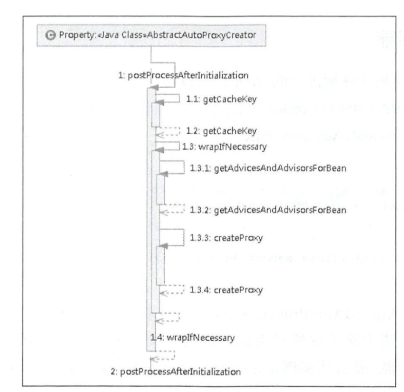

### Spring AOP 的创建

通过自定义标签 <aop:aspectj-autoproxy > 的解析（AspectJAutoProxyBeanDefinitionParser.parse() ）对 AnnotationAwareAspectJAutoProxyCreator 类型的自动注册

```java
@Override
@Nullable
public BeanDefinition parse(Element element, ParserContext parserContext) {
    // 1、注册AnnotationAwareAspectJAutoProxyCreator
    AopNamespaceUtils.registerAspectJAnnotationAutoProxyCreatorIfNecessary(parserContext, element);
    // 2、处理子标签<aop:include/>， 指定@Aspect类，支持正则表达式，符合该表达式的切面类才会被应用
    extendBeanDefinition(element, parserContext);
    return null;
}

public static void registerAspectJAnnotationAutoProxyCreatorIfNecessary(
			ParserContext parserContext, Element sourceElement) {
	// 注册 AnnotationAwareAspectJAutoProxyCreator 的 BeanDefinition信息
    // 这个beanName= org.springframework.aop.config.internalAutoProxyCreator
    BeanDefinition beanDefinition = AopConfigUtils.registerAspectJAnnotationAutoProxyCreatorIfNecessary(
        parserContext.getRegistry(), parserContext.extractSource(sourceElement));
    
    // 2、解析子标签 proxy-target-class 和 expose-proxy
    useClassProxyingIfNecessary(parserContext.getRegistry(), sourceElement);
    // 3、注册组件并发送组件注册事件，便于监听器做进一步处理
    registerComponentIfNecessary(beanDefinition, parserContext);
}

@Nullable
public static BeanDefinition registerAspectJAnnotationAutoProxyCreatorIfNecessary(
    BeanDefinitionRegistry registry, @Nullable Object source) {
	// 注册 AnnotationAwareAspectJAutoProxyCreator
    return registerOrEscalateApcAsRequired(AnnotationAwareAspectJAutoProxyCreator.class, registry, source);
}

@Nullable
private static BeanDefinition registerOrEscalateApcAsRequired(
    Class<?> cls, BeanDefinitionRegistry registry, @Nullable Object source) {

    Assert.notNull(registry, "BeanDefinitionRegistry must not be null");
	// 如果registry已经包含了AnnotationAwareAspectJAutoProxyCreator 
    // 则按照优先级顺序安排 @Priority	
    if (registry.containsBeanDefinition(AUTO_PROXY_CREATOR_BEAN_NAME)) {
        BeanDefinition apcDefinition = registry.getBeanDefinition(AUTO_PROXY_CREATOR_BEAN_NAME);
        if (!cls.getName().equals(apcDefinition.getBeanClassName())) {
            int currentPriority = findPriorityForClass(apcDefinition.getBeanClassName());
            int requiredPriority = findPriorityForClass(cls);
            if (currentPriority < requiredPriority) {
                apcDefinition.setBeanClassName(cls.getName());
            }
        }
        return null;
    }
	// 容器没有 AnnotationAwareAspectJAutoProxyCreator 则创建
    RootBeanDefinition beanDefinition = new RootBeanDefinition(cls);
    beanDefinition.setSource(source);
    beanDefinition.getPropertyValues().add("order", Ordered.HIGHEST_PRECEDENCE);
    beanDefinition.setRole(BeanDefinition.ROLE_INFRASTRUCTURE);
    registry.registerBeanDefinition(AUTO_PROXY_CREATOR_BEAN_NAME, beanDefinition);
    return beanDefinition;
}
```


AnnotationAwareAspectJAutoProxyCreator 实现了 

SmartInstantiationAwareBeanPostProcessor extends InstantiationAwareBeanPostProcessor

重写了里面的 postProcessBeforeInstantiation 和 postProcessAfterInitialization 

在 doCreateBean 之前的 Object bean = resolveBeforeInstantiation(beanName, mbdToUse); 

调用 postProcessBeforeInstantiation  方法

initializeBean(beanName, exposedObject, mbd); 里面

调用 postProcessAfterInitialization  方法


**postProcessBeforeInstantiation  方法：获取增强**

isInfrastructureClass(beanClass) || shouldSkip(beanClass, beanName)  方法判断当前类是否需要 被代理 

```java
this.advisedBeans.put(cacheKey, Boolean.FALSE);
```

shouldSkip 里面 缓存  切面类的名称

```java
// 这里缓存 实现 Aspect接口的
this.cachedAdvisorBeanNames = advisorNames

// 这里循环依赖的时候会缓存 this.earlyProxyReferences.put(cacheKey, bean);
// addSingletonFactory(beanName, () -> getEarlyBeanReference(beanName, mbd, bean));
// SmartInstantiationAwareBeanPostProcessor 这个接口要执行getEarlyBeanReference方法
// 获取提前代理的对象    
this.beanFactory.getBean(name, Advisor.class)
// 这里处理 @Aspect 注解的    
this.aspectJAdvisorsBuilder.buildAspectJAdvisors()   
// 缓存@Aspect 注解的名字
aspectNames = this.aspectBeanNames 
// 缓存--找到切面    
List<Advisor> classAdvisors = this.advisorFactory.getAdvisors(factory);
if (this.beanFactory.isSingleton(beanName)) {
    this.advisorsCache.put(beanName, classAdvisors);
}


// Create proxy here if we have a custom TargetSource.
// Suppresses unnecessary default instantiation of the target bean:
// The TargetSource will handle target instances in a custom fashion.
// 对应的代理内部类（aop AnnotationAwareAspectJAutoProxyCreator）
// setCustomTargetSourceCreators 自定义有生成的类
// 配置自定义的TargetSourceCreator进行TargetSource创建 
// 当我们配置TargetSourceCreator进行自定义TargetSource创建时，并在会创建代理对象过程中，中断默认Spring创建流程
TargetSource targetSource = getCustomTargetSource(beanClass, beanName);
if (targetSource != null) {
    // 如果targetSource不为null 添加到targetSourcedBeans缓存，并创建AOP代理对象  
    if (StringUtils.hasLength(beanName)) {
        this.targetSourcedBeans.add(beanName);
    }
    // 获取增强和切面
    Object[] specificInterceptors = getAdvicesAndAdvisorsForBean(beanClass, beanName, targetSource);
    // 创建代理
    Object proxy = createProxy(beanClass, beanName, specificInterceptors, targetSource);
    // 将代理类型放入proxyTypes从而允许后续的predictBeanType()调用获取 
    this.proxyTypes.put(cacheKey, proxy.getClass());
    return proxy;
}
```

总结：缓存当前类是否需要 被 aop 代理--判断标准 （当前类是否是 切面，切入点，增强 这些类）

同时 shouldSkip 里面会缓存一些 容器里的切面


 **postProcessAfterInitialization方法 ：**

缓存：this.advisedBeans.put(cacheKey, Boolean.TRUE);

​	和    this.proxyTypes.put(cacheKey, proxy.getClass());

首先如果是 切面类 在 isInfrastructureClass(beanClass) 里面直接返回了

```java
/**
 * 如果bean被子类标识为要代理的bean，则使用配置的拦截器创建代理。
 * Create a proxy with the configured interceptors if the bean is
 * identified as one to proxy by the subclass.
 * @see #getAdvicesAndAdvisorsForBean
 */
@Override
public Object postProcessAfterInitialization(@Nullable Object bean, String beanName) {
    if (bean != null) {
        // 为beanName和beanClass构建缓存key
        Object cacheKey = getCacheKey(bean.getClass(), beanName);
        // 这个好像不太会用：切面类里面一般不会有循环依赖
        if (!this.earlyProxyReferences.contains(cacheKey)) {
            // 如果它适合被代理，则需要封装指定 bean 
            return wrapIfNecessary(bean, beanName, cacheKey);
        }
    }
    return bean;
}
```

 wrapIfNecessary方法 ：

```java
/**
 * 如果需要则包装该bean,例如该bean可以被代理
 * Wrap the given bean if necessary, i.e. if it is eligible for being proxied.
 * @param bean the raw bean instance
 * @param beanName the name of the bean
 * @param cacheKey the cache key for metadata access
 * @return a proxy wrapping the bean, or the raw bean instance as-is
 */
protected Object wrapIfNecessary(Object bean, String beanName, Object cacheKey) {
    // 1、如果已经处理过或者不需要创建代理，则返回
    // TargetSource接口已经处理过的不需要再次处理 
    if (StringUtils.hasLength(beanName) && this.targetSourcedBeans.contains(beanName)) {
        return bean;
    }
    // 当前类不需要增强
    if (Boolean.FALSE.equals(this.advisedBeans.get(cacheKey))) {
        return bean;
    }
    // 给定的 bean 类是否代表一个基础设施类， 基础设施类不应代理，
    // 或者配置了指定 bean 不需要自动代理  
    if (isInfrastructureClass(bean.getClass()) || shouldSkip(bean.getClass(), beanName)) {
        this.advisedBeans.put(cacheKey, Boolean.FALSE);
        return bean;
    }

    // 2、创建代理
    // 2.1 根据指定的bean获取所有的适合该bean的增强
    Object[] specificInterceptors = getAdvicesAndAdvisorsForBean(bean.getClass(), beanName, null);
    if (specificInterceptors != DO_NOT_PROXY) {
        // 2.2 有增强需要为指定bean创建代理
        this.advisedBeans.put(cacheKey, Boolean.TRUE);
        // 创建代理
        Object proxy = createProxy(bean.getClass(), beanName, specificInterceptors, new SingletonTargetSource(bean));
        // 缓存代理
        this.proxyTypes.put(cacheKey, proxy.getClass());
        return proxy;
    }

    // 3、没有增强缓存当前了不需要被代理
    this.advisedBeans.put(cacheKey, Boolean.FALSE);
    return bean;
}
```




### 获取增强器


```java
@Override
@Nullable
protected Object[] getAdvicesAndAdvisorsForBean(
    Class<?> beanClass, String beanName, @Nullable TargetSource targetSource) {
	// 寻找具备条件的增强器
    List<Advisor> advisors = findEligibleAdvisors(beanClass, beanName);
    // 找不到对应的增强器
    if (advisors.isEmpty()) {
        // 返回空
        return DO_NOT_PROXY;
    }
    // 返回对应的增强器
    return advisors.toArray();
}

protected List<Advisor> findEligibleAdvisors(Class<?> beanClass, String beanName) {
    // 事务的类直接执行当前类的 findCandidateAdvisors
    // 这里查找所有的切面 : 执行的类在子类 AnnotationAwareAspectJAutoProxyCreator 中的 findCandidateAdvisors
    //     1. Advisor 这个接口的实现类
    //     2. 从当前BeanFactory中查找所有标记了@AspectJ的注解的bean
	List<Advisor> candidateAdvisors = findCandidateAdvisors();
    // 寻找匹配的增强器--匹配对的类
    List<Advisor> eligibleAdvisors = findAdvisorsThatCanApply(candidateAdvisors, beanClass, beanName);
    // 向通知器列表中的首位添加 ExposeInvocationInterceptor.ADVISOR
    // advisors.add(0, ExposeInvocationInterceptor.ADVISOR);
    // 拦截默认 true 都拦截 
    // 功能暴露 MethodInvocation 对象到 ThreadLocal 中
    // 直接通过调用 currentInvocation 方法取出
    /*
    @Override
	public Object invoke(MethodInvocation mi) throws Throwable {
		MethodInvocation oldInvocation = invocation.get();
		invocation.set(mi);
		try {
			return mi.proceed();
		}
		finally {
			invocation.set(oldInvocation);
		}
	}
	*/
    extendAdvisors(eligibleAdvisors);
    
    if (!eligibleAdvisors.isEmpty()) {
        // 排序 @Priority 这个注解比较优先级
        eligibleAdvisors = sortAdvisors(eligibleAdvisors);
    }
    return eligibleAdvisors;
}


@Override
protected List<Advisor> findCandidateAdvisors() {
    // Add all the Spring advisors found according to superclass rules.
    // 当使用注解方式配置 AOP 的时候并不是丢弃了对 XML 配置的支持， 
    // 这里查找所有的切面 :
    //		Advisor 这个接口的实现类
    List<Advisor> advisors = super.findCandidateAdvisors();
    // Build Advisors for all AspectJ aspects in the bean factory.
    if (this.aspectJAdvisorsBuilder != null) {
        // 从当前BeanFactory中查找所有标记了@AspectJ的注解的bean，并返回增强注解集合
        advisors.addAll(this.aspectJAdvisorsBuilder.buildAspectJAdvisors());
    }
    return advisors;
}
```


```java
/**
 * Look for AspectJ-annotated aspect beans in the current bean factory,
 * and return to a list of Spring AOP Advisors representing them.
 * <p>Creates a Spring Advisor for each AspectJ advice method.
 * @return the list of {@link org.springframework.aop.Advisor} beans
 * @see #isEligibleBean
 */
// 查找所有 AspectJ-annotated 的 aspect beans
// 缓存规则：
//  this.aspectBeanNames; 保存 beanName
//  this.advisorsCache.put(beanName, classAdvisors); 保存切面类--对应增强
public List<Advisor> buildAspectJAdvisors() {
    // 在实例化之前已经找过一遍   
    // ps:postProcessBeforeInstantiation里面的shouldSkip() 
    // shouldSkip() 会缓存 aspectBeanNames 
    List<String> aspectNames = this.aspectBeanNames;

    if (aspectNames == null) {
        synchronized (this) {
            aspectNames = this.aspectBeanNames;
            if (aspectNames == null) {
                
                List<Advisor> advisors = new ArrayList<>();
                aspectNames = new ArrayList<>();
                
                // 获取所有的 beanName 
                String[] beanNames = BeanFactoryUtils.beanNamesForTypeIncludingAncestors(
                    this.beanFactory, Object.class, true, false);
                
               // 循环遍历所有的 beanName 找出对应的增强方法 
                for (String beanName : beanNames) {
                    // 当前 beanName 是否在<aop:include name=""/> 里面 
                    // 由子类定义规则，默认返回 true
                    if (!isEligibleBean(beanName)) {
                        continue;
                    }
                    
                    // We must be careful not to instantiate beans eagerly as in this case they
                    // would be cached by the Spring container but would not have been weaved.
                    
                    Class<?> beanType = this.beanFactory.getType(beanName);
                    if (beanType == null) {
                        continue;
                    }
                    
                    // 没有 @Aspect 和 名字 ajc$ 这个开头的 都是 aspect bean
                    if (this.advisorFactory.isAspect(beanType)) {
                        // 后面缓存名称
                        aspectNames.add(beanName);
                        // 封装 Aspect信息类
                        AspectMetadata amd = new AspectMetadata(beanType, beanName);
                        // 切面是单例的
                        if (amd.getAjType().getPerClause().getKind() == PerClauseKind.SINGLETON) {
                            MetadataAwareAspectInstanceFactory factory =
                                new BeanFactoryAspectInstanceFactory(this.beanFactory, beanName);
                            
                            // 解析标记 AspectJ 注解中的增强方法 
                            // 核心方法
                            List<Advisor> classAdvisors =
                                this.advisorFactory.getAdvisors(factory);
/**
 * 切面实例化模型简介
 *
 * singleton: 即切面只会有一个实例；
 * perthis  : 每个切入点表达式匹配的连接点对应的AOP对象都会创建一个新切面实例；
 *            使用@Aspect("perthis(切入点表达式)")指定切入点表达式；
 *            例如: @Aspect("perthis(this(com.lyc.cn.v2.day04.aspectj.Dog))")
 * pertarget: 每个切入点表达式匹配的连接点对应的目标对象都会创建一个新的切面实例；
 *            使用@Aspect("pertarget(切入点表达式)")指定切入点表达式；
 *            例如:
 *
 * 默认是singleton实例化模型，Schema风格只支持singleton实例化模型，
 *  而@AspectJ风格支持这三种实例化模型。
 */
                        	// 切面 singleton实例化模型处理
                            if (this.beanFactory.isSingleton(beanName)) {
                                // 缓存对应的切面
                                this.advisorsCache.put(beanName, classAdvisors);
                            } else {
                                // 非单例缓存 factory 
                                this.aspectFactoryCache.put(beanName, factory);
                            }
                            // 记录缓存中
                            advisors.addAll(classAdvisors);
                        }  else {
                            // Per target or per this.
                            // 切面 perthis或pertarget实例化模型处理
                            if (this.beanFactory.isSingleton(beanName)) {
                                throw new IllegalArgumentException("Bean with name '" + beanName +
                                                                   "' is a singleton, but aspect instantiation model is not singleton");
                            }
                            MetadataAwareAspectInstanceFactory factory =
                                new PrototypeAspectInstanceFactory(this.beanFactory, beanName);
                            this.aspectFactoryCache.put(beanName, factory);
                            // 记录缓存中
                            advisors.addAll(this.advisorFactory.getAdvisors(factory));
                        }
                    }
                }
                this.aspectBeanNames = aspectNames;
                return advisors;
            }
        }
    }

    if (aspectNames.isEmpty()) {
        return Collections.emptyList();
    }
    // 记录在缓存中 
    List<Advisor> advisors = new ArrayList<>();
    for (String aspectName : aspectNames) {
        List<Advisor> cachedAdvisors = this.advisorsCache.get(aspectName);
        if (cachedAdvisors != null) {
            advisors.addAll(cachedAdvisors);
        }
        else {
            MetadataAwareAspectInstanceFactory factory = this.aspectFactoryCache.get(aspectName);
            advisors.addAll(this.advisorFactory.getAdvisors(factory));
        }
    }
    return advisors;
}
```


**Advisor 的提取**

```java
@Override
public List<Advisor> getAdvisors(MetadataAwareAspectInstanceFactory aspectInstanceFactory) {
    // 获取标记为 AspectJ 的类
    Class<?> aspectClass = aspectInstanceFactory.getAspectMetadata().getAspectClass();
    // 获取标记为 AspectJ 的 name
    String aspectName = aspectInstanceFactory.getAspectMetadata().getAspectName();
    // 验证 -- 父类有@AspectJ注解 ，父类就不能是 抽象的
    validate(aspectClass);

    // We need to wrap the MetadataAwareAspectInstanceFactory with a decorator
    // so that it will only instantiate once.
    // 一个装饰类
    MetadataAwareAspectInstanceFactory lazySingletonAspectInstanceFactory =
        new LazySingletonAspectInstanceFactoryDecorator(aspectInstanceFactory);
	
    List<Advisor> advisors = new ArrayList<>();
    // 遍历所以方法 得到 增强--这些只能注解在方法上
    for (Method method : getAdvisorMethods(aspectClass)) {
        
        Advisor advisor = getAdvisor(method, lazySingletonAspectInstanceFactory, advisors.size(), aspectName);
        if (advisor != null) {
            advisors.add(advisor);
        }
    }

    // If it's a per target aspect, emit the dummy instantiating aspect.
    if (!advisors.isEmpty() && 
        lazySingletonAspectInstanceFactory.getAspectMetadata().isLazilyInstantiated()) {
        // 如果寻找的增强都不为空而且又配置了增强延迟初始化， 
        // 那么需要在首位加入同步实例化增强器 
        Advisor instantiationAdvisor = new SyntheticInstantiationAdvisor(lazySingletonAspectInstanceFactory);
        advisors.add(0, instantiationAdvisor);
    }

    // Find introduction fields.
    // 遍历属性 获取 DeclareParents 注解 -- DeclareParents 只能注解在属性上
    for (Field field : aspectClass.getDeclaredFields()) {
        Advisor advisor = getDeclareParentsAdvisor(field);
        if (advisor != null) {
            advisors.add(advisor);
        }
    }

    return advisors;
}

@Override
@Nullable
public Advisor getAdvisor(Method candidateAdviceMethod, MetadataAwareAspectInstanceFactory aspectInstanceFactory,
                          int declarationOrderInAspect, String aspectName) {
	
    validate(aspectInstanceFactory.getAspectMetadata().getAspectClass());
	// 切点信息的获取 
    AspectJExpressionPointcut expressionPointcut = getPointcut(
        candidateAdviceMethod, aspectInstanceFactory.getAspectMetadata().getAspectClass());
    if (expressionPointcut == null) {
        return null;
    }
	// 根据切点信息生成增强器
    // Advisor 的实现类 InstantiationModelAwarePointcutAdvisorImpl 统一封装的
    return new InstantiationModelAwarePointcutAdvisorImpl(expressionPointcut, 
                                                          candidateAdviceMethod,
                                                          this, 
                                                          aspectInstanceFactory, 
                                                          declarationOrderInAspect,
                                                          aspectName);
}


// 切点信息的获取 
@Nullable
private AspectJExpressionPointcut getPointcut(Method candidateAdviceMethod, Class<?> candidateAspectClass) {
    // 在方法上按顺序找 Pointcut.class, Around.class, 
    // Before.class, After.class, AfterReturning.class, 
    // AfterThrowing.class 注解信息
    // 找到第一个 Pointcut 的注解信息
    // @Pointcut 
    AspectJAnnotation<?> aspectJAnnotation = AbstractAspectJAdvisorFactory.findAspectJAnnotationOnMethod(candidateAdviceMethod);
    // 没有对应的注解信息返回null
    if (aspectJAnnotation == null) {
        return null;
    }
	// 使用 AspectJExpressionPointcut 实例封装获取的信息
    AspectJExpressionPointcut ajexp =
        new AspectJExpressionPointcut(candidateAspectClass, new String[0], new Class<?>[0]);
    // 提取得到的注解中的表达式，如:
    // @Pointcut("execution(* com.qin.demo.proxy.Dog.*(..))")
    // 里面的 execution(* com.qin.demo.proxy.Dog.*(..)) 
    // 或者 @Around("test()") 里面的 test()
    ajexp.setExpression(aspectJAnnotation.getPointcutExpression());
    if (this.beanFactory != null) {
        ajexp.setBeanFactory(this.beanFactory);
    }
    return ajexp;
}

```

**寻找匹配的增强器**:

获取到的bean 不易顶匹配增强器 这里就是匹配

```java
findAdvisorsThatCanApply(candidateAdvisors, beanClass, beanName);

protected List<Advisor> findAdvisorsThatCanApply(
			List<Advisor> candidateAdvisors, Class<?> beanClass, String beanName) {

    ProxyCreationContext.setCurrentProxiedBeanName(beanName);
    try {
        // 当前类匹配对应的切面
        return AopUtils.findAdvisorsThatCanApply(candidateAdvisors, beanClass);
    }
    finally {
        ProxyCreationContext.setCurrentProxiedBeanName(null);
    }
}

// 当前类是否匹配
public static List<Advisor> findAdvisorsThatCanApply(List<Advisor> candidateAdvisors, Class<?> clazz) {
    // 增强器为空
    if (candidateAdvisors.isEmpty()) {
        return candidateAdvisors;
    }
    // 
    List<Advisor> eligibleAdvisors = new ArrayList<>();
    for (Advisor candidate : candidateAdvisors) {
        // 处理 引介增强的
        if (candidate instanceof IntroductionAdvisor && canApply(candidate, clazz)) {
            eligibleAdvisors.add(candidate);
        }
    }
    boolean hasIntroductions = !eligibleAdvisors.isEmpty();
    for (Advisor candidate : candidateAdvisors) {
        if (candidate instanceof IntroductionAdvisor) {
            // already processed
            // 引介增强的已经处理过了
            continue;
        }
        if (canApply(candidate, clazz, hasIntroductions)) {
            // 对应普通bean 处理
            eligibleAdvisors.add(candidate);
        }
    }
    return eligibleAdvisors;
}
```


其实在 postProcessBeforeInstantiation 里面的 shouldSkip(beanClass, beanName)  

里面已经封装过一次

```java
List<Advisor> classAdvisors = this.advisorFactory.getAdvisors(factory);
```

里面的逻辑主要是：

// 遍历所以方法 得到 增强
for (Method method : getAdvisorMethods(aspectClass)) 

// 遍历属性 获取 DeclareParents 注解

for (Field field : aspectClass.getDeclaredFields()) 

每个增强对应一个 InstantiationModelAwarePointcutAdvisorImpl 

后面 的 postProcessAfterInitialization  也会执行上面的过程

只不过是获取缓存的增强

对应的关系：

环绕增强     AspectJAroundAdvice 对应 MethodInterceptor
前置增强     AspectJMethodBeforeAdvice 对应 MethodBeforeAdvice
后置增强     AspectJAfterAdvice 对应 MethodInterceptor
后置返回增强 AspectJAfterReturningAdvice 对应 AfterReturningAdvice
异常增强     AspectJAfterThrowingAdvice 对应 MethodInterceptor


**InstantiationModelAwarePointcutAdvisorImpl ：**

在 postProcessAfterInitialization 里面会将 Advisor  统一封装 

成 InstantiationModelAwarePointcutAdvisorImpl 

因为不同的增强所体现的逻辑是不同的，需要不同的增强器来完成不同的逻辑，而根据注解中的信息初始化对应的增强器就是在 instantiateAdvice 函数中实现的

在 instantiateAdvice 里面 


```java
public InstantiationModelAwarePointcutAdvisorImpl(AspectJExpressionPointcut declaredPointcut,
			Method aspectJAdviceMethod, AspectJAdvisorFactory aspectJAdvisorFactory,
			MetadataAwareAspectInstanceFactory aspectInstanceFactory, int declarationOrder, String aspectName) {
	
    this.declaredPointcut = declaredPointcut;
    this.declaringClass = aspectJAdviceMethod.getDeclaringClass();
    this.methodName = aspectJAdviceMethod.getName();
    this.parameterTypes = aspectJAdviceMethod.getParameterTypes();
    this.aspectJAdviceMethod = aspectJAdviceMethod;
    this.aspectJAdvisorFactory = aspectJAdvisorFactory;
    this.aspectInstanceFactory = aspectInstanceFactory;
    this.declarationOrder = declarationOrder;
    this.aspectName = aspectName;

    if (aspectInstanceFactory.getAspectMetadata().isLazilyInstantiated()) {
        // Static part of the pointcut is a lazy type.
        Pointcut preInstantiationPointcut = Pointcuts.union(
            aspectInstanceFactory.getAspectMetadata().getPerClausePointcut(), this.declaredPointcut);

        // Make it dynamic: must mutate from pre-instantiation to post-instantiation state.
        // If it's not a dynamic pointcut, it may be optimized out
        // by the Spring AOP infrastructure after the first evaluation.
        this.pointcut = new PerTargetInstantiationModelPointcut(
            this.declaredPointcut, preInstantiationPointcut, aspectInstanceFactory);
        this.lazy = true;
    }
    else {
        // A singleton aspect.
        this.pointcut = this.declaredPointcut;
        this.lazy = false;
        this.instantiatedAdvice = instantiateAdvice(this.declaredPointcut);
    }
}

private Advice instantiateAdvice(AspectJExpressionPointcut pointcut) {
    Advice advice = this.aspectJAdvisorFactory.getAdvice(this.aspectJAdviceMethod,
                                                         pointcut,
                                                         this.aspectInstanceFactory, 
                                                         this.declarationOrder,
                                                         this.aspectName);
    return (advice != null ? advice : EMPTY_ADVICE);
}

@Override
@Nullable
public Advice getAdvice(Method candidateAdviceMethod, AspectJExpressionPointcut expressionPointcut,
                        MetadataAwareAspectInstanceFactory aspectInstanceFactory, int declarationOrder, String aspectName) {
	// aspect类的Class
    Class<?> candidateAspectClass = aspectInstanceFactory.getAspectMetadata().getAspectClass();
    // 验证-父类有@Aspect注解，就不能是 抽象类
    validate(candidateAspectClass);
	// 该方法必须要有
    // Pointcut.class, Around.class, Before.class, After.class, AfterReturning.class, AfterThrowing.class
    // 这些注解
    AspectJAnnotation<?> aspectJAnnotation = AbstractAspectJAdvisorFactory.findAspectJAnnotationOnMethod(candidateAdviceMethod);
    
    if (aspectJAnnotation == null) {
        return null;
    }

    // If we get here, we know we have an AspectJ method.
    // 切面类必须是 aspect Bean
    if (!isAspect(candidateAspectClass)) {
        throw new AopConfigException("Advice must be declared inside an aspect type: " +
                                     "Offending method '" + candidateAdviceMethod + "' in class [" +
                                     candidateAspectClass.getName() + "]");
    }

    if (logger.isDebugEnabled()) {
        logger.debug("Found AspectJ method: " + candidateAdviceMethod);
    }

    AbstractAspectJAdvice springAdvice;
	
    // 方法上的是什么注解对应的就是什么增强器
    switch (aspectJAnnotation.getAnnotationType()) {
        case AtPointcut:
            if (logger.isDebugEnabled()) {
                logger.debug("Processing pointcut '" + candidateAdviceMethod.getName() + "'");
            }
            return null;
        case AtAround:
            springAdvice = new AspectJAroundAdvice(
                candidateAdviceMethod, expressionPointcut, aspectInstanceFactory);
            break;
        case AtBefore:
            springAdvice = new AspectJMethodBeforeAdvice(
                candidateAdviceMethod, expressionPointcut, aspectInstanceFactory);
            break;
        case AtAfter:
            springAdvice = new AspectJAfterAdvice(
                candidateAdviceMethod, expressionPointcut, aspectInstanceFactory);
            break;
        case AtAfterReturning:
            springAdvice = new AspectJAfterReturningAdvice(
                candidateAdviceMethod, expressionPointcut, aspectInstanceFactory);
            AfterReturning afterReturningAnnotation = (AfterReturning) aspectJAnnotation.getAnnotation();
            if (StringUtils.hasText(afterReturningAnnotation.returning())) {
                springAdvice.setReturningName(afterReturningAnnotation.returning());
            }
            break;
        case AtAfterThrowing:
            springAdvice = new AspectJAfterThrowingAdvice(
                candidateAdviceMethod, expressionPointcut, aspectInstanceFactory);
            AfterThrowing afterThrowingAnnotation = (AfterThrowing) aspectJAnnotation.getAnnotation();
            if (StringUtils.hasText(afterThrowingAnnotation.throwing())) {
                springAdvice.setThrowingName(afterThrowingAnnotation.throwing());
            }
            break;
        default:
            throw new UnsupportedOperationException(
                "Unsupported advice type on method: " + candidateAdviceMethod);
    }

    // Now to configure the advice...
    // 配置剩下的信息
    springAdvice.setAspectName(aspectName);
    springAdvice.setDeclarationOrder(declarationOrder);
    String[] argNames = this.parameterNameDiscoverer.getParameterNames(candidateAdviceMethod);
    if (argNames != null) {
        springAdvice.setArgumentNamesFromStringArray(argNames);
    }
    springAdvice.calculateArgumentBindings();

    return springAdvice;
}
```


**在 JdkDynamicAopProxy 和 CglibAopProxy 里面调用 获取拦截器链**

```java
List<Object> chain = 
    this.advised.getInterceptorsAndDynamicInterceptionAdvice(method, targetClass);

/**
 * 获取拦截器链
 */
public List<Object> getInterceptorsAndDynamicInterceptionAdvice(Method method, @Nullable Class<?> targetClass) {
    // 缓存里是否有
    MethodCacheKey cacheKey = new MethodCacheKey(method);
    List<Object> cached = this.methodCache.get(cacheKey);
    // 缓存里没有
    if (cached == null) {
        // 
        cached = this.advisorChainFactory.getInterceptorsAndDynamicInterceptionAdvice(
            this, method, targetClass);
        // 添加缓存
        this.methodCache.put(cacheKey, cached);
    }
    return cached;
}
```

```java
/**
 * 获取拦截器链
 */
@Override
public List<Object> getInterceptorsAndDynamicInterceptionAdvice(
    Advised config, Method method, @Nullable Class<?> targetClass) {

    // This is somewhat tricky... We have to process introductions first,
    // but we need to preserve order in the ultimate list.
    // 当前 切面类 config
    List<Object> interceptorList = new ArrayList<Object>(config.getAdvisors().length);
    // targetClass 为空就从 方法里获取
    Class<?> actualClass = (targetClass != null ? targetClass : method.getDeclaringClass());
    // 判断是否有引介增强
    boolean hasIntroductions = hasMatchingIntroductions(config, actualClass);
    
    AdvisorAdapterRegistry registry = GlobalAdvisorAdapterRegistry.getInstance();
	// 遍历所有增强
    for (Advisor advisor : config.getAdvisors()) {
        // 如果增强是PointcutAdvisor的实例
        if (advisor instanceof PointcutAdvisor) {
            // Add it conditionally.
            // config.isPreFiltered() -> 返回是否对该代理配置进行了预筛选，以便仅对其进行筛选包含适用的增强(匹配此代理的目标类)。
            // pointcutAdvisor.getPointcut().getClassFilter().matches(actualClass) -> 当前切点匹配的类是否匹配actualClass
            // ClassFilter 判断当前类是否符合代理 默认 是永真
            PointcutAdvisor pointcutAdvisor = (PointcutAdvisor) advisor;
            if (config.isPreFiltered() || pointcutAdvisor.getPointcut().getClassFilter().matches(actualClass)) {
                // MethodMatcher 判断当前方法是否需要代理 默认 是永真
                MethodMatcher mm = pointcutAdvisor.getPointcut().getMethodMatcher();
                if (MethodMatchers.matches(mm, method, actualClass, hasIntroductions)) {
                    // 这里会根据 哪个增强处理器 找到对应的 MethodInterceptor
                    /*
                    环绕增强     AspectJAroundAdvice 对应 MethodInterceptor
                    前置增强     AspectJMethodBeforeAdvice 对应 MethodBeforeAdvice
                    后置增强     AspectJAfterAdvice 对应 MethodInterceptor
                    后置返回增强  AspectJAfterReturningAdvice 对应 AfterReturningAdvice
                    异常增强     AspectJAfterThrowingAdvice 对应 MethodInterceptor
                    前置增强 和 后置返回增强 需要 调用 getInterceptor 得到
                   
 * 增强适配器
 * 这个方法在获取拦截器链的时候调用,从这里也可以看出,Spring中的advisor(增强/切面)
 * 最终还是被转换为MethodInterceptor对象
 *
 * AdvisorAdapter的实现类有AfterReturningAdviceAdapter,MethodBeforeAdviceAdapter,ThrowsAdviceAdapter三个
 *
 * AfterReturningAdviceAdapter -> new AfterReturningAdviceInterceptor(advice) -> 后置返回增强
 * MethodBeforeAdviceAdapter -> new MethodBeforeAdviceInterceptor(advice) -> 前置增强
 * ThrowsAdviceAdapter -> new ThrowsAdviceInterceptor(advisor.getAdvice()) -> 该适配器有些特殊 不是处理这个的AspectJAfterThrowingAdvice 
 */
                    */
                    MethodInterceptor[] interceptors = registry.getInterceptors(advisor);
                    if (mm.isRuntime()) {
                        // Creating a new object instance in the getInterceptors() method
                        // isn't a problem as we normally cache created chains.
                        for (MethodInterceptor interceptor : interceptors) {
                            interceptorList.add(new InterceptorAndDynamicMethodMatcher(interceptor, mm));
                        }
                    } else {
                        interceptorList.addAll(Arrays.asList(interceptors));
                    }
                }
            }
        }  else if (advisor instanceof IntroductionAdvisor) {
            // 引介增强处理
            IntroductionAdvisor ia = (IntroductionAdvisor) advisor;
            if (config.isPreFiltered() || ia.getClassFilter().matches(actualClass)) {
                Interceptor[] interceptors = registry.getInterceptors(advisor);
                interceptorList.addAll(Arrays.asList(interceptors));
            }
        } else {
            // 其他类型
            Interceptor[] interceptors = registry.getInterceptors(advisor);
            interceptorList.addAll(Arrays.asList(interceptors));
        }
    }

    return interceptorList;
}
```


 通过上面的代码可以发现Spring最终还是要把增强（切面）转换为方法拦截器 


##### 拦截器链调动过程

```java
// CglibAopProxy:
retVal = new CglibMethodInvocation(proxy, target, method, args, targetClass, chain, methodProxy).proceed();


// JdkDynamicAopProxy:
// We need to create a method invocation...
MethodInvocation invocation =
    new ReflectiveMethodInvocation(proxy, target, method, args, targetClass, chain);
// Proceed to the joinpoint through the interceptor chain.
retVal = invocation.proceed();


/**
 * 调用拦截器链
 *
 * currentInterceptorIndex维护了一个计数器，该计数器从-1开始，当计数器值等于拦截方法长度减一时，
 * 表名所有的增强方法已经被调用（但是不一定被真正执行），那么此时调用连接点的方法，针对本例：即sayHello方法
 */
// 两个都执行这里
@Override
@Nullable
public Object proceed() throws Throwable {
    //	We start with an index of -1 and increment early.
    if (this.currentInterceptorIndex == this.interceptorsAndDynamicMethodMatchers.size() - 1) {
        // 如果调用链为空，则直接调用目标方法
        // jdk反射的形式调用 
        // (方法) method.invoke(target （对象）, args （参数）)
        return invokeJoinpoint();
    }

    Object interceptorOrInterceptionAdvice =
        this.interceptorsAndDynamicMethodMatchers.get(++this.currentInterceptorIndex);
    // 动态匹配增强
    if (interceptorOrInterceptionAdvice instanceof InterceptorAndDynamicMethodMatcher) {
        // Evaluate dynamic method matcher here: static part will already have
        // been evaluated and found to match.
        InterceptorAndDynamicMethodMatcher dm =
            (InterceptorAndDynamicMethodMatcher) interceptorOrInterceptionAdvice;
        if (dm.methodMatcher.matches(this.method, this.targetClass, this.arguments)) {
             // 匹配成功则执行
            return dm.interceptor.invoke(this);
        }
        else {
            // Dynamic matching failed.
            // Skip this interceptor and invoke the next in the chain.
            // 匹配失败则跳过并执行下一个拦截器
            return proceed();
        }
    }
    else {
        // It's an interceptor, so we just invoke it: The pointcut will have
        // been evaluated statically before this object was constructed.
        // 静态增强
        // 默认的都是静态增强
        return ((MethodInterceptor) interceptorOrInterceptionAdvice).invoke(this);
    }
}
```


这段代码看似简单，但是如果真的debug进去，方法栈还是比较深刻的，前面介绍过在获取到合适的增强集合之后，首先在其首位加入了ExposeInvocationInterceptor拦截器，然后对增强集合进行了排序（当然ExposeInvocationInterceptor依然会在首位），那么接下来第一个拦截器调用就是ExposeInvocationInterceptor了

1.  ExposeInvocationInterceptor 

   ```java
   public Object invoke(MethodInvocation mi) throws Throwable {
       MethodInvocation oldInvocation = invocation.get();
       invocation.set(mi);
       try {
           // 递归调用拦截器链
           return mi.proceed();
       }
       finally {
           invocation.set(oldInvocation);
       }
   }
   ```

2.  AspectJAfterThrowingAdvice 

   ```java
   public Object invoke(MethodInvocation mi) throws Throwable {
       try {
           // 继续递归调用拦截器链
           return mi.proceed();
       }
       catch (Throwable ex) {
           if (shouldInvokeOnThrowing(ex)) {
               invokeAdviceMethod(getJoinPointMatch(), null, ex);
           }
           throw ex;
       }
   }
   ```

   

3.  AspectJAfterThrowingAdvice 

   ```java
   public Object invoke(MethodInvocation mi) throws Throwable {
       try {
           // 继续拦截器链调用
           return mi.proceed();
       }
       catch (Throwable ex) {
           if (shouldInvokeOnThrowing(ex)) {
               invokeAdviceMethod(getJoinPointMatch(), null, ex);
           }
           throw ex;
       }
   }
   ```

4.  AfterReturningAdviceInterceptor 

   ```java
   public Object invoke(MethodInvocation mi) throws Throwable {
       // 继续拦截器链调用
       Object retVal = mi.proceed();
       this.advice.afterReturning(retVal, mi.getMethod(), mi.getArguments(), mi.getThis());
       return retVal;
   }
   ```

5.  AspectJAfterAdvice 

   ```java
   public Object invoke(MethodInvocation mi) throws Throwable {
       try {
           // 继续拦截器链调用
           return mi.proceed();
       }
       finally {
           invokeAdviceMethod(getJoinPointMatch(), null, null);
       }
   }
   ```

6.  AspectJAroundAdvice 

   ```java
   public Object invoke(MethodInvocation mi) throws Throwable {
       if (!(mi instanceof ProxyMethodInvocation)) {
           throw new IllegalStateException("MethodInvocation is not a Spring ProxyMethodInvocation: " + mi);
       }
       ProxyMethodInvocation pmi = (ProxyMethodInvocation) mi;
       ProceedingJoinPoint pjp = lazyGetProceedingJoinPoint(pmi);
       JoinPointMatch jpm = getJoinPointMatch(pmi);
       return invokeAdviceMethod(pjp, jpm, null, null);
   }
   ```

7. invokeAdviceMethod 里面的  invokeAdviceMethodWithGivenArgs 

   ```java
   protected Object invokeAdviceMethodWithGivenArgs(Object[] args) throws Throwable {
       Object[] actualArgs = args;
       if (this.aspectJAdviceMethod.getParameterCount() == 0) {
           actualArgs = null;
       }
       try {
           ReflectionUtils.makeAccessible(this.aspectJAdviceMethod);
           // TODO AopUtils.invokeJoinpointUsingReflection
           // 调用代理方法
           return this.aspectJAdviceMethod.invoke(this.aspectInstanceFactory.getAspectInstance(), actualArgs);
       }
       catch (IllegalArgumentException ex) {
           throw new AopInvocationException("Mismatch on arguments to advice method [" +
                   this.aspectJAdviceMethod + "]; pointcut expression [" +
                   this.pointcut.getPointcutExpression() + "]", ex);
       }
       catch (InvocationTargetException ex) {
           throw ex.getTargetException();
     }
     
   // 调用代理方法
   public Object invoke(Object obj, Object... args)
           throws IllegalAccessException, IllegalArgumentException,
       InvocationTargetException {
           if (!override) {
               if (!Reflection.quickCheckMemberAccess(clazz, modifiers)) {
                   Class<?> caller = Reflection.getCallerClass();
                   checkAccess(caller, clazz, obj, modifiers);
               }
           }
           MethodAccessor ma = methodAccessor;             // read volatile
           if (ma == null) {
               ma = acquireMethodAccessor();
           }
           // 调用 增强的方法
           return ma.invoke(obj, args);
       }
   ```

8. 到我们的环绕增强

   ```java
    @Around("test()")
   public Object aroundTest(ProceedingJoinPoint p) {
       System.out.println("==环绕增强开始");
       Object o = null;
       try {
           // 这里调用前置增强
           o = p.proceed();
       } catch (Throwable e) {
           e.printStackTrace();
       }
       System.out.println("==环绕增强结束");
       return o;
   }
   ```

9. 前置增强

   ```java
   public Object invoke(MethodInvocation mi) throws Throwable {
       // 调用前置增强
       this.advice.before(mi.getMethod(), mi.getArguments(), mi.getThis());
       return mi.proceed();
   }
   ```

10.  目标方法
    执行完前置增强之后，再次进入到proceed方法，这时候，计数器已经满足条件了，执行目标方法调用： 

    ```java
    if (this.currentInterceptorIndex == this.interceptorsAndDynamicMethodMatchers.size() - 1) {
        return invokeJoinpoint();
    }
    ```

     待执行完目标方法调用后，再将之前压入方法栈的那些增强方法依次出栈并调用。


### 创建代理

在获取了所有对应 bean 的增强器后，便可以进行代理的创建

```java
//创建代理
Object proxy = createProxy(
					bean.getClass(),
    beanName, specificInterceptors, 
    new SingletonTargetSource(bean));

protected Object createProxy(Class<?> beanClass, @Nullable String beanName,
			@Nullable Object[] specificInterceptors, TargetSource targetSource) {
	
    // 设置一个org.springframework.aop.framework.autoproxy.AutoProxyUtils.originalTargetClass属性
    // 将需要被代理的对象暴露出来
    if (this.beanFactory instanceof ConfigurableListableBeanFactory) {
        AutoProxyUtils.exposeTargetClass((ConfigurableListableBeanFactory) this.beanFactory, beanName, beanClass);
    }
	// 创建代理工厂
    ProxyFactory proxyFactory = new ProxyFactory();
    // 复制proxyTargetClass，exposeProxy等属性
    proxyFactory.copyFrom(this);
	// 决定对于给定的 bean 是否应该使用 targetClass 而不是它的接口代理， 
    // 检查 proxyTargeClass 设置以及 preserveTargetClass 属性 
    // 不使用Cglib代理目标类
    if (!proxyFactory.isProxyTargetClass()) {
        
        // 如果当前设置了不使用Cglib代理目标类，则判断目标类是否设置了preserveTargetClass属性，
    	// 如果设置了，则还是强制使用Cglib代理目标类；如果没有设置，则判断目标类是否实现了相关接口，
    	// 没有设置，则还是使用Cglib代理。需要注意的是Spring默认使用的是Jdk代理来织入切面逻辑。
        
        // 判断目标类是否设置了preserveTargetClass属性,设置了就强制使用 Cglib代理目标类
        if (shouldProxyTargetClass(beanClass, beanName)) {
            proxyFactory.setProxyTargetClass(true);
        }
        else {
            // 判断目标类是否实现了相关接口
            evaluateProxyInterfaces(beanClass, proxyFactory);
        }
    }
    
	// 将需要织入的切面逻辑都转换为Advisor对象
    Advisor[] advisors = buildAdvisors(beanName, specificInterceptors);
    proxyFactory.addAdvisors(advisors);
    proxyFactory.setTargetSource(targetSource);
    // 提供的hook方法，供子类实现以实现对代理工厂的定制
    customizeProxyFactory(proxyFactory);

    proxyFactory.setFrozen(this.freezeProxy);
    
    // 当前判断逻辑默认返回false，子类可进行重写，对于AnnotationAwareAspectJAutoProxyCreator，
    // 其重写了该方法返回true，因为其已经对获取到的Advisor进行了过滤，后面不需要在对目标类进行重新
    // 匹配了
    if (advisorsPreFiltered()) {
        // 默认已经匹配了，就不需要再次匹配
        proxyFactory.setPreFiltered(true);
    }
	 // 生成代理类
    return proxyFactory.getProxy(getProxyClassLoader());
}
```

### 生成代理类

```java
public AopProxy createAopProxy(AdvisedSupport config) throws AopConfigException {
    // 判断当前类是否需要进行运行时优化，或者是指定了使用Cglib代理的方式，再或者是目标类没有用户提供的
    // 相关接口，则使用Cglib代理实现代理逻辑的织入
    if (config.isOptimize() || config.isProxyTargetClass() || 
        hasNoUserSuppliedProxyInterfaces(config)) {
        Class<?> targetClass = config.getTargetClass();
        if (targetClass == null) {
            throw new AopConfigException("TargetSource cannot determine target class: " 
                + "Either an interface or a target is required for proxy creation.");
        }
        // 如果被代理的类是一个接口，
        // 或者被代理的类是使用Jdk代理生成的类，(继承了 Proxy 或者已经缓存的 jdk代理)
        // 此时还是使用Jdk代理
        if (targetClass.isInterface() || Proxy.isProxyClass(targetClass)) {
            return new JdkDynamicAopProxy(config);
        }
        
        // 返回Cglib代理织入类对象
        return new ObjenesisCglibAopProxy(config);
    } else {
        // 返回Jdk代理织入类对象
        return new JdkDynamicAopProxy(config);
    }
}
```


