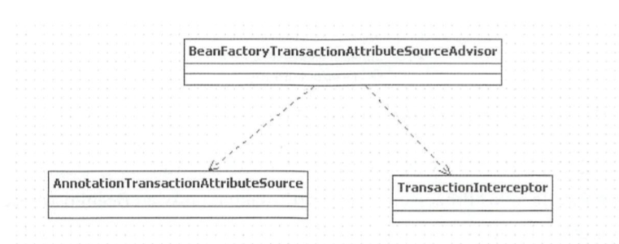
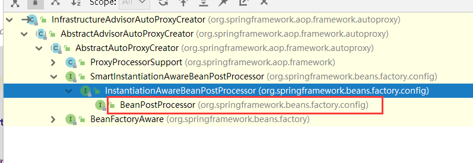
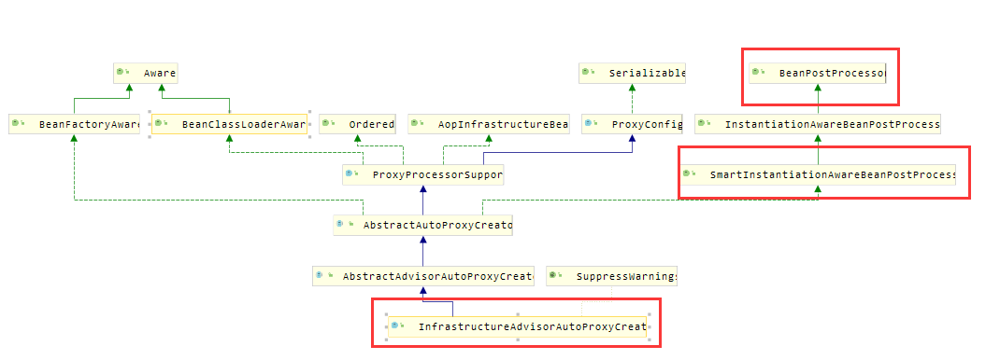
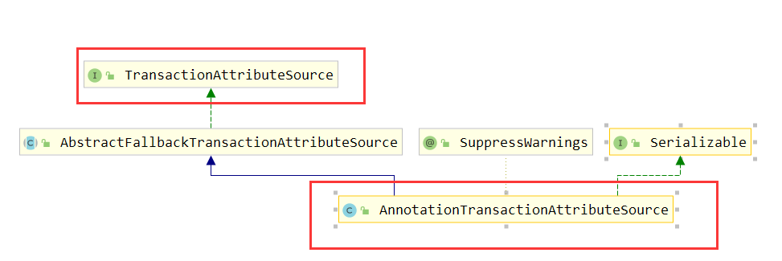
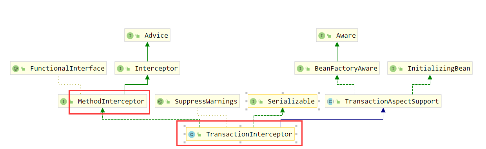
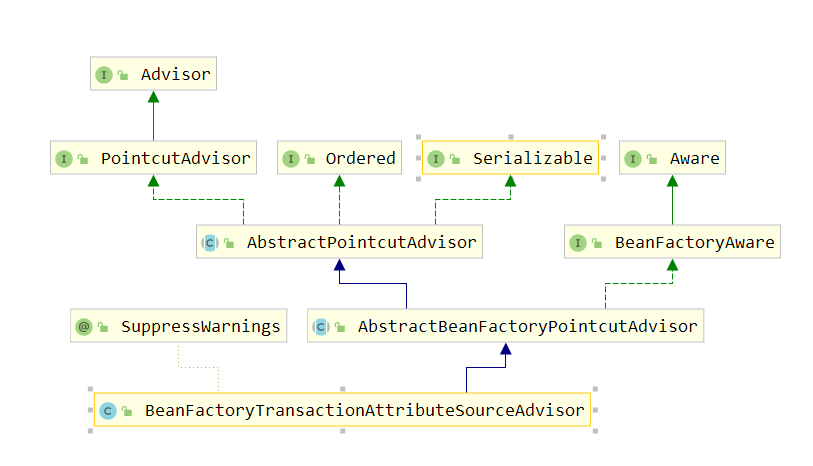

### Spring tx:annotation-driven 标签解析过程

##### 快速定位Spring自定义标签解析入口：

配置文件中，通过 <tx:annotation-driven transaction-manager="transactionManager"/> 开启了注解事物

以此为入口 , tx是Spring的自定义标签，而Spring通过继承NamespaceHandler自定义命名空间的解析   

根据之前的经验 全局搜索 **annotation-driven**  可以找到TxNamespaceHandler类下包含了`annotation-driven` 

```java
public class TxNamespaceHandler extends NamespaceHandlerSupport {

	static final String TRANSACTION_MANAGER_ATTRIBUTE = "transaction-manager";

	static final String DEFAULT_TRANSACTION_MANAGER_BEAN_NAME = "transactionManager";
	// transaction-manager 属性的默认值是 transactionManager
	static String getTransactionManagerName(Element element) {
		return (element.hasAttribute(TRANSACTION_MANAGER_ATTRIBUTE) ?
				element.getAttribute(TRANSACTION_MANAGER_ATTRIBUTE) : DEFAULT_TRANSACTION_MANAGER_BEAN_NAME);
	}

	@Override
	public void init() {
        // 注册 TxAdviceBeanDefinitionParser 事务增强类
		registerBeanDefinitionParser("advice", new TxAdviceBeanDefinitionParser());
        // 注册 AnnotationDrivenBeanDefinitionParser
		registerBeanDefinitionParser("annotation-driven", new AnnotationDrivenBeanDefinitionParser());
		registerBeanDefinitionParser("jta-transaction-manager", new JtaTransactionManagerBeanDefinitionParser());
	}

}
```


AnnotationDrivenBeanDefinitionParser 

```java
@Override
	@Nullable
public BeanDefinition parse(Element element, ParserContext parserContext) {
    // 注册 TransactionalEventListenerFactory
    registerTransactionalEventListenerFactory(parserContext);
    // <tx:annotation-driven transaction-manager="transactionManager" mode="aspectj"/>
    // 解析标签的mode属性 默认 proxy 模式
    String mode = element.getAttribute("mode");
   
    if ("aspectj".equals(mode)) {
        // mode="aspectj"
        registerTransactionAspect(element, parserContext);
        if (ClassUtils.isPresent("javax.transaction.Transactional", getClass().getClassLoader())) {
            registerJtaTransactionAspect(element, parserContext);
        }
    }
    else {
        // mode="proxy"
        // 默认
        AopAutoProxyConfigurer.configureAutoProxyCreator(element, parserContext);
    }
    return null;
}
```


 proxy模式 ：

```java
private static class AopAutoProxyConfigurer {

		public static void configureAutoProxyCreator(Element element, ParserContext parserContext) {
            // 1、注册 InfrastructureAdvisorAutoProxyCreator 这个内部类
            // 名称：AopConfigUtils.AUTO_PROXY_CREATOR_BEAN_NAME = 
            //           "org.springframework.aop.config.internalAutoProxyCreator";
			AopNamespaceUtils.registerAutoProxyCreatorIfNecessary(parserContext, element);
			// 切面类名称
			String txAdvisorBeanName = TransactionManagementConfigUtils.TRANSACTION_ADVISOR_BEAN_NAME;
            
			if (!parserContext.getRegistry().containsBeanDefinition(txAdvisorBeanName)) {
				Object eleSource = parserContext.extractSource(element);
                
				// 2、创建AnnotationTransactionAttributeSource的BeanDefinition
				// Create the TransactionAttributeSource definition.
				RootBeanDefinition sourceDef = new RootBeanDefinition(
						"org.springframework.transaction.annotation.AnnotationTransactionAttributeSource");
                
				sourceDef.setSource(eleSource);
                // 这个bean属于内部类
				sourceDef.setRole(BeanDefinition.ROLE_INFRASTRUCTURE);
                // 注册bean ，并使用 spring 内部自定义的规则 类名 + # + 数字 0 开始  
				String sourceName = parserContext.getReaderContext().registerWithGeneratedName(sourceDef);

				// Create the TransactionInterceptor definition.
                // 3、创建 TransactionInterceptor 这个 bean （执行里面的 invoke 方法）
				RootBeanDefinition interceptorDef = new RootBeanDefinition(TransactionInterceptor.class);
				interceptorDef.setSource(eleSource);
                // 内部类
				interceptorDef.setRole(BeanDefinition.ROLE_INFRASTRUCTURE);
                // 解析 transaction-manager 属性 并注册 默认 transactionManager
				registerTransactionManager(element, interceptorDef);
                // 添加 transactionAttributeSource 属性
                // 里面的属性都是不可变的
				interceptorDef.getPropertyValues().add("transactionAttributeSource", new RuntimeBeanReference(sourceName));
                
                // 注册bean ，并使用 spring 内部自定义的规则 类名 + # + 数字 0 开始  
				String interceptorName = parserContext.getReaderContext().registerWithGeneratedName(interceptorDef);

				// Create the TransactionAttributeSourceAdvisor definition.
                // 4、创建BeanFactoryTransactionAttributeSourceAdvisor的BeanDefinition（切面）
				RootBeanDefinition advisorDef = new RootBeanDefinition(BeanFactoryTransactionAttributeSourceAdvisor.class);
				advisorDef.setSource(eleSource);
                // spring内部类
				advisorDef.setRole(BeanDefinition.ROLE_INFRASTRUCTURE);
                // 添加 transactionAttributeSource 属性
                // 里面的属性都是不可变的
				advisorDef.getPropertyValues().add("transactionAttributeSource", new RuntimeBeanReference(sourceName));
                // 添加属性 adviceBeanName 属性 上面的：TransactionInterceptor
				advisorDef.getPropertyValues().add("adviceBeanName", interceptorName);
				if (element.hasAttribute("order")) {
					advisorDef.getPropertyValues().add("order", element.getAttribute("order"));
				}
                // 注册切面：TRANSACTION_ADVISOR_BEAN_NAME 
				parserContext.getRegistry().registerBeanDefinition(txAdvisorBeanName, advisorDef);
				
                /**
                 * 通过上面的操作：
                 * 1、创建AnnotationTransactionAttributeSource的BeanDefinition
                 * 2、创建TransactionInterceptor的BeanDefinition
                 * 3、创建BeanFactoryTransactionAttributeSourceAdvisor的BeanDefinition
                 */
                
				CompositeComponentDefinition compositeDef = new CompositeComponentDefinition(element.getTagName(), eleSource);
				compositeDef.addNestedComponent(new BeanComponentDefinition(sourceDef, sourceName));
				compositeDef.addNestedComponent(new BeanComponentDefinition(interceptorDef, interceptorName));
				compositeDef.addNestedComponent(new BeanComponentDefinition(advisorDef, txAdvisorBeanName));
				parserContext.registerComponent(compositeDef);
			}
		}
	}

public static void registerAutoProxyCreatorIfNecessary(
			ParserContext parserContext, Element sourceElement) {
	// 注册 InfrastructureAdvisorAutoProxyCreator 这个内部类
    BeanDefinition beanDefinition = AopConfigUtils.registerAutoProxyCreatorIfNecessary(
        parserContext.getRegistry(), parserContext.extractSource(sourceElement));
    // 解析标签的 proxy-target-class 属性 ，
    // 注意：这里 <tx:annotation-driven  /> 这个元素没有 expose-proxy 这个属性
    useClassProxyingIfNecessary(parserContext.getRegistry(), sourceElement);
    registerComponentIfNecessary(beanDefinition, parserContext);
}
```

上面注册了 3个bean ,这3个bean支撑了spring 的整个事务体系

组装的关系：

advisorDef 使用 BeanFactoryTransactionAttributeSourceAdvisor 作为其 class 属性

transactionAttributeSource 属性 等于：AnnotationTransactionAttributeSource

adviceBeanName属性 等于：TransactionInterceptor



开始的  注册 **InfrastructureAdvisorAutoProxyCreator** 这个类的继承关系







InfrastructureAdvisorAutoProxyCreator 继承  AbstractAdvisorAutoProxyCreator 

AbstractAdvisorAutoProxyCreator  继承 AbstractAutoProxyCreator

AbstractAutoProxyCreator 实现了 SmartInstantiationAwareBeanPostProcessor 接口

SmartlnstantiationAwareBeanPostProcessm 又间接继承了 InstantiationAwareBeanPostProcessor

而 AbstractAutoProxyCreator  实现了里面的 postProcessBeforeInstantiation 和 postProcessAfterInitialization 

在所有 bean 实例化时 Spring 都会调用其AbstractAutoProxyCreator  类的 postProcessBeforeInstantiation和 postProcessAfterInitialization 方法 。 


SpringAOP时，曾经注册了AnnotationAwareAspectJAutoProxyCreator,该类的作用是为目标对象自动创建代理，该类也是间接实现了BeanPostProcessor接口，所以会在 所有的bean实例化前后调用postProcessBeforeInstantiation和postProcessAfterInitialization方法


**AnnotationTransactionAttributeSource的BeanDefinition** ：




从类的继承结构。可以看到该类实现了TransactionAttributeSource接口，该接口只提供了一个获取TransactionAttribute的方法TransactionAttribute getTransactionAttribute(Method method, @Nullable Class<?> targetClass);。TransactionAttribute实现了TransactionDefinition接口，该接口提供了Spring事物的传播特性以及事物隔离级别等定义

综合上述分析，大致可以了解到AnnotationTransactionAttributeSource可以用来获取类、接口、方法上的事物注解属性 


**TransactionInterceptor的BeanDefinition** 



 TransactionInterceptor是Spring声明式事物管理器的基础 

 查看其类图结构，TransactionInterceptor继承了TransactionAspectSupport并实现了MethodInterceptor接口 

 TransactionAspectSupport提供了对事物支持的能力 

 MethodInterceptor我们之前已经介绍过，可以用来实现环绕增强 

 从此我们大致可以推断出，Spring的事物管理是基于环绕增强的。该类的具体方法以及调用过程留在后面分析。 


 **TransactionAttributeSourceAdvisor的BeanDefinition** 

 上面已经创建了事物属性定义、事物增强定义、那么接下来就应该创建切面了 



 从类图上看到BeanFactoryTransactionAttributeSourceAdvisor是PointcutAdvisor类型的切面 

 创建了该bean的定义之后，又将上面创建的AnnotationTransactionAttributeSource注入到transactionAttributeSource属性中 

 将TransactionInterceptor注入到adviceBeanName属性中 


### @Transactional注解的声明式事物事物标签提取

InfrastructureAdvisorAutoProxyCreator 的 postProcessBeforeInstantiation  方法：获取增强

和 aop 的一样 AbstractAutoProxyCreator 的 postProcessBeforeInstantiation  方法

```java
@Override
public Object postProcessBeforeInstantiation(Class<?> beanClass, String beanName) {
    // 得到bean在容器中的名称 -- 如果 bean 实现了FactoryBean 就在前面加上 # 
    Object cacheKey = getCacheKey(beanClass, beanName);
	// 判断之前有没有处理过
    if (!StringUtils.hasLength(beanName) || !this.targetSourcedBeans.contains(beanName)) {
        // 处理过
        if (this.advisedBeans.containsKey(cacheKey)) {
            return null;
        }
        // 不需要处理
        // 1 . Advice ,Pointcut,Advisor,AopInfrastructureBean这些实现的类
        // 2 . 名称与容器中的 Advisor 相同或者名称 .ORIGINAL 这个结尾的
        if (isInfrastructureClass(beanClass) || shouldSkip(beanClass, beanName)) {
            this.advisedBeans.put(cacheKey, Boolean.FALSE);
            return null;
        }
    }

    // Create proxy here if we have a custom TargetSource.
    // Suppresses unnecessary default instantiation of the target bean:
    // The TargetSource will handle target instances in a custom fashion.
    // 配置自定义的TargetSourceCreator 则进行TargetSource创建 
    // 当我们配置TargetSourceCreator进行自定义TargetSource创建时，
    // 会创建代理对象过程中，中断默认Spring创建流程
    TargetSource targetSource = getCustomTargetSource(beanClass, beanName);
    if (targetSource != null) {
        // 如果targetSource不为null 添加到targetSourcedBeans缓存，并创建AOP代理对象  
        if (StringUtils.hasLength(beanName)) {
            this.targetSourcedBeans.add(beanName);
        }
        // 获取增强和切面
        Object[] specificInterceptors = getAdvicesAndAdvisorsForBean(beanClass, beanName, targetSource);
        // 创建代理
        Object proxy = createProxy(beanClass, beanName, specificInterceptors, targetSource);
        // 将代理类型放入proxyTypes从而允许后续的predictBeanType()调用获取 
        this.proxyTypes.put(cacheKey, proxy.getClass());
        return proxy;
    }

    return null;
}
```


和 aop 的一样 AbstractAutoProxyCreator 的  postProcessAfterInitialization 方法一样

```java
@Override
public Object postProcessAfterInitialization(@Nullable Object bean, String beanName) {
    if (bean != null) {
        // 获取容器中缓存的key
        Object cacheKey = getCacheKey(bean.getClass(), beanName);
        // 这个好像不太会用：切面类里面一般不会有循环依赖
        if (this.earlyProxyReferences.remove(cacheKey) != bean) {
            // 如果它适合被代理，则需要封装指定 bean 
            return wrapIfNecessary(bean, beanName, cacheKey);
        }
    }
    return bean;
}
```

```java
protected Object wrapIfNecessary(Object bean, String beanName, Object cacheKey) {
    // 自定义的 targetSourcedBeans已经处理就不处理了
    if (StringUtils.hasLength(beanName) && this.targetSourcedBeans.contains(beanName)) {
        return bean;
    }
    // 之前已经处理过就不处理了明确标示这个类不需要被代理 -- 就直接返回
    if (Boolean.FALSE.equals(this.advisedBeans.get(cacheKey))) {
        return bean;
    }
    // 不需要处理的情况
    // 1 . Advice ,Pointcut,Advisor,AopInfrastructureBean这些实现的类
    // 2 . 名称与容器中的 Advisor 相同或者名称 .ORIGINAL 这个结尾的
    if (isInfrastructureClass(bean.getClass()) || shouldSkip(bean.getClass(), beanName)) {
        this.advisedBeans.put(cacheKey, Boolean.FALSE);
        return bean;
    }

    // Create proxy if we have advice.
    // 创建代理
    // 根据指定的bean获取所有的适合该bean的增强
    Object[] specificInterceptors = getAdvicesAndAdvisorsForBean(bean.getClass(), beanName, null);
    if (specificInterceptors != DO_NOT_PROXY) {
        this.advisedBeans.put(cacheKey, Boolean.TRUE);
        Object proxy = createProxy(
            bean.getClass(), beanName, specificInterceptors, new SingletonTargetSource(bean));
        this.proxyTypes.put(cacheKey, proxy.getClass());
        return proxy;
    }

    this.advisedBeans.put(cacheKey, Boolean.FALSE);
    return bean;
}

```

```java
protected Object[] getAdvicesAndAdvisorsForBean(
			Class<?> beanClass, String beanName, @Nullable TargetSource targetSource) {
	/**
     * 获取符合条件的增强并返回
     */
    List<Advisor> advisors = findEligibleAdvisors(beanClass, beanName);
    if (advisors.isEmpty()) {
        // 没有就返回空
        return DO_NOT_PROXY;
    }
    // 将获取到的增强转换为数组并返回
    return advisors.toArray();
}
```

```java
/**
 * 为当前bean获取所有需要自动代理的增强
 */
protected List<Advisor> findEligibleAdvisors(Class<?> beanClass, String beanName) {
    // 1、查找所有候选增强
    // 事务这里寻找增强只找 实现了 Advisor 这个接口的实现类
    // aop 里面不仅需要找 实现了 Advisor 这个接口的实现类 
    // 还要从当前BeanFactory中查找所有标记了@AspectJ的注解的bean
    // 两者有区别
    // 之前我们已经手动向容器中注册了TransactionInterceptor，那么这里获取到的增强就是TransactionInterceptor，并通过getBean方法将其实例化。到这里，我们已经拿到了所有增强
    //
    List<Advisor> candidateAdvisors = findCandidateAdvisors();
    // 当前类是否匹配 对应的增强类
    List<Advisor> eligibleAdvisors = findAdvisorsThatCanApply(candidateAdvisors, beanClass, beanName);
    // 向通知器列表中的首位添加 ExposeInvocationInterceptor.ADVISOR
    // advisors.add(0, ExposeInvocationInterceptor.ADVISOR);
    // 拦截默认 true 都拦截 
    // 功能暴露 MethodInvocation 对象到 ThreadLocal 中
    // 直接通过调用 currentInvocation 方法取出
    /*
    @Override
	public Object invoke(MethodInvocation mi) throws Throwable {
		MethodInvocation oldInvocation = invocation.get();
		invocation.set(mi);
		try {
			return mi.proceed();
		}
		finally {
			invocation.set(oldInvocation);
		}
	}
	*/
    extendAdvisors(eligibleAdvisors);
    if (!eligibleAdvisors.isEmpty()) {
        // 排序 @Priority 这个注解比较优先级
        eligibleAdvisors = sortAdvisors(eligibleAdvisors);
    }
    return eligibleAdvisors;
}
```

```java
/**
* Find all candidate Advisors to use in auto-proxying.
* @return the List of candidate Advisors
*/
protected List<Advisor> findCandidateAdvisors() {
    Assert.state(this.advisorRetrievalHelper != null, "No BeanFactoryAdvisorRetrievalHelper available");
    return this.advisorRetrievalHelper.findAdvisorBeans();
}

public List<Advisor> findAdvisorBeans() {
    // Determine list of advisor bean names, if not cached already.
    // 获取缓存的增强
    String[] advisorNames = this.cachedAdvisorBeanNames;
    // 缓存增强为空，则重新查找增强并缓存
    if (advisorNames == null) {
        // Do not initialize FactoryBeans here: We need to leave all regular beans
        // uninitialized to let the auto-proxy creator apply to them!
        // 从当前BeanFactory中获取所有类型为Advisor的bean
        advisorNames = BeanFactoryUtils.beanNamesForTypeIncludingAncestors(
                this.beanFactory,
                Advisor.class,
                true,
                false);
        this.cachedAdvisorBeanNames = advisorNames;
    }
    // 当前BeanFactory中没有类型为Advisor的bean则返回一个空的集合
    if (advisorNames.length == 0) {
        return new ArrayList<>();
    }

    // 循环所有获取到的bean
    List<Advisor> advisors = new ArrayList<>();
    for (String name : advisorNames) {
        // 这个方法在 InfrastructureAdvisorAutoProxyCreator 类 isEligibleBean
        if (isEligibleBean(name)) {
            // 跳过正在创建的增强
            if (this.beanFactory.isCurrentlyInCreation(name)) {
                if (logger.isDebugEnabled()) {
                    logger.debug("Skipping currently created advisor '" + name + "'");
                }
            }
            else {
                try {
                    // 通过getBean方法获取bean实例
                    advisors.add(this.beanFactory.getBean(name, Advisor.class));
                }
                catch (BeanCreationException ex) {
                    Throwable rootCause = ex.getMostSpecificCause();
                    if (rootCause instanceof BeanCurrentlyInCreationException) {
                        BeanCreationException bce = (BeanCreationException) rootCause;
                        String bceBeanName = bce.getBeanName();
                        if (bceBeanName != null && this.beanFactory.isCurrentlyInCreation(bceBeanName)) {
                            // 跳过正在创建的增强
                            if (logger.isDebugEnabled()) {
                                logger.debug("Skipping advisor '" + name +
                                        "' with dependency on currently created bean: " + ex.getMessage());
                            }
                            // Ignore: indicates a reference back to the bean we're trying to advise.
                            // We want to find advisors other than the currently created bean itself.
                            continue;
                        }
                    }
                    throw ex;
                }
            }
        }
    }
    return advisors;
}

```

**注意这里与之前分析AOP的不同点**

 在这里我们没有在配置文件、类中描述任何增强增强信息

 例如：在之前的AOP分析中，我们在DogAspect类上开启了@Aspect 

​			 或者在配置文件里配置增强方法 

 其实我们之前已经手动向容器中注册了TransactionInterceptor，那么这里获取到的增强就是TransactionInterceptor，并通过getBean方法将其实例化 。


###  查找适合当前类的增强

当我们查看类是否适用事务增强，那么 advisor  就是之前的 BeanFactoryTransactionAttributeSourceAdvisor  

实例 （名称：org.springframework.transaction.config.internalTransactionAdvisor）这个类实现了

PointcutAdvisor 里面的 getPointcut（）返回  TransactionAttributeSourcePointcut 实例 里面的 

transactionAttributeSource 属性 就是 收到注册的  AnnotationTransactionAttributeSource

TransactionAttributeSourcePointcut 实例的 ClassFilter 在构造器里 TransactionAttributeSourceClassFilter

setClassFilter(new TransactionAttributeSourceClassFilter());


```java

public static boolean canApply(Pointcut pc, Class<?> targetClass, boolean hasIntroductions) {
    Assert.notNull(pc, "Pointcut must not be null");
    // 查看当前类是否符合java标准，包名不可以已java.开头
    if (!pc.getClassFilter().matches(targetClass)) {
        return false;
    }
	// 这里pc标示TransactionAttributeSourcePointcut 实例
    // getMethodMatcher() 就是返回自己 （this）
    MethodMatcher methodMatcher = pc.getMethodMatcher();
    // 是否等于永真
    if (methodMatcher == MethodMatcher.TRUE) {
        // No need to iterate the methods if we're matching any method anyway...
        return true;
    }
	
    IntroductionAwareMethodMatcher introductionAwareMethodMatcher = null;
    if (methodMatcher instanceof IntroductionAwareMethodMatcher) {
        introductionAwareMethodMatcher = (IntroductionAwareMethodMatcher) methodMatcher;
    }

    Set<Class<?>> classes = new LinkedHashSet<>();
    if (!Proxy.isProxyClass(targetClass)) {
        classes.add(ClassUtils.getUserClass(targetClass));
    }
    classes.addAll(ClassUtils.getAllInterfacesForClassAsSet(targetClass));

    for (Class<?> clazz : classes) {
        // 循环代理目标的所有接口和实现类的所有方法并调用matches方法做匹配判断
        Method[] methods = ReflectionUtils.getAllDeclaredMethods(clazz);
        for (Method method : methods) {
            if (introductionAwareMethodMatcher != null ?
                introductionAwareMethodMatcher.matches(method, targetClass, hasIntroductions) :
                // 匹配 TransactionAttributeSourcePointcut 的 matches方法
                methodMatcher.matches(method, targetClass)) {
                return true;
            }
        }
    }

    return false;
}

// pc.getClassFilter().matches(targetClass)
// TransactionAttributeSourceClassFilter 实例的 matches
private class TransactionAttributeSourceClassFilter implements ClassFilter {

    @Override
    public boolean matches(Class<?> clazz) {
        if (TransactionalProxy.class.isAssignableFrom(clazz) ||
            PlatformTransactionManager.class.isAssignableFrom(clazz) ||
            PersistenceExceptionTranslator.class.isAssignableFrom(clazz)) {
            return false;
        }
        // 这里获取到之前注册的 AnnotationTransactionAttributeSource
        TransactionAttributeSource tas = getTransactionAttributeSource();
        // AnnotationTransactionAttributeSource 的 SpringTransactionAnnotationParser
        // 主要判断类和注解是否已 java. 开头的
        // 不符合 java 标准的类都过滤
        return (tas == null || tas.isCandidateClass(clazz));
    }
}

// methodMatcher.matches(method, targetClass)
// TransactionAttributeSourcePointcut  实例的 matches
@Override
public boolean matches(Method method, Class<?> targetClass) {
    // 这里的getTransactionAttribute 接口在 BeanFactoryTransactionAttributeSourceAdvisor 里面实现的 
    /**
    private final TransactionAttributeSourcePointcut pointcut = new TransactionAttributeSourcePointcut() {
		@Override
		@Nullable
		//这里 TransactionAttributeSourcePointcut 的 abstract getTransactionAttributeSource
		protected TransactionAttributeSource getTransactionAttributeSource() {
			return transactionAttributeSource;
		}
	};
    */ 
    // 这里获取 AnnotationTransactionAttributeSource 这和实例-之前注入的
    TransactionAttributeSource tas = getTransactionAttributeSource();
    // 执行AnnotationTransactionAttributeSource 的 getTransactionAttribute
    // 在父类的 AbstractFallbackTransactionAttributeSource 里面
    return (tas == null || tas.getTransactionAttribute(method, targetClass) != null);
}

```

  **事物标签（注解）提取**

```java

// tas.getTransactionAttribute(method, targetClass)
// AnnotationTransactionAttributeSource 的 getTransactionAttribute
// 在父类的 AbstractFallbackTransactionAttributeSource 里面
@Override
@Nullable
public TransactionAttribute getTransactionAttribute(Method method, @Nullable Class<?> targetClass) {
    // 如果是 Object 的方法就返回空
    if (method.getDeclaringClass() == Object.class) {
        return null;
    }
    
    // First, see if we have a cached value.
    // 检查是否缓存过该方法上的事物标签
    Object cacheKey = getCacheKey(method, targetClass);
    // 缓存中查找
    TransactionAttribute cached = this.attributeCache.get(cacheKey);
    // 存在缓存
    if (cached != null) {
        // Value will either be canonical value indicating there is no transaction attribute,
        // or an actual transaction attribute.
        // 判断缓存的事物标签,如果缓存的方法上没有具体的事物标签,返回null;否则返回对应的事物标签
        if (cached == NULL_TRANSACTION_ATTRIBUTE) {
            return null;
        } else {
            return cached;
        }
    } else {
        // We need to work it out.
        // 如果没有缓存的事物标签,则重新提取事物标签并缓存
        // 提取事物标签
        /***
         * 分为了两个部分：从给定的类或方法上提取事物注解。
         * 		方法上的事物注解是优先于类上的事物注解的		
         */
        TransactionAttribute txAttr = computeTransactionAttribute(method, targetClass);
        // Put it in the cache.
        if (txAttr == null) {
            // 空就缓存 NULL_TRANSACTION_ATTRIBUTE
            this.attributeCache.put(cacheKey, NULL_TRANSACTION_ATTRIBUTE);
        }  else {
            // 得到完整的方法名称：类名 + 方法名
            String methodIdentification = ClassUtils.getQualifiedMethodName(method, targetClass);
            if (txAttr instanceof DefaultTransactionAttribute) {
                ((DefaultTransactionAttribute) txAttr).setDescriptor(methodIdentification);
            }
            if (logger.isTraceEnabled()) {
                logger.trace("Adding transactional method '" + methodIdentification + "' with attribute: " + txAttr);
            }
            // 保存缓存
            this.attributeCache.put(cacheKey, txAttr);
        }
        return txAttr;
    }
}    
```

**提取事物标签** 

```java
@Nullable
protected TransactionAttribute computeTransactionAttribute(Method method, @Nullable Class<?> targetClass) {
    // Don't allow no-public methods as required.
    // AnnotationTransactionAttributeSource 的 publicMethodsOnly 只允许公共的方法默认是 true
    // 只允许公共的方法
    if (allowPublicMethodsOnly() && !Modifier.isPublic(method.getModifiers())) {
        return null;
    }

    // The method may be on an interface, but we need attributes from the target class.
    // If the target class is null, the method will be unchanged.
    // method 代表接口中的方法， specificMethod 代表实现类中的方法
    // 如果method是一个接口,那么根据该接口和目标类,找到目标类上的对应的方法(如果有)
    // 如果没有目标对象的 该方法没有变化
    // 注意:该原始方法不一定是接口方法
    Method specificMethod = AopUtils.getMostSpecificMethod(method, targetClass);

    // First try is the method in the target class.
    // 首先尝试从目标类的方法上提取事物标签
    TransactionAttribute txAttr = findTransactionAttribute(specificMethod);
    if (txAttr != null) {
        return txAttr;
    }

    // Second try is the transaction attribute on the target class.
    // 其次,尝试从目标类上提取事物标签
    txAttr = findTransactionAttribute(specificMethod.getDeclaringClass());
    if (txAttr != null && ClassUtils.isUserLevelMethod(method)) {
        return txAttr;
    }
	// 如果从目标类上提取的方法,不等于原始方法--就是存在接口则到接口中去寻找
    if (specificMethod != method) {
        // Fallback is to look at the original method.
        // 首先尝试从原始方法上提取事物标签
        txAttr = findTransactionAttribute(method);
        if (txAttr != null) {
            return txAttr;
        }
        // Last fallback is the class of the original method.
        // 最后尝试从原始方法的实现类方法上提取事物标签
        txAttr = findTransactionAttribute(method.getDeclaringClass());
        if (txAttr != null && ClassUtils.isUserLevelMethod(method)) {
            return txAttr;
        }
    }

    return null;
}
```

**总结：**

**如果对应类的方法上存在事务属性，则使用方法上的属性，否则使用类上的属性。**

**如果还没有再搜寻接口中的方法，还没有搜寻接口的类上面的声明。**

```java
/**
 * 从给定的方法上提取事物标签
 * @param method the method to retrieve the attribute for
 * @return
 */
@Override
@Nullable
protected TransactionAttribute findTransactionAttribute(Method method) {
    return determineTransactionAttribute(method);
}

/**
 * 从给定的类上提取事物标签
 * @param clazz the class to retrieve the attribute for
 * @return
 */
@Override
@Nullable
protected TransactionAttribute findTransactionAttribute(Class<?> clazz) {
    return determineTransactionAttribute(clazz);
}
```

这两个方法最终会调用同一个方法来获取事物标签 

```java
@Nullable
protected TransactionAttribute determineTransactionAttribute(AnnotatedElement element) {
    for (TransactionAnnotationParser parser : this.annotationParsers) {
        TransactionAttribute attr = parser.parseTransactionAnnotation(element);
        if (attr != null) {
            return attr;
        }
    }
    return null;
}
```

这里 三个事物注解转换器，SpringTransactionAnnotationParser、JtaTransactionAnnotationParser、Ejb3TransactionAnnotationParser 。

JtaTransactionAnnotationParser 这个是jta的事务注解处理

Ejb3TransactionAnnotationParser 这个是ejb的事务注解处理

Spring 使用  SpringTransactionAnnotationParser  处理Spring 的 Transactional 注解

**解析事务 Transactional 标签**

```java
public TransactionAttribute parseTransactionAnnotation(AnnotatedElement ae) {
    // 1.提取事物注解标签（该方法较长就不粘贴了，感兴趣的自己看一下，比较简单）
    AnnotationAttributes attributes = AnnotatedElementUtils.findMergedAnnotationAttributes(
            ae,
            Transactional.class,
            false,
            false);
    // 2.解析事物标签
    if (attributes != null) {
        return parseTransactionAnnotation(attributes);
    }
    else {
        return null;
    }
}
```

```java
protected TransactionAttribute parseTransactionAnnotation(AnnotationAttributes attributes) {
    RuleBasedTransactionAttribute rbta = new RuleBasedTransactionAttribute();
	// 1.解析propagation属性 --spring的事务行为
    Propagation propagation = attributes.getEnum("propagation");
    rbta.setPropagationBehavior(propagation.value());
    // 2.解析isolation属性-- 数据库的隔离级别
    Isolation isolation = attributes.getEnum("isolation");
    rbta.setIsolationLevel(isolation.value());
    // 3.解析timeout属性
    rbta.setTimeout(attributes.getNumber("timeout").intValue());
    // 4.解析readOnly属性
    rbta.setReadOnly(attributes.getBoolean("readOnly"));
    // 5.解析value属性 -- 事务管理器
    rbta.setQualifier(attributes.getString("value"));
	// 6.解析rollbackFor属性
    List<RollbackRuleAttribute> rollbackRules = new ArrayList<>();
    for (Class<?> rbRule : attributes.getClassArray("rollbackFor")) {
        rollbackRules.add(new RollbackRuleAttribute(rbRule));
    }
    // 7.解析rollbackForClassName属性
    for (String rbRule : attributes.getStringArray("rollbackForClassName")) {
        rollbackRules.add(new RollbackRuleAttribute(rbRule));
    }
    // 8.解析noRollbackFor属性
    for (Class<?> rbRule : attributes.getClassArray("noRollbackFor")) {
        rollbackRules.add(new NoRollbackRuleAttribute(rbRule));
    }
    // 9.解析noRollbackForClassName属性
    for (String rbRule : attributes.getStringArray("noRollbackForClassName")) {
        rollbackRules.add(new NoRollbackRuleAttribute(rbRule));
    }
    rbta.setRollbackRules(rollbackRules);

    return rbta;
}
```


自此我们完成了事务标签的解析，再回顾一下，我们在 InfrastructureAdvisorAutoProxyCreator 的postProcessAfterInitialization 方法 查找 Advisor 这个接口的实现类 BeanFactoryTransactionAttributeSourceAdvisor  里面的 transactionAttributeSource 属性 （AnnotationTransactionAttributeSource）   adviceBeanName 属性 （TransactionInterceptor）

找到这个实现类后，匹配当前创建的类是否 含有事务的属性 ，含有则想aop一样增强，对应的增强就是注入的 Transactionlnterceptor 类型，也就是在Transactionlnterceptor  的invoke 方法中完成整个事务的逻辑


