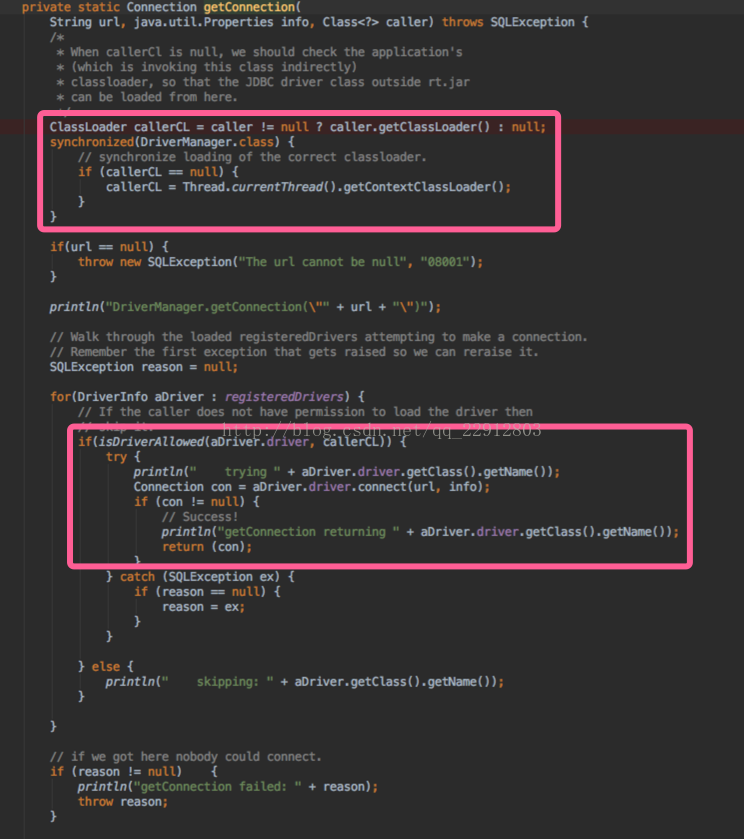
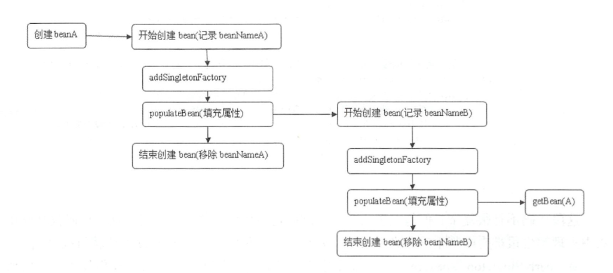

# **spring** 源码日志

**JAVA类加载流程**

-  **Bootstrap ClassLoader**  （是由C++编写的-- 虚拟机的一部分）最顶层的加载类，主要加载核心类库，%JRE_HOME%\lib下的rt.jar、resources.jar、charsets.jar和class等
- **ExtClassLoader** 扩展的类加载器，加载目录%JRE_HOME%\lib\ext目录下的jar包和class文件
- **AppClassLoader**  **也称为SystemAppClass** 加载当前应用的classpath的所有类

```java
ClassLoader c = Test.class.getClassLoader();  //获取Test类的类加载器
System.out.println(c); 
ClassLoader c1 = c.getParent();  //获取c这个类加载器的父类加载器
System.out.println(c1);
ClassLoader c2 = c1.getParent();//获取c1这个类加载器的父类加载器
System.out.println(c2); // Bootstrap ClassLoader 不是java的写所以为 null
System.out.println(ClassUtils.getDefaultClassLoader());//spring 加载的
// BootstrapClassLoader 加载目录
String[] files = System.getProperty("sun.boot.class.path").split(";");
Arrays.asList(files).forEach(System.out::println);
// ExtClassLoader  加载目录
String[] extFiles = System.getProperty("java.ext.dirs").split(";");
Arrays.asList(extFiles).forEach(System.out::println); 
// AppClassLoader  加载目录
String[] appFiles = System.getProperty("java.class.path").split(";");
Arrays.asList(appFiles).forEach(System.out::println); 
```

**ClassLoader双亲委派加载源码**

1. 当AppClassLoader加载一个class时，它首先不会自己去尝试加载这个类，而是把类加载请求委派给父类加载器ExtClassLoader去完成。

2. 当ExtClassLoader加载一个class时，它首先也不会自己去尝试加载这个类，而是把类加载请求委派给BootStrapClassLoader去完成。

3. 如果BootStrapClassLoader加载失败（例如在$JAVA_HOME/jre/lib里未查找到该class），会使用ExtClassLoader来尝试加载。

4. 若ExtClassLoader也加载失败，则会使用AppClassLoader来加载，如果AppClassLoader也加载失败，则会报出异常ClassNotFoundException。

**ClassLoader类的loadClass方法：** 

​	委托是从下向上（app--ext--boot）具体查找过程却是自上至下 findClass()

   ```java
   protected synchronized Class<?> loadClass(String name, boolean resolve) throws ClassNotFoundException {
       // First, check if the class has already been loaded
       // 首先找缓存（findLoadedClass）
       Class c = findLoadedClass(name);
       if (c == null) {
           try {
               if (parent != null) {
                   // 用parent来递归的loadClass -- (AppClassLoader)
                   c = parent.loadClass(name, false);
               } else {
                   // ExtClassLoader并没有设置parent 
                   // 使用BootStrapClassLoader来加载class
                   c = findBootstrapClassOrNull(name);
               }
           } catch (ClassNotFoundException e) {
               // ClassNotFoundException thrown if class not found
               // from the non-null parent class loader
           }
           if (c == null) {
               // If still not found, then invoke findClass in order
               // to find the class.
               // 这个是先从 BootStrapClassLoader查找
               // 然后到 ExtClassLoade
               // 最后到 AppClassLoader
               c = findClass(name);
           }
       }
       if (resolve) {
           resolveClass(c);
       }
       return c;
   }
   ```

**为什么使用双亲委派机制：**

​	双亲委派机制是为了安全而设计的，比如我可以自定义一个java.lang.Integer类来覆盖jdk中默认的Integer类，破坏应用程序的正常进行。使用双亲委派机制的话该Integer类永远不会被调用，以为委托BootStrapClassLoader加载后会加载JDK中的Integer类而不会加载自定义的Integer类 	

**contextClassLoader**：

​	每一个线程都有一个相关联的ClassLoader，默认是AppClassLoader

​	主要解决一些类似于spi的服务，常见的就是jdbc 。jdbc接口在%JRE_HOME%\lib下的rt.jar，而实现类在 classpath下面 。

​	在rt.jar里面的DriverManager想使用具体的实现类 ，但它是有BootStrapClassLoader加载的，而具体的实现类是由AppClassLoader加载的 ，根据隔离原则，DriverManager中是访问不到mysql具体方法的。

​	解决使用contextClassLoader 去获取 AppClassLoader 就可以直接访问mysql类了

​	这其实打破了类的委托机制，这种机制普遍存在于好多第三方的工具中，如tomcat、spring中

 **总结：就是加载的时候**

​	0.解決問題：在java.sql.DriverManager类(在rt.jar里面)里需要加载具体实现类

​	1.使用Thread.currentThread().getContextClassLoader() 当前线程的AppClassLoader去加载

​    2.或者使用SPI ServiceLoader 去加载 

**SPI:**

指定的目录META-INF/services/下加载配置文件

文件名为要加载的服务类的全限定类名

文件的内容为：服务类对应的实现类全限定名

**DriverManager类的getConnection方法**：



​	


----------------------------------------------------------------------------------------------------------------------------------------------------------------

**加载文件时使用以下代码：** 

```java
Resource resource= new ClassPathResource("beanFactoryTest.xml");
InputStream inputStream = resource.getInputStream();
```

 **profile 属性的使用：**

```xml
<?xml version="1.0" encoding="UTF-8"?>
<beans xmlns="http://www.springframework.org/schema/beans"
       xmlns:xsi="http://www.w3.org/2001/XMLSchema-instance"
       xsi:schemaLocation="http://www.springframework.org/schema/beans
       http://www.springframework.org/schema/beans/spring-beans.xsd">
	<beans prfile="dev">
	</beans> 
    <beans prile="pro">
	</beans> 
    <bean id="myTestBean" name ="one,testBean,testBean2" class="com.qin.start.bean.MyTestBean" >
        <meta key="1" value="2"/>
    </bean>
</beans>
```

```xml
<context-param> 
    <param-name>spring.profile.active</param-name> 
    <param-value>dev</param-value> 
</context-param> 
```

**manualSingletonNames 存储手动注册的bean :**

```java
xmlBeanFactory.registerSingleton("myDog", new Dog());
```


### AbstractBeanFactory.doGetBean()   方法

```java
protected <T> T doGetBean(final String name, @Nullable final Class<T> requiredType,
                              @Nullable final Object[] args, boolean typeCheckOnly) throws BeansException {
        // 转换对应 beanName 
		// 传人的参数 name 参数除了正常的面层，也有可能是别名和 FactoryBean
    	// 和originalBeanName(name);区别是这里获取到的可能是别名
     	/*
         * 通过 name 获取 beanName。这里不使用 name 直接作为 beanName 有两点原因：
         * 1. name 可能会以 & 字符开头，表明调用者想获取 FactoryBean 本身，而非 FactoryBean 
         *    实现类所创建的 bean。在 BeanFactory 中，FactoryBean 的实现类和其他的 bean 存储
         *    方式是一致的，即 <beanName, bean>，beanName 中是没有 & 这个字符的。所以我们需要
         *    将 name 的首字符 & 移除，这样才能从缓存里取到 FactoryBean 实例。
         * 2. 若 name 是一个别名，则应将别名转换为具体的实例名，也就是 beanName。
         */
        final String beanName = transformedBeanName(name);
        Object bean;
		
        // Eagerly check singleton cache for manually registered singletons.
        // 尝试从缓存中 singletonObjects 加载单例    
    	// 如果加载不成功则再次尝试从 earlySingletonObjects 中加载 （循环依赖中的提前加载）
    	// 最后尝试从 singletonFactories 中加载获取提前曝光的 ObjectFactory  
    	// 因为在创建单例 bean 的时候会存在依赖注入的情况，而在创建依赖的时候为了避免循环依赖，
    	// 在 Spring 中创建 bean 的原则是不等 bean 创建完成就会将创建 bean 的 ObjectFactory 
        // 提早曝光加入到缓存中，一旦下一个 bean 创建时候需要依赖上一个 bean 则直接使用ObjectFactory
        Object sharedInstance = getSingleton(beanName);
        if (sharedInstance != null && args == null) {
            if (logger.isDebugEnabled()) {
                if (isSingletonCurrentlyInCreation(beanName)) {
                    logger.debug("Returning eagerly cached instance of singleton bean '" + beanName +
                            "' that is not fully initialized yet - a consequence of a circular reference");
                }
                else {
                    logger.debug("Returning cached instance of singleton bean '" + beanName + "'");
                }
            }
      		// 此处获取的可能是bean,
            // 也可能是FactoryBean (实现了FactoryBean的bean) 
            // name 都是 & 开头的
            // 需要对FactoryBean#getObject（）方法所返回的进行处理，得到bean
            // 
            // 当这里是有FactoryBean#getObject获取bean的时候会
            // 如果非提前加载还会调用beanPostProcess的后置处理方法
            bean = getObjectForBeanInstance(sharedInstance, name, beanName, null);
        }

        else {
            // Fail if we're already creating this bean instance:
            // We're assumably within a circular reference.
            // 这里只是证明非单例的循环依赖问题
            // 当前线程如果存在正在创建的bean 则证明这里存在循环依赖的问题
            // 如果存在 A 中有 B 的属性， B 中有 A 的属性， 
            // 那么当依赖注入的时候，就会产生当 A 还未创建完的时候因为对于 B 的创建再次返回创建 A,
            // 造成循环依赖，也就是情况： isPrototypeCurrentlyInCreation(beanName）判断 true
            // 通过prototypesCurrentlyInCreation 这个属性判断
            if (isPrototypeCurrentlyInCreation(beanName)) {
                // 当前线程正在创建多例的 bean 就会报错
                throw new BeanCurrentlyInCreationException(beanName);
            }

            // Check if bean definition exists in this factory.
            // 先检查父类容器 有没有 bean 实例
            BeanFactory parentBeanFactory = getParentBeanFactory();
            // 存在父类容器，且当前容器不包含BeanDefintion信息
            if (parentBeanFactory != null && !containsBeanDefinition(beanName)) {
                // Not found -> check parent.
                // 获取原始bean的名称
                String nameToLookup = originalBeanName(name);
                // 递归到BeanFactory查找
                if (parentBeanFactory instanceof AbstractBeanFactory) {
                    return ((AbstractBeanFactory) parentBeanFactory).doGetBean(
                            nameToLookup, requiredType, args, typeCheckOnly);
                }
                else if (args != null) {
                    // Delegation to parent with explicit args.
                    return (T) parentBeanFactory.getBean(nameToLookup, args);
                }
                else {
                    // No args -> delegate to standard getBean method.
                    return parentBeanFactory.getBean(nameToLookup, requiredType);
                }
            }

            if (!typeCheckOnly) {
                // 标记为正在创建 -- alreadyCreated 这个属性标记这个name已经创建了
                // 顺便清空存储RootBeanDefinition 的 mergedBeanDefinitions 
                markBeanAsCreated(beanName);
            }

            try {
                // 将存储 XML 配置文件的 GernericBeanDefinition 转换为 RootBeanDefinition 
                // 合并相关的的父类属性（如果存在）
                // 因为后续所有的bean都是针对于 RootBeanDefinition 处理 
                // 下面是配置了相关父类属性的配置	
                /*
                <bean id="hello" class="xyz.coolblog.innerbean.Hello">
                    <property name="content" value="hello"/>
                </bean>

                <bean id="hello-child" parent="hello">
                    <property name="content" value="I`m hello-child"/>
                </bean> 
				*/
                // hello-child 未配置 class 属性，这里我们让它继承父配置中的 class 属性
                
                final RootBeanDefinition mbd = getMergedLocalBeanDefinition(beanName);
                // 检查 RootBeanDefinition 是不是抽象类
                checkMergedBeanDefinition(mbd, beanName, args);

                // Guarantee initialization of beans that the current bean depends on.
                // dependsOn 依赖关系先解决
                String[] dependsOn = mbd.getDependsOn();
                if (dependsOn != null) {
                    for (String dep : dependsOn) {
                        // 判断循环依赖的问题
                        /*
                         * 检测是否存在 depends-on 循环依赖，若存在则抛异常。比如 A 依赖 B，
                         * B 又依赖 A，他们的配置如下：
                         *   <bean id="beanA" class="BeanA" depends-on="beanB">
                         *   <bean id="beanB" class="BeanB" depends-on="beanA">
                         *   
                         * beanA 要求 beanB 在其之前被创建，但 beanB 又要求 beanA 先于它
                         * 创建。这个时候形成了循环，对于 depends-on 循环，Spring 会直接
                         * 抛出异常
                     	*/
                        if (isDependent(beanName, dep)) {
                            throw new BeanCreationException(mbd.getResourceDescription(), beanName,
                                    "Circular depends-on relationship between '" + beanName + "' and '" + dep + "'");
                        }
                        // 标记依赖的注册关系
                        // dependentBeanMap 存放 dep - beanName <set> 集合
                        // dependenciesForBeanMap  存放 beanName - dep <set> 集合
                        registerDependentBean(dep, beanName);
                        try {
                            // 递归 getBean 获取实例
                            getBean(dep);
                        }
                        catch (NoSuchBeanDefinitionException ex) {
                            throw new BeanCreationException(mbd.getResourceDescription(), beanName,
                                    "'" + beanName + "' depends on missing bean '" + dep + "'", ex);
                        }
                    }
                }

                // Create bean instance.
                // 针对scope= singleton（默认）创建bean
                if (mbd.isSingleton()) {
                    /*
                     * 这里并没有直接调用 createBean 方法创建 bean 实例，而是通过 
                     * getSingleton(String, ObjectFactory) 方法获取 bean 实例。
                     * getSingleton(String, ObjectFactory) 方法会在内部调用 
                     * ObjectFactory 的 getObject() 方法创建 bean，并会在创建完成后，
                     * 将 bean 放入缓存中。
                     */
                    sharedInstance = getSingleton(beanName, () -> {
                        try {
                            Object result = createBean(beanName, mbd, args);
                            return result;
                        }
                        catch (BeansException ex) {
                            // Explicitly remove instance from singleton cache: It might have been put there
                            // eagerly by the creation process, to allow for circular reference resolution.
                            // Also remove any beans that received a temporary reference to the bean.
                            destroySingleton(beanName);
                            throw ex;
                        }
                    });
                    bean = getObjectForBeanInstance(sharedInstance, name, beanName, mbd);
                }
				// 针对scope= prototype 创建bean
                else if (mbd.isPrototype()) {
                    // It's a prototype -> create a new instance.
                    Object prototypeInstance = null;
                    try {
                        beforePrototypeCreation(beanName);
                        prototypeInstance = createBean(beanName, mbd, args);
                    }
                    finally {
                        afterPrototypeCreation(beanName);
                    }
                    bean = getObjectForBeanInstance(prototypeInstance, name, beanName, mbd);
                }

                else {
                    // 针对scope= 其他 （request之类的） 创建bean
                    String scopeName = mbd.getScope();
                    final Scope scope = this.scopes.get(scopeName);
                    if (scope == null) {
                        throw new IllegalStateException("No Scope registered for scope name '" + scopeName + "'");
                    }
                    try {
                        Object scopedInstance = scope.get(beanName, () -> {
                            beforePrototypeCreation(beanName);
                            try {
                                return createBean(beanName, mbd, args);
                            }
                            finally {
                                afterPrototypeCreation(beanName);
                            }
                        });
                        bean = getObjectForBeanInstance(scopedInstance, name, beanName, mbd);
                    }
                    catch (IllegalStateException ex) {
                        throw new BeanCreationException(beanName,
                                "Scope '" + scopeName + "' is not active for the current thread; consider " +
                                        "defining a scoped proxy for this bean if you intend to refer to it from a singleton",
                                ex);
                    }
                }
            }
            catch (BeansException ex) {
                cleanupAfterBeanCreationFailure(beanName);
                throw ex;
            }
        }

        // Check if required type matches the type of the actual bean instance.
    	// 类型转换 
    	// 可能会存在这样的情况，返回的 bean 其实是个 String，
    	// 但是 requiredType 却传人 Integer 类型，那么这时候本步骤就会起作用了
        if (requiredType != null && !requiredType.isInstance(bean)) {
            try {
                T convertedBean = getTypeConverter().convertIfNecessary(bean, requiredType);
                if (convertedBean == null) {
                    throw new BeanNotOfRequiredTypeException(name, requiredType, bean.getClass());
                }
                return convertedBean;
            }
            catch (TypeMismatchException ex) {
                if (logger.isDebugEnabled()) {
                    logger.debug("Failed to convert bean '" + name + "' to required type '" +
                            ClassUtils.getQualifiedName(requiredType) + "'", ex);
                }
                throw new BeanNotOfRequiredTypeException(name, requiredType, bean.getClass());
            }
        }
        return (T) bean;
    }
```

总体步骤：

1. 转换对应 beanName 
2. 尝试从缓存中加载单例
3. bean 的实例化
4. 原型模式的依赖检查 （isPrototypeCurrentlyInCreation）
5. 检测 parentBeanFactory
6. 将存储 XML 配置文件的 GernericBeanDefinition 转换为 RootBeanDefinition
7. 寻找依赖（dependsOn）
8. 针对不同的 scope 进行 bean 的创建
9. 类型转换


### 缓存中获取单例 bean

```java
public Object getSingleton(String beanName) {
    // 参数 true 设置标识允许早期依赖 
	return getSingleton(beanName, true);
}
protected Object getSingleton(String beanName, boolean allowEarlyReference) {
   		// 检查缓存中是否存在--之前已经创建过了--一级缓存
		Object singletonObject = this.singletonObjects.get(beanName);
		if (singletonObject == null && isSingletonCurrentlyInCreation(beanName)) {
            // 如果为空，则锁定全局变量并进行处理
			synchronized (this.singletonObjects) {
                // 再从 earlySingletonObjects 里面获取  --二级缓存
				singletonObject = this.earlySingletonObjects.get(beanName);
				if (singletonObject == null && allowEarlyReference) {
                    // 尝试从 singletonFactories 里面获取 beanName 对应的 ObjectFactory
                    // 某些方法初始化前，会调用： addSingletonFactory方法将对应的
                    // 将ObjectFactory存储在singletonFactories中
                    // 三级缓存
					ObjectFactory<?> singletonFactory = this.singletonFactories.get(beanName);
					if (singletonFactory != null) {
                        // 调用预先的getObject方法
                        // 实际调用getEarlyBeanReference(beanName, mbd, bean)方法
						singletonObject = singletonFactory.getObject();
                        // 记录缓存中--earlySingletonObjects和singletonFactories互斥的
						this.earlySingletonObjects.put(beanName, singletonObject);
						this.singletonFactories.remove(beanName);
					}
				}
			}
		}
		return singletonObject;
	}


```


- singletonObjects：用于保存 BeanName 和创建 bean 实例之间的关系， bean name -> beaninstance
-  singletonFactories ：用于保存 BeanName 和创建 bean 的工厂之间的关系，bean name -> ObjectFactory
- earlySingletonObjects ：也是保存 BeanName 和创建 bean 实例之间的关系，与 singletonObjects 的不同之处在于，当一个单例 bean 被放到这里面后，那么当 bean 还在创建过程中，就可以通过 getBean 方法获取到了，其目的是用来检测循环引用 。( earlySingletonObjects 与 singletonFactories  互斥 )
-  registeredSingletons：用来保存当前所有巳注册的 bean


### 创建bean的过程

```java
// 刚开始的getBean() - doGetBean() - 单例模式的创建bean 
1. AbstractBeanFactory.doGetBean()
if (mbd.isSingleton()) {
    sharedInstance = getSingleton(beanName, () -> {
        try {
            return createBean(beanName, mbd, args);
        }
        catch (BeansException ex) {
       // Explicitly remove instance from singleton cache: It might have been put there
	   // eagerly by the creation process, to allow for circular reference resolution.
	   // Also remove any beans that received a temporary reference to the bean.
            destroySingleton(beanName);
            throw ex;
        }
    });
    bean = getObjectForBeanInstance(sharedInstance, name, beanName, mbd);
}

//DefaultSingletonBeanRegistry.getSingleton() -> 上面的 createBean(beanName, mbd, args);  
2.AbstractAutowireCapableBeanFactory.createBean () 
    // 解析Class-- ClassUtils.getDefaultClassLoader()
    // Thread.currentThread().getContextClassLoader()
    // AppClassLoader
	Class<?> resolvedClass = resolveBeanClass(mbd, beanName);
	
	//Prepare method overrides.
	// 存在methodOverrides--存在 lookup-method 和 replace-method 
	// 如果一个类中存在若干个重载方法
	// 增强的时候还需要根据参数类型进行匹配
	// 如果当前类中的方法只有一个，那么需要被替换的的方法没有被重载
	// 后续调用的时候便可以直接使用找到的方法，而不需要进行方法的参数匹配验证了
	mbdToUse.prepareMethodOverrides();

    
//Give BeanPostProcessors a chance to return a proxy instead of the target bean instance 
//这里改变原始的bean变成代理的bean  
//将 AbsractBeanDefinition 转换为 BeanWrapper 前的处理
//子类一个修改 BeanDefinition 的机会
    
//实现BeanPostProcessor的实现类注册到IOC中
//所有的bean都经过bean的后置处理器BeanPostProcessor 
//分别在bean的初始化前后对bean对象提供自己的实例化逻辑
//postProcessAfterInitialization：初始化之后对bean进行增强处理
//postProcessBeforeInitialization：初始化之前对bean进行增强处理
   

//AbstractAutowireCapableBeanFactory.applyBeanPostProcessorsBeforeInstantiation 
//InstantiationAwareBeanPostProcessor.postProcessBeforeInstantiation   
    
//AbstractAutowireCapableBeanFactory.applyBeanPostProcessorsAfterInitialization
//BeanPostProcessors.postProcessAfterInitialization  

// 这里改变原始的bean变成代理的bean 
3.Object bean = resolveBeforeInstantiation(beanName, mbdToUse);
    // 如果返回的代理bean不等于null直接返回--不进行原始bean的创建
    // 我们熟知的 AOP 功能就是基于这里的判断的
    if (bean != null) {
        return bean;
    }

	// 对处理器中的所有 lnstantiationAwareBeanPostProcessor 类型的后处理器进行 
	// postProcessBeforelnstantiation 方法 和
	// BeanPostProcessor.postProcessAfterInitialization 方法的调用 
	
	// 经过applyBeanPostProcessorsBeforeInstantiation处理的bean
	// 可能有可能已经不是我们认为的 bean 了, 或许是一个经过处理的代理 bean，
	// 可能是通过 cglib 生成的，也可能是通过其他技术生成的
    bean = applyBeanPostProcessorsBeforeInstantiation(targetType, beanName);
    if (bean != null) {
        // spring 到这里已经不会再去创建bean了
        // 所以要保证BeanPostProcessor.postProcessAfterInitialization 方法的调用
        // 只能在这里处理了
        bean = applyBeanPostProcessorsAfterInitialization(bean, beanName);
    }
	return bean;


// 常规创建bean就是在doCreateBean里面完成--后面讲解
4.Object beanInstance = doCreateBean(beanName, mbdToUse, args);   
    
```


### FactoryBean 的使用

**当配置文件中＜bean＞的 class 属性配置的实现类是 FactoryBean 时，通过 getBean（）方法法返回的不是 FactoryBean 本身，而是 FactoryBean#getObject() 方法所返回的对象相当于  FactoryBean#getObject（）  代理了 getBean（）方法**

```java
public class CarFactoryBean implements FactoryBean<Car> {

    private String info;

    public void setInfo(String info) {
        this.info = info;
    }

    @Override
    public Car getObject() throws Exception {
        String[] infos = StringUtils.tokenizeToStringArray(info, ",");
        Car car = new Car();
        if (infos.length >= 3) {
            car.setBrand(infos[0]);
            car.setMaxSpeed(Integer.valueOf(infos[1]));
            car.setPrice(Double.valueOf(infos[2]));
        }
        return car;
    }

    @Override
    public boolean isSingleton() {
        return false;
    }

    @Override
    public Class<?> getObjectType() {
        return Car.class;
    }
}
```

```xml
<bean id="car" class="com.qin.demo.bean.CarFactoryBean">
    <property name="info" value="超级跑车,400,200000"></property>
</bean>
```

**当调用 getBean("car")时， Spring 通过反射机制发现 CarFactoryBean实现了 FactoryBean 的接口，这时 Spring 容器就调用接口方法 CarFactoryBean#getObject（）方法返回。 如果希望获取 CarFactoryBean 的实例，则需要在使用 getBean(beanName） 方法时在 beanName 前显示的加上 ”＆”前缀，例如 getBean（"＆car"）**


### 循环依赖

**spring 容器中只处理单例的 setter 循环依赖**

**对于构造器依赖和 prototype 范围的依赖不进行处理，直接抛出 BeanCurrentlyInCreationException**

**对于prototype 作用域的bean,spring无法完成依赖注入，因为 spring不缓存prototype 范围的bean**

**所以spring无法提前暴露创建中的bean**

**Setter 注入造成的依赖是通过 Spring 容器 提前暴露刚完成构造器注入但未完成其他步骤（如 setter 注入）的 bean 来完成的。通过提前暴露一个单例工厂方法，从而使其他 bean 能引用到 该 bean**

代码：在AbstractAutowireCapableBeanFactory.doCreateBean里面

```java
addSingletonFactory(beanName, () -> getEarlyBeanReference(beanName, mbd, bean));
```

**对于singleton作用域的bean可以通过beanFactory.setAllowCircularReferences(false);来禁止循环引用**


 prototype 范围和其他范围 的依赖通过 **prototypesCurrentlyInCreation** 池去判断

```java
/** Names of beans that are currently in creation */
private final ThreadLocal<Object> prototypesCurrentlyInCreation =
    new NamedThreadLocal<>("Prototype beans currently in creation");

// 在创建prototype和其他范围的依赖时都调用
beforePrototypeCreation(beanName);
afterPrototypeCreation(beanName);

//判断：当前线程内有没有构造器依赖和 prototype 范围的依赖
isPrototypeCurrentlyInCreation(String beanName)
```

singleton 范围的 有一个参数 **singletonsCurrentlyInCreation** 通过这个参数判断

```java
boolean earlySingletonExposure =
   mbd.isSingleton() && 
   this.allowCircularReferences &&
   isSingletonCurrentlyInCreation(beanName);
// 在DefaultSingletonBeanRegistry.isSingletonCurrentlyInCreation()
isSingletonCurrentlyInCreation(beanName) 判断是否提前加载

//在getSingleton()方法里
/** Names of beans that are currently in creation */
private final Set<String> singletonsCurrentlyInCreation =
    Collections.newSetFromMap(new ConcurrentHashMap<>(16));

beforeSingletonCreation(beanName);
afterSingletonCreation(beanName);

/**
 * singletonFactories 和 earlySingletonObjects 组成bean池
 * 两个是互斥的 
 * singletonFactories.getBean() 方法后
 * 删除自身 然后放到 earlySingletonObjects 里
 */

addSingletonFactory(beanName, () -> getEarlyBeanReference(beanName, mbd, bean));

// addSingletonFactory
protected void addSingletonFactory(String beanName, ObjectFactory<?> singletonFactory) {
    Assert.notNull(singletonFactory, "Singleton factory must not be null");
    synchronized (this.singletonObjects) {
        if (!this.singletonObjects.containsKey(beanName)) {
            this.singletonFactories.put(beanName, singletonFactory);
            this.earlySingletonObjects.remove(beanName);
            this.registeredSingletons.add(beanName);
        }
    }
}

```


 构造器依赖：

- Spring 容器创建"testA"  bean 之前，首先 beforeSingletonCreation(beanName); "**当前创建 bean 池 （singletonsCurrentlyInCreation）**" add()操作查看是否可以添加，不能操作，证明存在循环依赖，当前如果没发现，使用构造器实例化 "testA" ，在获取构造器参数的时候，发现需要构造器参数"testB" 
- Spring 容器创建"testB"  bean 之前，首先 beforeSingletonCreation(beanName); "**当前创建 bean 池 （singletonsCurrentlyInCreation）**" add()操作查看是否可以添加，不能操作，证明存在循环依赖，当前如果没发现，使用构造器实例化 "testB" ，在获取构造器参数的时候，发现需要构造器参数"testC"  
- Spring 容器创建"testC"  bean 之前，首先 beforeSingletonCreation(beanName); "**当前创建 bean 池 （singletonsCurrentlyInCreation）**" add()操作查看是否可以添加，不能操作，证明存在循环依赖，当前如果没发现，使用构造器实例化 "testC" ，在获取构造器参数的时候，发现需要构造器参数"testA"  
- 到此为止 Spring 容器要去创建"testA" bean，发现该 bean 标识符在"**当前创建 bean 池（singletonsCurrentlyInCreation）**"中，因为表示循环依赖，抛出 BeanCurrently InCreationException

setter 循环依赖：

- Spring 容器创建单例"testA" bean ，首先根据**无参构造器**创建 bean，并暴露一个"ObjectFactory" 用于返回一个提前暴露一个创建中的 bean，并将"testA"标识符放到"**当前创建 bean 池**", 然后进行 setter 注入"testB"
- addSingletonFactory （放入三级缓存 singletonFactories--提前暴露一个ObjectFactory）  ->  populateBean(beanName, mbd, instanceWrapper) 属性注入
- Spring 容器创建单例"testB" bean ，首先根据**无参构造器**创建 bean，并暴露一个"ObjectFactory" 用于返回一个提前暴露一个创建中的 bean，并将"testB"标识符放到"**当前创建 bean 池**", 然后进行 setter 注入"testC"
- addSingletonFactory （放入三级缓存 singletonFactories--提前暴露一个ObjectFactory）  ->  populateBean(beanName, mbd, instanceWrapper) 属性注入
- Spring 容器创建单例"testC" bean ，首先根据**无参构造器**创建 bean，并暴露一个"ObjectFactory" 用于返回一个提前暴露一个创建中的 bean，并将"testC"标识符放到"**当前创建 bean 池**", 然后进行 setter 注入"testA"
- addSingletonFactory （放入三级缓存 singletonFactories--提前暴露一个ObjectFactory）  ->  populateBean(beanName, mbd, instanceWrapper) 属性注入
- 进行注入" testA" 时由于提前暴露了"ObjectFactory" 工厂，从而使用它返回提前暴露的ObjectFactory。
- getBean(A)时将自己从三级缓存 singletonFactories 移动到二级缓存中 earlySingletonObjects 中--无参构造实例化--没有属性赋值
-  "testC" 在 setter 注入 getBean(A)获取到的 bean--这是 "testA" 在二级缓存中, 将自己放到一级缓存中，并删除2级和3级缓存
- 接着 "testB" setter 注入一级缓存中的 "testC" ，完成之后 将自己放到一级缓存中，并删除2级和3级缓存
- 最后"testA".从一级缓存里获取到  "testB" 并setter 注入

对于prototype 作用域的依赖：

- 对于"prototype" 作用域的bean ,Spring 容器无法完成依赖注入，因为Spring 不缓存 "prototype" 作用域的bean ，因此无法提前暴露一个创建中的bean




1. 创建A（工厂方法--实例工厂和静态工厂，构造函数实例化--无参构造和有参构造， 通过实例提供者实例化--Spring5新增的实例化策略）
2. 创建A的时候将 beanName和 beanA的工厂类加入缓存中
3. 对A的属性调用populateBean 填充时，递归创建B  
4. 创建B（工厂方法--实例工厂和静态工厂，构造函数实例化--无参构造和有参构造， 通过实例提供者实例化--Spring5新增的实例化策略）
5. 同样的B中存在A属性 ，在实例化B 填充 属性时 （populateBean ）getBean(A)
6. 获取到 没有填充任何属性的 A  （A 还在创建中）
7. 因为 A 与 B 中的 A 所表示的属性地址是一样的， 所以在 A 中创建好的属性填充自然可以通过 B 中的 A 获取，这样就解决了循环依赖的问题。


### 创建 bean

经历过 resolveBeforelnstantiation 方法后，程序有两个选择  ，如果创建 了代理或者说重写了 InstantiationAwareBeanPostProcessor 的 postProcessBeforelnstantiation 方法并在方法 postProcessBeforelnstantiation 中改变了 bean 则直接返回就可以了 ， 否则需要进行常规 bean 的创建。 而 这常规 bean 的创建就是在 doCreateBean 中完成的

```java
protected Object doCreateBean(final String beanName, final RootBeanDefinition mbd, final @Nullable Object[] args)
			throws BeanCreationException {

		// Instantiate the bean.
		BeanWrapper instanceWrapper = null;
		if (mbd.isSingleton()) {
			instanceWrapper = this.factoryBeanInstanceCache.remove(beanName);
		}
		if (instanceWrapper == null) {
            //根据指定bean使用对应的策略创建新的实例 
            //实例化 bean ，将 BeanDefinition 转换为 BeanWrapper
            //转换是一个复杂的过程 如：工厂方法、构造函数自动注入 、简单初始化 
			instanceWrapper = createBeanInstance(beanName, mbd, args);
		}
		final Object bean = instanceWrapper.getWrappedInstance();
		Class<?> beanType = instanceWrapper.getWrappedClass();
		if (beanType != NullBean.class) {
			mbd.resolvedTargetType = beanType;
		}

		// Allow post-processors to modify the merged bean definition.
    	// 关键的类：AutowiredAnnotationBeanPostProcessor
    
        // AutowiredAnnotationBeanPostProcessor类把正在被spring实例化的
    	// 		bean进行@Autowired和@Value扫描，扫描到类里面属性和方法上面如果有注解，
    	// 		就会把对应的方法或者属性封装起来，最终封装成InjectionMetadata对象。
    	// MergedBeanDefinitionPostProcessor 的应用 
    	// bean 合并后的处理， Autowired 注解正是通过此方法实现诸如类型的预解析。
    	// 先解析属性上的 @Autowired 没有才解析 @value 
        // 后解析方法上的 @Autowired 没有才解析 @value 
   		// 解析：@PostConstruct 和 @PreDestroy
    	
		synchronized (mbd.postProcessingLock) {
			if (!mbd.postProcessed) {
				try {
                    // Autowired 注解正是通过此方法实现诸如类型的预解析
                    //1 . 找到@Autowired 的注解信息放到
                    // this.externallyManagedConfigMembers 和 this.checkedElements 中
					applyMergedBeanDefinitionPostProcessors(mbd, beanType, beanName);
				}
				catch (Throwable ex) {
					throw new BeanCreationException(mbd.getResourceDescription(), beanName,
							"Post-processing of merged bean definition failed", ex);
				}
				mbd.postProcessed = true;
			}
		}

		// Eagerly cache singletons to be able to resolve circular references
		// even when triggered by lifecycle interfaces like BeanFactoryAware.
    	// 是否需要提前曝光：单例&允许循环依赖&当前正在创建中，检查循环依赖
		boolean earlySingletonExposure = (mbd.isSingleton() && this.allowCircularReferences &&
				isSingletonCurrentlyInCreation(beanName));
		if (earlySingletonExposure) {
			if (logger.isDebugEnabled()) {
				logger.debug("Eagerly caching bean '" + beanName +
						"' to allow for resolving potential circular references");
			}
            // 单例提前曝光的都放到这里面 
            // 提前曝光：
            // 1.添加getEarlyBeanReference放到singletonFactories里
            // 2.删除earlySingletonObjects 
            // 3.注册registeredSingletons 
            // 对bean再一次依赖引用，主要应用 SmartInstantiationAwre BeanPost Processor, 
            // 其中我们熟知的 AOP 就是在这里将 advice 动态织入 bean中， 
            // 若没有则直接返回 bean，不做任何处理 
			addSingletonFactory(beanName, () -> getEarlyBeanReference(beanName, mbd, bean));
		}

		// Initialize the bean instance.
		Object exposedObject = bean;
		try {
            // 属性填充
            // BeanDefinitionValueResolver类的resolveValueIfNecessary方法
            // 里面调用 valueResolver.resolveValueIfNecessary(pv, originalValue);
            // 调用依赖的bean
			populateBean(beanName, mbd, instanceWrapper);
            
             /*
             * 进行余下的初始化工作，详细如下：
             * 1. 判断 bean 是否实现了 BeanNameAware、BeanFactoryAware、
             *    BeanClassLoaderAware 等接口，并执行接口方法
             * 2. 应用 bean 初始化前置操作
             * 3. 如果 bean 实现了 InitializingBean 接口，则执行 afterPropertiesSet 
             *    方法。如果用户配置了 init-method，则调用相关方法执行自定义初始化逻辑
             * 4. 应用 bean 初始化后置操作
             * 
             * 另外，AOP 相关逻辑也会在该方法中织入切面逻辑，此时的 exposedObject 就变成了
             * 一个代理对象了
             */
            // 调研始化方法，比如 init- method 
            
			exposedObject = initializeBean(beanName, exposedObject, mbd);
		}
		catch (Throwable ex) {
			if (ex instanceof BeanCreationException && beanName.equals(((BeanCreationException) ex).getBeanName())) {
				throw (BeanCreationException) ex;
			}
			else {
				throw new BeanCreationException(
						mbd.getResourceDescription(), beanName, "Initialization of bean failed", ex);
			}
		}

		if (earlySingletonExposure) {
			Object earlySingletonReference = getSingleton(beanName, false);
            // earlySingletonReference 只有在检测到有循环依赖的忻况下才会不为空 
			if (earlySingletonReference != null) {
                // 如果 exposedObject 没有在初始化方法中被改变，也就是没有被增强 
                // 主要是这个方法有没有被增强
                // applyBeanPostProcessorsBeforeInitialization(wrappedBean, beanName);
                // applyBeanPostProcessorsAfterInitialization(wrappedBean, beanName);
               	
				if (exposedObject == bean) {
					exposedObject = earlySingletonReference;
				}
				else if (!this.allowRawInjectionDespiteWrapping && hasDependentBean(beanName)) {
					String[] dependentBeans = getDependentBeans(beanName);
					Set<String> actualDependentBeans = new LinkedHashSet<>(dependentBeans.length);
					for (String dependentBean : dependentBeans) {
                        // 增强后的没有的依赖没有创建就 add 
						if (!removeSingletonIfCreatedForTypeCheckOnly(dependentBean)) {
							actualDependentBeans.add(dependentBean);
						}
					}
                    /*  增强后存在循环依赖的问题
                     *  因为 bean 创建后其所依赖的 bean 一定是已经创建的， 
                     *  actualDependentBeans  不为空则表示
                     *  当前 bean 创建后其依赖的 bean 却没有没全部创建完，
                     *  也就是说存在循环依赖
                     */
					if (!actualDependentBeans.isEmpty()) {
						throw new BeanCurrentlyInCreationException(beanName,
								"Bean with name '" + beanName + "' has been injected into other beans [" +
								StringUtils.collectionToCommaDelimitedString(actualDependentBeans) +
								"] in its raw version as part of a circular reference, but has eventually been " +
								"wrapped. This means that said other beans do not use the final version of the " +
								"bean. This is often the result of over-eager type matching - consider using " +
								"'getBeanNamesOfType' with the 'allowEagerInit' flag turned off, for example.");
					}
				}
			}
		}

		// Register bean as disposable.
		try {
            // 根据 scopse 注册 bean （注册销毁方法）
			registerDisposableBeanIfNecessary(beanName, bean, mbd);
		}
		catch (BeanDefinitionValidationException ex) {
			throw new BeanCreationException(
					mbd.getResourceDescription(), beanName, "Invalid destruction signature", ex);
		}

		return exposedObject;
	}
```

createBeanInstance ：使用适当的实例化策略为指定的bean创建一个新实例:工厂方法、构造函数自动装配或简单实例化

```java
/**
  * 使用适当的实例化策略为指定的bean创建一个新实例:工厂方法、构造函数自动装配或简单实例化。
  *
  * @param beanName bean的名称
  * @param mbd      bean的bean定义
  * @param args     用于构造函数或工厂方法调用的显式参数
  * @return 新实例的BeanWrapper
  * @see #obtainFromSupplier
  * @see #instantiateUsingFactoryMethod
  * @see #autowireConstructor
  * @see #instantiateBean
  */
protected BeanWrapper createBeanInstance(String beanName, RootBeanDefinition mbd, @Nullable Object[] args) {
		// Make sure bean class is actually resolved at this point.
    	// 确保此时bean类已经被解析。
		Class<?> beanClass = resolveBeanClass(mbd, beanName);
		// 检测beanClass是不是公共的，是否允许非公共访问的构造器和方法
		if (beanClass != null && !Modifier.isPublic(beanClass.getModifiers()) && !mbd.isNonPublicAccessAllowed()) {
			throw new BeanCreationException(mbd.getResourceDescription(), beanName,
					"Bean class isn't public, and non-public access not allowed: " + beanClass.getName());
		}
    	// 通过实例提供者实例化（Spring5新增的实例化策略）
    	// 如果存在 Supplier 回调，则调用 obtainFromSupplier() 进行初始化
		// Spring5.0新增的实例化策略,如果设置了该策略,将会覆盖构造方法和工厂方法实例化策略
		Supplier<?> instanceSupplier = mbd.getInstanceSupplier();
		if (instanceSupplier != null) {
			return obtainFromSupplier(instanceSupplier, beanName);
		}
		// 如果有工厂方法的话,则使用工厂方法实例化bean
		if (mbd.getFactoryMethodName() != null) {
			return instantiateUsingFactoryMethod(beanName, mbd, args);
		}
		
		// Shortcut when re-creating the same bean...
    	// 当创建一个相同的bean时,使用之前保存的快照
    	// 单例模式: IoC容器除了可以获取Bean之外,还能销毁Bean
    	// 		当我们调用xmlBeanFactory.destroyBean(myBeanName,myBeanInstance)
    	// 		销毁bean时,容器是不会销毁已经解析的构造函数快照的,如果再次调用
        // 		xmlBeanFactory.getBean(myBeanName)时,就会使用该策略了 
    	// 原型模式: 对于该模式的理解就简单了
    	//		IoC容器不会缓存原型模式bean的实例
    	// 		当我们第二次向容器索取同一个bean时,就会使用该策略了
    	// 解析构造函数是一个比较消耗性能的步骤，所以采取缓存机制，
    	// 如果已经解析过则,不需要重复解析而是直接从 
    	// RootBeanDefinition 中的属性resolvedConstructorOrFactoryMethod缓存中获取
    	// 否则需要再次解析
    	// resolvedConstructorOrFactoryMethod 存储的就是实例化bean的构造器
    	boolean resolved = false;
		boolean autowireNecessary = false;
		if (args == null) {
			synchronized (mbd.constructorArgumentLock) {
				if (mbd.resolvedConstructorOrFactoryMethod != null) {
					resolved = true;
					autowireNecessary = mbd.constructorArgumentsResolved;
				}
			}
		}
    	// 如果该bean已经被解析过
		if (resolved) {
            // 使用已经解析过的构造函数实例化
			if (autowireNecessary) {
				return autowireConstructor(beanName, mbd, null, null);
			}
            // 使用默认无参构造函数实例化
			else {
				return instantiateBean(beanName, mbd);
			}
		}

		// Candidate constructors for autowiring?
    	// 通过BeanPostProcessors确定需要使用的构造函数
		Constructor<?>[] ctors = determineConstructorsFromBeanPostProcessors(beanClass, beanName);
		if (ctors != null || mbd.getResolvedAutowireMode() == AUTOWIRE_CONSTRUCTOR ||
				mbd.hasConstructorArgumentValues() || !ObjectUtils.isEmpty(args)) {
            // args 显式指定参数 - factory.getBean("cat","美美",3);
			return autowireConstructor(beanName, mbd, ctors, args);
		}

		// No special handling: simply use no-arg constructor.
    	// 无任何的特殊处理,则使用默认的无参构造函数实例化bean
		return instantiateBean(beanName, mbd);
	}
```

从该方法里我们看到了Spring实例化bean的策略:

- **工厂方法（实例工厂和静态工厂）**
- **构造函数实例化（无参构造和有参构造）**
- **通过实例提供者实例化（Spring5新增的实例化策略）**

###  无参构造函数实例化Bean

**instantiateBean(beanName, mbd);**

```java
/**
 * 创建实例使用默认的无参构造器
 */
protected BeanWrapper instantiateBean(final String beanName, final RootBeanDefinition mbd) {
    try {
        Object beanInstance;
        final BeanFactory parent = this;
        // 1、如果权限管理器不为空,需要校验
        if (System.getSecurityManager() != null) {
            beanInstance = AccessController.doPrivileged((PrivilegedAction<Object>) () ->
                                                         getInstantiationStrategy().instantiate(mbd, beanName, parent),
                                                         getAccessControlContext());
        }
        else {
            // 2、获取实例化策略并实例化bean
            // Spring实例化bean的两种策略: CGLIB动态代理来创建对象实例 和 JDK的反射机制
            // 默认：new CglibSubclassingInstantiationStrategy();
            // 如果没有使用方法覆盖(replace-method或lookup-method注入)
            // 则使用反射创建bean的实例,
            // 否则必须使用CGLIB机制
			// if (!bd.hasMethodOverrides()) {}
            beanInstance = getInstantiationStrategy().instantiate(mbd, beanName, parent);
        }
        // 3、实例并初始化BeanWrapper对象
        BeanWrapper bw = new BeanWrapperImpl(beanInstance);
        initBeanWrapper(bw);
        return bw;
    }
    catch (Throwable ex) {
        throw new BeanCreationException(
            mbd.getResourceDescription(), beanName, "Instantiation of bean failed", ex);
    }
}
```

```java
@Override
public Object instantiate(RootBeanDefinition bd, @Nullable String beanName, BeanFactory owner) {
    // Don't override the class with CGLIB if no overrides.
    // 没有使用方法覆盖(replace-method或lookup-method注入)就用JDK反射机制创建实例
    if (!bd.hasMethodOverrides()) {
        Constructor<?> constructorToUse;
        synchronized (bd.constructorArgumentLock) {
            constructorToUse = (Constructor<?>) bd.resolvedConstructorOrFactoryMethod;
            if (constructorToUse == null) {
                final Class<?> clazz = bd.getBeanClass();
                if (clazz.isInterface()) {
                    throw new BeanInstantiationException(clazz, "Specified class is an interface");
                }
                try {
                    if (System.getSecurityManager() != null) {
                        constructorToUse = AccessController.doPrivileged(
                            (PrivilegedExceptionAction<Constructor<?>>) clazz::getDeclaredConstructor);
                    }
                    else {
                        constructorToUse = clazz.getDeclaredConstructor();
                    }
                    bd.resolvedConstructorOrFactoryMethod = constructorToUse;
                }
                catch (Throwable ex) {
                    throw new BeanInstantiationException(clazz, "No default constructor found", ex);
                }
            }
        }
        // JDk反射--构造器 ctor.newInstance(args) 创建实例 args ==null 无参构造器
        return BeanUtils.instantiateClass(constructorToUse);
    }
    else {
        // Must generate CGLIB subclass.
        // 使用cglib增强 -- 无参构造器
        // 
        return instantiateWithMethodInjection(bd, beanName, owner);
    }
}
```

**jdk 反射创建实例**

```java
// jdk 反射创建实例
public static <T> T instantiateClass(Constructor<T> ctor, Object... args) throws BeanInstantiationException {
	Assert.notNull(ctor, "Constructor must not be null");
    // 使构造器可以被访问
    ReflectionUtils.makeAccessible(ctor);
    // 从Spring Boot 2开始，Boot也开始正式支持Kotlin编程，
    // KotlinDetector，Spring5.0新增的类，用于检测Kotlin的存在和识别Kotlin类型
    // 我们可以在创建Spring Boot应用时程序时使用Spring初始化Kotlin
    // 不过Kotlin要在新的Spring 5版本中才得到支持
	return (KotlinDetector.isKotlinType(ctor.getDeclaringClass()) ?
					KotlinDelegate.instantiateClass(ctor, args) : ctor.newInstance(args));
    
```

**cglib创建bean实例：**

```java
/**
 * 动态创建一个实例（实现了lookups和replace的子类）
 */
public Object instantiate(@Nullable Constructor<?> ctor, @Nullable Object... args) {
    // 对类进行增强
    Class<?> subclass = createEnhancedSubclass(this.beanDefinition);
    Object instance;
    if (ctor == null) {
        // 对增强的类进行创建
        instance = BeanUtils.instantiateClass(subclass);
    } else {
        try {
            // 获取增强类的构造器
            Constructor<?> enhancedSubclassConstructor = subclass.getConstructor(ctor.getParameterTypes());
            // 对增强的类--创建有构造器参数的实例
            instance = enhancedSubclassConstructor.newInstance(args);
        } catch (Exception ex) {
            throw new BeanInstantiationException(this.beanDefinition.getBeanClass(),
                                                 "Failed to invoke constructor for CGLIB enhanced subclass [" + subclass.getName() + "]", ex);
        }
    }
    // SPR-10785: set callbacks directly on the instance instead of in the
    // enhanced class (via the Enhancer) in order to avoid memory leaks.
    // 设置回调
    Factory factory = (Factory) instance;
    factory.setCallbacks(new Callback[] {NoOp.INSTANCE,
                                             new 		LookupOverrideMethodInterceptor(this.beanDefinition, this.owner),
                                             new ReplaceOverrideMethodInterceptor(this.beanDefinition, this.owner)});
        return instance;
        
} 
```

```java
// cglib 增强的类
private static final Class<?>[] CALLBACK_TYPES = new Class<?>[]
				{NoOp.class, LookupOverrideMethodInterceptor.class, ReplaceOverrideMethodInterceptor.class};

NoOp.class : 调用原始的方法
LookupOverrideMethodInterceptor.class:用增强的结果替换返回结果
ReplaceOverrideMethodInterceptor.class: 替换方法的执行

private Class<?> createEnhancedSubclass(RootBeanDefinition beanDefinition) {
    Enhancer enhancer = new Enhancer();
    enhancer.setSuperclass(beanDefinition.getBeanClass());
    enhancer.setNamingPolicy(SpringNamingPolicy.INSTANCE);
    if (this.owner instanceof ConfigurableBeanFactory) {
        ClassLoader cl = ((ConfigurableBeanFactory) this.owner).getBeanClassLoader();
        enhancer.setStrategy(new ClassLoaderAwareGeneratorStrategy(cl));
    }
    enhancer.setCallbackFilter(new MethodOverrideCallbackFilter(beanDefinition));
    enhancer.setCallbackTypes(CALLBACK_TYPES);
    return enhancer.createClass();
}
```

### 有参构造方法实例化单例bean

ConstructorResolver.autowireConstructor()

```java
public BeanWrapper autowireConstructor(String beanName, RootBeanDefinition mbd,
			@Nullable Constructor<?>[] chosenCtors, @Nullable Object[] explicitArgs) {

    BeanWrapperImpl bw = new BeanWrapperImpl();
    this.beanFactory.initBeanWrapper(bw);

    Constructor<?> constructorToUse = null;
    ArgumentsHolder argsHolderToUse = null;
    Object[] argsToUse = null;
	// 判断有无显式指定参数,如果有则优先使用,如xmlBeanFactory.getBean("cat", "美美",3);
    if (explicitArgs != null) {
        argsToUse = explicitArgs;
    } else {
        // 从配置文件中解析
        Object[] argsToResolve = null;
        synchronized (mbd.constructorArgumentLock) {
            // 先缓存的构造器 -- 解析过程是比较复杂也耗时的
            // 缓存中缓存的可能是参数的最终类型也可能是参数的初始类型
            constructorToUse = (Constructor<?>) mbd.resolvedConstructorOrFactoryMethod;
            // 缓存中没有找到构造器且构造器解析标识也是false
            if (constructorToUse != null && mbd.constructorArgumentsResolved) {
                // Found a cached constructor...
                // 缓存中缓存的可能是参数的最终类型也可能是参数的初始类型，
                // 例如：构造函数参数要求的是 int 类型，但是原始的参数值可能是 String 类型的“l” ，
                // 那么即使在缓存中得到了参数，
                // 也需要经过类型转换器的过滤以确保参数类型与对应的构造函数参数类型完全对应
                // 获取已解析的构造方法参数列表
                argsToUse = mbd.resolvedConstructorArguments;
                if (argsToUse == null) {
                    // 解析配置文件后的构造涵数参数 
                    // 就是String "1" 转成 int 1 后的参数
                    // 若 argsToUse 为空，则获取未解析的构造方法参数列表
                    argsToResolve = mbd.preparedConstructorArguments;
                }
            }
        }
        // 如果缓存中存在 
        if (argsToResolve != null) {
            // 解析参数类型， 如给定方法的构造函数 A( int , int ） 则通过此方法后就会把配置中的 
            //（ ”1”，”l”）转换为 (1 , 1) 
            // 缓存中的值可能是原始值也可能是最终值 为了保证在解析一次 
            // 同时这里也会调用getBean（）
            argsToUse = resolvePreparedArguments(beanName, mbd, bw, constructorToUse, argsToResolve);
        }
    }
	
    // 缓存中没有数据
    if (constructorToUse == null) {
        // Need to resolve the constructor.
        // determineConstructorsFromBeanPostProcessors 里面没有找到
        // BeanPostProcessors 的 determineCandidateConstructors 构造器
        // SmartInstantiationAwareBeanPostProcessor.determineCandidateConstructors
        boolean autowiring = (chosenCtors != null ||
       mbd.getResolvedAutowireMode() == AutowireCapableBeanFactory.AUTOWIRE_CONSTRUCTOR);
        
        // resolvedValues 里面放了有下标的构造器参数 和 没有下标的构造器参数
        ConstructorArgumentValues resolvedValues = null;
		
        // 这里定义了一个变量,来记录最小的构造函数参数个数,其作用可以参见下面解释
        int minNrOfArgs;
        if (explicitArgs != null) {
            minNrOfArgs = explicitArgs.length;
        } else {
            // 提取配置文件的构造器参数
            ConstructorArgumentValues cargs = mbd.getConstructorArgumentValues();
            // 用于承载解析后的构造器参数
            resolvedValues = new ConstructorArgumentValues();
            // 能解析到的参数个数--会找到所有必要的参数
            // valueResolver.resolveValueIfNecessary() -- 
            // 根据配置文件获取必要的参数 -- getBean（）放到 resolvedValues 里面   
            /*
             * 确定构造方法参数数量，比如下面的配置：
             *     <bean id="persion" class="xyz.coolblog.autowire.Person">
             *         <constructor-arg index="0" value="xiaoming"/>
             *         <constructor-arg index="1" value="1"/>
             *         <constructor-arg index="2" value="man"/>
             *     </bean>
             *
             * 此时 minNrOfArgs = maxIndex + 1 = 2 + 1 = 3，除了计算 minNrOfArgs，
             * 下面的方法还会将 cargs 中的参数数据转存到 resolvedValues 中
             */
            minNrOfArgs = resolveConstructorArguments(beanName, mbd, bw, cargs, resolvedValues);
        }

        // Take specified constructors, if any.
        // 这里是解析SmartInstantiationAwareBeanPostProcessor得出的构造函数
        // 参见AbstractAutowireCapableBeanFactory 类的
        // .determineConstructorsFromBeanPostProcessors(beanClass, beanName)
        Constructor<?>[] candidates = chosenCtors;
        if (candidates == null) {
            Class<?> beanClass = mbd.getBeanClass();
            try {
                // 如果没有指定的构造函数,则根据方法访问级别,获取该bean所有的构造函数
                // 如果不能访问就获取：beanClass.getDeclaredConstructors() 
                // 	 就获取所有的构造器方法包括public，protected，private和默认的 
                // 如果能访问就获取：beanClass.getConstructors()就获取 public 的构造器 
                // 注意:该处获取到的构造函数,并不是配置文件中定义的构造函数,而是bean类中的构造函数
                candidates = (mbd.isNonPublicAccessAllowed() ?
                              beanClass.getDeclaredConstructors() : beanClass.getConstructors());
            }
            catch (Throwable ex) {
                throw new BeanCreationException(mbd.getResourceDescription(), beanName,
                                                "Resolution of declared constructors on bean Class [" + beanClass.getName() +
                                                "] from ClassLoader [" + beanClass.getClassLoader() + "] failed", ex);
            }
        }
        
        // 排序给定的构造函数 public 构造函数优先参数数量降序
        // 非 public 构造函数参数数量降序 
        AutowireUtils.sortConstructors(candidates);
        
        int minTypeDiffWeight = Integer.MAX_VALUE;
        Set<Constructor<?>> ambiguousConstructors = null;
        LinkedList<UnsatisfiedDependencyException> causes = null;
        
		// 循环所有bean类中的构造函数,解析确定使用哪一个构造函数
        // 首先因为构造函数已经按照参数的个数排序，参数个数最多的排在最前面，
        // 所以判断如若解析出来的构造函数个数小于BeanDefinition中的构造函数个数，
        // 那么肯定不会使用该构造函数进行实例化，那么循环会继续。
        for (Constructor<?> candidate : candidates) {
            // 获取构造器的参数
            Class<?>[] paramTypes = candidate.getParameterTypes();
			// 已经获取构造器，且 需要的参数个数小于当前的构造函数参数个数则终止 
            // 因为已经按照参数个数排序
            if (constructorToUse != null && argsToUse.length > paramTypes.length) {
                // Already found greedy constructor that can be satisfied ->
                // do not look any further, there are only less greedy constructors left.
                break;
            }
            // public 的已经解析完成 解析 private 的
            // 如果从bean类中解析到的构造函数个数小于从beanDefinition中解析到的构造函数个数
            // 那么肯定不会使用该方法实例化,循环继续
            // 简单的理解:beanDefinition中的构造函数和bean类中的构造函数参数个数不相等,
            //		那么肯定不会使用该构造函数实例化
            if (paramTypes.length < minNrOfArgs) {
                continue;
            }
			// 获取ArgumentsHolder对象,直接理解为一个参数持有者即可
            ArgumentsHolder argsHolder;
            if (resolvedValues != null) {
                try {
                    /*从@ConstructorPropertie里获取参数
                     *public class Point {
                           @ConstructorProperties({"x", "y"})
                           public Point(int x, int y) {
                               this.x = x;
                               this.y = y;
                           }
                           private final int x, y;
                       }
                     */
                    String[] paramNames = ConstructorPropertiesChecker.evaluate(candidate, paramTypes.length);
                    if (paramNames == null) {
                        // 获取参数名称探索器
                        ParameterNameDiscoverer pnd = this.beanFactory.getParameterNameDiscoverer();
                        if (pnd != null) {
                            // 获取指定构造函数的参数名称--这里只是参数名称没有类型
                            paramNames = pnd.getParameterNames(candidate);
                        }
                    }
                    
                    // 这里构造器的参数在spring容器里获取不到 （多参的构造器） 
                    // 就报错  continue;
                    // 根据名称和数据类型创建参数持有者 
                    argsHolder = createArgumentArray(beanName, mbd, resolvedValues, bw, paramTypes, paramNames,
                                                     getUserDeclaredConstructor(candidate), autowiring);
                }
                catch (UnsatisfiedDependencyException ex) {
                    if (logger.isTraceEnabled()) {
                        logger.trace("Ignoring constructor [" + candidate + "] of bean '" + beanName + "': " + ex);
                    }
                    // Swallow and try next constructor.
                    if (causes == null) {
                        causes = new LinkedList<>();
                    }
                    causes.add(ex);
                    continue;
                }
            } else {
                // Explicit arguments given -> arguments length must match exactly.
                if (paramTypes.length != explicitArgs.length) {
                    continue;
                }
                // 构造函数没有参数的情况 -- 配置文件没有配 
                argsHolder = new ArgumentsHolder(explicitArgs);
            }
            
			// 10、 通过构造函数参数权重对比,得出最适合使用的构造函数
            // 先判断是返回是在宽松模式下解析构造函数还是在严格模式下解析构造函数。(默认是宽松模式)
            // 10.1、对于宽松模式:例如构造函数为(String name,int age),配置文件中定义(value="美美",value="3")
            // 	 那么对于age来讲,配置文件中的"3",可以被解析为int也可以被解析为String,
            //   这个时候就需要来判断参数的权重,使用ConstructorResolver的静态内部类ArgumentsHolder分别对字符型和数字型的参数做权重判断
            //   权重越小,则说明构造函数越匹配
            // 10.2、对于严格模式:严格返回权重值,不会根据分别比较而返回比对值
            // 10.3、minTypeDiffWeight = Integer.MAX_VALUE;而权重比较返回结果都是在Integer.MAX_VALUE做减法,起返回最大值为Integer.MAX_VALUE
            
            // 探测是否有不确定性的构造函数存在， 例如不同构造函数的参数为父子关系 
             /*
             * 计算参数值（argsHolder.arguments）每个参数类型与构造方法参数列表
             * （paramTypes）中参数的类型差异量，差异量越大表明参数类型差异越大。参数类型差异
             * 越大，表明当前构造方法并不是一个最合适的候选项。引入差异量（typeDiffWeight）
             * 变量目的：是将候选构造方法的参数列表类型与参数值列表类型的差异进行量化，通过量化
             * 后的数值筛选出最合适的构造方法。
             * 
             * 讲完差异量，再来说说 mbd.isLenientConstructorResolution() 条件。
             * 官方的解释是：返回构造方法的解析模式，有宽松模式（lenient mode）和严格模式
             * （strict mode）两种类型可选。具体的细节没去研究，就不多说了。
             */
            int typeDiffWeight = (mbd.isLenientConstructorResolution() ?
                                  argsHolder.getTypeDifferenceWeight(paramTypes) : argsHolder.getAssignabilityWeight(paramTypes));
            // Choose this constructor if it represents the closest match.
            // 如果它代表着当前最接近的匹配则选择作为构造函数 
            if (typeDiffWeight < minTypeDiffWeight) {
                // 将解析到的构造函数赋予constructorToUse 
                constructorToUse = candidate;
                argsHolderToUse = argsHolder;
                // 参数赋予 argsToUse
                argsToUse = argsHolder.arguments;
                minTypeDiffWeight = typeDiffWeight;
                ambiguousConstructors = null;
            } else if (constructorToUse != null && typeDiffWeight == minTypeDiffWeight) {
                
                /* 
                 * 如果两个构造方法与参数值类型列表之间的差异量一致，那么这两个方法都可以作为
                 * 候选项，这个时候就出现歧义了，这里先把有歧义的构造方法放入 
                 * ambiguousConstructors 集合中
                 */
                if (ambiguousConstructors == null) {
                    ambiguousConstructors = new LinkedHashSet<>();
                    ambiguousConstructors.add(constructorToUse);
                }
                ambiguousConstructors.add(candidate);
            }
        }
		
        // 若上面未能筛选出合适的构造方法，这里将抛出 BeanCreationException 异常
        if (constructorToUse == null) {
            if (causes != null) {
                UnsatisfiedDependencyException ex = causes.removeLast();
                for (Exception cause : causes) {
                    this.beanFactory.onSuppressedException(cause);
                }
                throw ex;
            }
            throw new BeanCreationException(mbd.getResourceDescription(), beanName,
                                            "Could not resolve matching constructor " +
                                            "(hint: specify index/type/name arguments for simple parameters to avoid type ambiguities)");
        }
        
        
        /*
         * 如果 constructorToUse != null，且 ambiguousConstructors 也不为空，表明解析
         * 出了多个的合适的构造方法，此时就出现歧义了。Spring 不会擅自决定使用哪个构造方法，
         * 所以抛出异常。
         */
        else if (ambiguousConstructors != null && !mbd.isLenientConstructorResolution()) {
            throw new BeanCreationException(mbd.getResourceDescription(), beanName,
                                            "Ambiguous constructor matches found in bean '" + beanName + "' " +
                                            "(hint: specify index/type/name arguments for simple parameters to avoid type ambiguities): " +
                                            ambiguousConstructors);
        }

        if (explicitArgs == null) {
            // 将解析的构造函数加入缓存 
            /*
             * 缓存相关信息，比如：
             *   1. 已解析出的构造方法对象 resolvedConstructorOrFactoryMethod
             *   2. 构造方法参数列表是否已解析标志 constructorArgumentsResolved
             *   3. 参数值列表 resolvedConstructorArguments 或 preparedConstructorArguments
             *
             * 这些信息可用在其他地方，用于进行快捷判断
             */
            argsHolderToUse.storeCache(mbd, constructorToUse);
        }
    }

    try {
        
        //  获取实例化策略并执行实例化
        // 有反射或CGLIB实例化bean 两种模式
        final InstantiationStrategy strategy = beanFactory.getInstantiationStrategy();
        Object beanInstance;
		// 实例化bean
        if (System.getSecurityManager() != null) {
            final Constructor<?> ctorToUse = constructorToUse;
            final Object[] argumentsToUse = argsToUse;
            beanInstance = AccessController.doPrivileged((PrivilegedAction<Object>) () ->
                                                         strategy.instantiate(mbd, beanName, beanFactory, ctorToUse, argumentsToUse),
                                                         beanFactory.getAccessControlContext());
        }
        else {
            beanInstance = strategy.instantiate(mbd, beanName, this.beanFactory, constructorToUse, argsToUse);
        }
		// 返回BeanWrapper包装类
        bw.setBeanInstance(beanInstance);
        return bw;
    }
    catch (Throwable ex) {
        throw new BeanCreationException(mbd.getResourceDescription(), beanName,
                                        "Bean instantiation via constructor failed", ex);
    }
}
```

### 工厂方法实例化bean

```xml
<!-- 静态工厂方法实例化 -->
<bean id="dog3" class="com.lyc.cn.v2.day01.DogStaticFactory" factory-method="newInstance">
    <!-- 指定构造器参数 index对应构造器中参数的位置 -->
    <constructor-arg index="0" value="小明"/>
    <constructor-arg index="1" value="3"/>
</bean>

<!-- 实例工厂方法实例化 -->
<bean id="dogFactory" class="com.lyc.cn.v2.day01.DogFactory"/>
<!-- 不能指定class属性,此时必须使用factory-bean属性来指定工厂Bean,factory-method属性指定实例化Bean的方法 -->
<bean id="dog4" factory-bean="dogFactory" factory-method="newInstance">
    <constructor-arg index="0" value="小明"/>
    <constructor-arg index="1" value="3"/>
</bean>
```


```java
/**
	 * Instantiate the bean using a named factory method. The method may be static, if the
	 * bean definition parameter specifies a class, rather than a "factory-bean", or
	 * an instance variable on a factory object itself configured using Dependency Injection.
	 * <p>Implementation requires iterating over the static or instance methods with the
	 * name specified in the RootBeanDefinition (the method may be overloaded) and trying
	 * to match with the parameters. We don't have the types attached to constructor args,
	 * so trial and error is the only way to go here. The explicitArgs array may contain
	 * argument values passed in programmatically via the corresponding getBean method.
	 * @param beanName the name of the bean
	 * @param mbd the merged bean definition for the bean
	 * @param explicitArgs argument values passed in programmatically via the getBean
	 * method, or {@code null} if none (-> use constructor argument values from bean definition)
	 * @return a BeanWrapper for the new instance
	 */
	public BeanWrapper instantiateUsingFactoryMethod(
			String beanName, RootBeanDefinition mbd, @Nullable Object[] explicitArgs) {

		BeanWrapperImpl bw = new BeanWrapperImpl();
		this.beanFactory.initBeanWrapper(bw);

		Object factoryBean;
		Class<?> factoryClass;
		boolean isStatic;
        
		// 1、判断是实例工厂还是静态工厂方法
        // 获取factoryBeanName，即配置文件中的工厂方法
        // 注意：静态工厂方法是没有factoryBeanName的 (factory-bean)，
        // 所以如果factoryBeanName不为null，
        // 则一定是实例工厂方法，否则就是静态工厂方法
		String factoryBeanName = mbd.getFactoryBeanName();
		if (factoryBeanName != null) {
			if (factoryBeanName.equals(beanName)) {
				throw new BeanDefinitionStoreException(mbd.getResourceDescription(), beanName,
						"factory-bean reference points back to the same bean definition");
			}
            
			factoryBean = this.beanFactory.getBean(factoryBeanName);
            // 静态工厂创建的类已经存在容器中 ，报异常（隐式引用）
			if (mbd.isSingleton() && this.beanFactory.containsSingleton(beanName)) {
				throw new ImplicitlyAppearedSingletonException();
			}
			factoryClass = factoryBean.getClass();
			isStatic = false;
		} else {
            // 这里肯定是一个静态的工厂方法
			// It's a static factory method on the bean class.
			if (!mbd.hasBeanClass()) {
				throw new BeanDefinitionStoreException(mbd.getResourceDescription(), beanName,
						"bean definition declares neither a bean class nor a factory-bean reference");
			}
			factoryBean = null;
			factoryClass = mbd.getBeanClass();
			isStatic = true;
		}

		Method factoryMethodToUse = null;
		ArgumentsHolder argsHolderToUse = null;
		Object[] argsToUse = null;

		if (explicitArgs != null) {
			argsToUse = explicitArgs;
		}
		else {
			Object[] argsToResolve = null;
			synchronized (mbd.constructorArgumentLock) {
                // 之前缓存有构造器
				factoryMethodToUse = (Method) mbd.resolvedConstructorOrFactoryMethod;
                // 有缓存构造器 且 构造器参数已经解析
				if (factoryMethodToUse != null && mbd.constructorArgumentsResolved) {
					// Found a cached factory method...
                    // 查找解析的构造器参数的
                    // 缓存中可能是原始的 String "1" 也可能是转化后的 int 1
					argsToUse = mbd.resolvedConstructorArguments;
					if (argsToUse == null) {
                        // 解析配置文件后的构造涵数参数
                        // 配置文件中有可能是 String 1 需要转 int 1
						argsToResolve = mbd.preparedConstructorArguments;
					}
				}
			}
            // 配置文件中有构造参数
			if (argsToResolve != null) {
                // 确保参数一定被解析转换
				argsToUse = resolvePreparedArguments(beanName, mbd, bw, factoryMethodToUse, argsToResolve);
			}
		}

		if (factoryMethodToUse == null || argsToUse == null) {
			// Need to determine the factory method...
			// Try all methods with this name to see if they match the given arguments.
            // factoryClass 可能是cglib代理的需要获取原始的类
			factoryClass = ClassUtils.getUserClass(factoryClass);
			// 找到所有的方法
			Method[] rawCandidates = getCandidateMethods(factoryClass, mbd);
			List<Method> candidateList = new ArrayList<>();
			for (Method candidate : rawCandidates) {
                // 找到符合配置文件声明的方法
				if (Modifier.isStatic(candidate.getModifiers()) == isStatic && mbd.isFactoryMethod(candidate)) {
					candidateList.add(candidate);
				}
			}
            // 找到配置文件里声明的相同方法 （可能多个）
			Method[] candidates = candidateList.toArray(new Method[0]);
            // public 参数多排前面 接着  non-public 参数个数由大到小
			AutowireUtils.sortFactoryMethods(candidates);
			// 存储真实的构造器参数
			ConstructorArgumentValues resolvedValues = null;
            // 构造器填充
			boolean autowiring = (mbd.getResolvedAutowireMode() == AutowireCapableBeanFactory.AUTOWIRE_CONSTRUCTOR);
            
			int minTypeDiffWeight = Integer.MAX_VALUE;
			Set<Method> ambiguousFactoryMethods = null;
			// 配置文件中的构造器参数个数
			int minNrOfArgs;
			if (explicitArgs != null) {
				minNrOfArgs = explicitArgs.length;
			} else {
				// We don't have arguments passed in programmatically, so we need to resolve the
				// arguments specified in the constructor arguments held in the bean definition.
				// 配置文件有构造器参数
                if (mbd.hasConstructorArgumentValues()) {
                    // 配置文件中的构造器参数
					ConstructorArgumentValues cargs = mbd.getConstructorArgumentValues();
					// 存储真实的参数
                    resolvedValues = new ConstructorArgumentValues();
                    // 解析配置文件的构造器参数放到 resolvedValues 中
                    // 这里会通过容器获取必要参数 -- getBean(引用的参数)
					minNrOfArgs = resolveConstructorArguments(beanName, mbd, bw, cargs, resolvedValues);
				} else {
					minNrOfArgs = 0;
				}
			}

			LinkedList<UnsatisfiedDependencyException> causes = null;

			for (Method candidate : candidates) {
                // 方法参数
				Class<?>[] paramTypes = candidate.getParameterTypes();

				if (paramTypes.length >= minNrOfArgs) {
					ArgumentsHolder argsHolder;

					if (explicitArgs != null) {
						// Explicit arguments given -> arguments length must match exactly.
						// getBean()里面有构造器参数
                        if (paramTypes.length != explicitArgs.length) {
							continue;
						}
						argsHolder = new ArgumentsHolder(explicitArgs);
					}
					else {
						// Resolved constructor arguments: type conversion and/or autowiring necessary.
						try {
                            // 没有传构造器参数 --自动解析参数
							String[] paramNames = null;
                            // 获取构造器参数的探索器
							ParameterNameDiscoverer pnd = this.beanFactory.getParameterNameDiscoverer();
							if (pnd != null) {
                                // 通过探索器获取参数名称
                                // 反射获取的参数可能是 arg0 这种的
								paramNames = pnd.getParameterNames(candidate);
							}
                            // 将String 1 转化成 int 1 
                            // 首先参数多的 如果在这里会找不到，会报错
                            // 然后 continue; 到参数小的
                            // 成功就将参数存储在当前对象中
							argsHolder = createArgumentArray(
									beanName, mbd, resolvedValues, bw, paramTypes, paramNames, candidate, autowiring);
						}
						catch (UnsatisfiedDependencyException ex) {
							if (logger.isTraceEnabled()) {
								logger.trace("Ignoring factory method [" + candidate + "] of bean '" + beanName + "': " + ex);
							}
							// Swallow and try next overloaded factory method.
							if (causes == null) {
								causes = new LinkedList<>();
							}
							causes.add(ex);
							continue;
						}
					}
                    
                    // 过构造函数参数权重对比,得出最适合使用的构造函数
                    // 先判断是返回是在宽松模式下解析构造函数还是在严格模式下解析构造函数。(默认是宽松模式)
                    // 对于宽松模式:例如构造函数为(String name,int age),配置文件中定义(value="美美",value="3")
                    // 那么对于age来讲,配置文件中的"3",可以被解析为int也可以被解析为String,
                    // 这个时候就需要来判断参数的权重,使用ConstructorResolver的静态内部类ArgumentsHolder分别对字符型和数字型的参数做权重判断
                    //  权重越小,则说明构造函数越匹配
                    // 对于严格模式:严格返回权重值,不会根据分别比较而返回比对值
					int typeDiffWeight = (mbd.isLenientConstructorResolution() ?
							argsHolder.getTypeDifferenceWeight(paramTypes) : argsHolder.getAssignabilityWeight(paramTypes));
					// Choose this factory method if it represents the closest match.
					if (typeDiffWeight < minTypeDiffWeight) {
						factoryMethodToUse = candidate;
						argsHolderToUse = argsHolder;
						argsToUse = argsHolder.arguments;
						minTypeDiffWeight = typeDiffWeight;
						ambiguousFactoryMethods = null;
					}
					// Find out about ambiguity: In case of the same type difference weight
					// for methods with the same number of parameters, collect such candidates
					// and eventually raise an ambiguity exception.
					// However, only perform that check in non-lenient constructor resolution mode,
					// and explicitly ignore overridden methods (with the same parameter signature).
					
                    // 5.4 若果未能明确解析出需要使用的工厂方法
                	// 对于具有相同数量参数的方法，如果具有相同类型的差异权值，
                    // 则收集这些候选对象，并最终引发歧义异常。
                	// 但是，只在非宽松的构造函数解析模式中执行该检查，
                    // 并显式地忽略覆盖的方法(具有相同的参数签名)。
                    else if (factoryMethodToUse != null && typeDiffWeight == minTypeDiffWeight &&
							!mbd.isLenientConstructorResolution() &&
							paramTypes.length == factoryMethodToUse.getParameterCount() &&
							!Arrays.equals(paramTypes, factoryMethodToUse.getParameterTypes())) {
						if (ambiguousFactoryMethods == null) {
							ambiguousFactoryMethods = new LinkedHashSet<>();
							ambiguousFactoryMethods.add(factoryMethodToUse);
						}
						ambiguousFactoryMethods.add(candidate);
					}
				}
			}

			if (factoryMethodToUse == null) {
				if (causes != null) {
					UnsatisfiedDependencyException ex = causes.removeLast();
					for (Exception cause : causes) {
						this.beanFactory.onSuppressedException(cause);
					}
					throw ex;
				}
				List<String> argTypes = new ArrayList<>(minNrOfArgs);
				if (explicitArgs != null) {
					for (Object arg : explicitArgs) {
						argTypes.add(arg != null ? arg.getClass().getSimpleName() : "null");
					}
				}
				else if (resolvedValues != null) {
					Set<ValueHolder> valueHolders = new LinkedHashSet<>(resolvedValues.getArgumentCount());
					valueHolders.addAll(resolvedValues.getIndexedArgumentValues().values());
					valueHolders.addAll(resolvedValues.getGenericArgumentValues());
					for (ValueHolder value : valueHolders) {
						String argType = (value.getType() != null ? ClassUtils.getShortName(value.getType()) :
								(value.getValue() != null ? value.getValue().getClass().getSimpleName() : "null"));
						argTypes.add(argType);
					}
				}
				String argDesc = StringUtils.collectionToCommaDelimitedString(argTypes);
				throw new BeanCreationException(mbd.getResourceDescription(), beanName,
						"No matching factory method found: " +
						(mbd.getFactoryBeanName() != null ?
							"factory bean '" + mbd.getFactoryBeanName() + "'; " : "") +
						"factory method '" + mbd.getFactoryMethodName() + "(" + argDesc + ")'. " +
						"Check that a method with the specified name " +
						(minNrOfArgs > 0 ? "and arguments " : "") +
						"exists and that it is " +
						(isStatic ? "static" : "non-static") + ".");
			}
			else if (void.class == factoryMethodToUse.getReturnType()) {
				throw new BeanCreationException(mbd.getResourceDescription(), beanName,
						"Invalid factory method '" + mbd.getFactoryMethodName() +
						"': needs to have a non-void return type!");
			}
			else if (ambiguousFactoryMethods != null) {
				throw new BeanCreationException(mbd.getResourceDescription(), beanName,
						"Ambiguous factory method matches found in bean '" + beanName + "' " +
						"(hint: specify index/type/name arguments for simple parameters to avoid type ambiguities): " +
						ambiguousFactoryMethods);
			}

			if (explicitArgs == null && argsHolderToUse != null) {
                // 存储构造器和构造器参数
				argsHolderToUse.storeCache(mbd, factoryMethodToUse);
			}
		}

		try {
			Object beanInstance;

			if (System.getSecurityManager() != null) {
				final Object fb = factoryBean;
				final Method factoryMethod = factoryMethodToUse;
				final Object[] args = argsToUse;
				beanInstance = AccessController.doPrivileged((PrivilegedAction<Object>) () ->
						beanFactory.getInstantiationStrategy().instantiate(mbd, beanName, beanFactory, fb, factoryMethod, args),
						beanFactory.getAccessControlContext());
			} else {
                // 根据静态工厂创建实例：
                // Object result = factoryMethod.invoke(factoryBean, args);
                // 通过调用Method.invoke()方法完成bean的实例化
				beanInstance = this.beanFactory.getInstantiationStrategy().instantiate(
						mbd, beanName, this.beanFactory, factoryBean, factoryMethodToUse, argsToUse);
			}

			bw.setBeanInstance(beanInstance);
			return bw;
		}
		catch (Throwable ex) {
			throw new BeanCreationException(mbd.getResourceDescription(), beanName,
					"Bean instantiation via factory method failed", ex);
		}
	}
```


### 填充对象属性 populateBean(beanName, mbd, instanceWrapper);

```java
/**
 * Populate the bean instance in the given BeanWrapper with the property values
 * from the bean definition.
 * 通过 BeanDefinition 的  property values 给 bean 实例填充属性
 * @param beanName the name of the bean
 * @param mbd the bean definition for the bean
 * @param bw the BeanWrapper with bean instance
 */
protected void populateBean(String beanName, RootBeanDefinition mbd, @Nullable BeanWrapper bw) {
    // 如果BeanWrapper对象为null,则说明没有bean的实例
    if (bw == null) {
        // RootBeanDefinition中有属性,但是bean的实例为空,抛出异常
        if (mbd.hasPropertyValues()) {
            throw new BeanCreationException(
                mbd.getResourceDescription(), beanName, "Cannot apply property values to null instance");
        } else {
            // Skip property population phase for null instance.
            // 没有可填充的属性 
            // RootBeanDefinition中没有属性,直接返回
            return;
        }
    }
	
    // 给 InstantiationAwareBeanPostProcessor 处理器的 postProcessAfterinstantiation 
    // 函数的应用一个机会， 控制程序是否继续进行属性填充
    
    // Give any InstantiationAwareBeanPostProcessors the opportunity to modify the
    // state of the bean before properties are set. This can be used, for example,
    // to support styles of field injection.
    
    // ② 应用InstantiationAwareBeanPostProcessor处理器
    // 在设置属性之前,给InstantiationAwareBeanPostProcessor一个修改bean状态的机会
    // 此函数可以控制程序是否继续进行属性填充
    // 如:可以用来支持属性注入的类型 	
    
    /*
     * 在属性被填充前，给 InstantiationAwareBeanPostProcessor 类型的后置处理器一个修改 
     * bean 状态的机会。关于这段后置引用，官方的解释是：让用户可以自定义属性注入。比如用户实现一
     * 个 InstantiationAwareBeanPostProcessor 类型的后置处理器，并通过 
     * postProcessAfterInstantiation 方法向 bean 的成员变量注入自定义的信息。当然，如果无
     * 特殊需求，直接使用配置中的信息注入即可。另外，Spring 并不建议大家直接实现 
     * InstantiationAwareBeanPostProcessor 接口，如果想实现这种类型的后置处理器，更建议
     * 通过继承 InstantiationAwareBeanPostProcessorAdapter 抽象类实现自定义后置处理器。
     */
    boolean continueWithPropertyPopulation = true;
	
    if (!mbd.isSynthetic() && hasInstantiationAwareBeanPostProcessors()) {
        for (BeanPostProcessor bp : getBeanPostProcessors()) {
            if (bp instanceof InstantiationAwareBeanPostProcessor) {
                InstantiationAwareBeanPostProcessor ibp = (InstantiationAwareBeanPostProcessor) bp;
                // 是否继续填充bean属性
                if (!ibp.postProcessAfterInstantiation(bw.getWrappedInstance(), beanName)) {
                    continueWithPropertyPopulation = false;
                    break;
                }
            }
        }
    }
	// 如果后处理器发出停止填充命令则终止后续的执行 
    /* 
     * 如果上面设置 continueWithPropertyPopulation = false，表明用户可能已经自己填充了
     * bean 的属性，不需要 Spring 帮忙填充了。此时直接返回即可
     */
    if (!continueWithPropertyPopulation) {
        return;
    }
	
    // 获取PropertyValues属性
    PropertyValues pvs = (mbd.hasPropertyValues() ? mbd.getPropertyValues() : null);
    
    // spring默认是不开启autowire的，需要在配置文件中配置default-autowire属性
    
	// 解析自动装配类型
    // 根据注人类型（ byName/byType ），提取依赖的 bean，并统一存入 PropertyValues 中。 
    if (mbd.getResolvedAutowireMode() == AUTOWIRE_BY_NAME || mbd.getResolvedAutowireMode() == AUTOWIRE_BY_TYPE) {
        MutablePropertyValues newPvs = new MutablePropertyValues(pvs);
        // Add property values based on autowire by name if applicable.
        // 根据名称自动注入
        if (mbd.getResolvedAutowireMode() == AUTOWIRE_BY_NAME) {
            autowireByName(beanName, mbd, bw, newPvs);
        }
        // Add property values based on autowire by type if applicable.
        // 根据类型自动注人
        if (mbd.getResolvedAutowireMode() == AUTOWIRE_BY_TYPE) {
            autowireByType(beanName, mbd, bw, newPvs);
        }
        pvs = newPvs;
    }
	// 判断后处理器是否已经处理 
    boolean hasInstAwareBpps = hasInstantiationAwareBeanPostProcessors();
    // 需要依赖检查 
    boolean needsDepCheck = (mbd.getDependencyCheck() != AbstractBeanDefinition.DEPENDENCY_CHECK_NONE);
	
    
    /*
     * 这里又是一种后置处理，用于在 Spring 填充属性到 bean 对象前，对属性的值进行相应的处理，
     * 比如可以修改某些属性的值。这时注入到 bean 中的值就不是配置文件中的内容了，
     * 而是经过后置处理器修改后的内容
     */ 
    if (hasInstAwareBpps || needsDepCheck) {
        if (pvs == null) {
            pvs = mbd.getPropertyValues();
        }
        PropertyDescriptor[] filteredPds = filterPropertyDescriptorsForDependencyCheck(bw, mbd.allowCaching);
        // 有InstantiationAwareBeanPostProcessors处理器 需要处理
        // 属性后置处理器
        if (hasInstAwareBpps) {
            for (BeanPostProcessor bp : getBeanPostProcessors()) {
                if (bp instanceof InstantiationAwareBeanPostProcessor) {
                    InstantiationAwareBeanPostProcessor ibp = (InstantiationAwareBeanPostProcessor) bp;
                    pvs = ibp.postProcessPropertyValues(pvs, filteredPds, bw.getWrappedInstance(), beanName);
                    if (pvs == null) {
                        return;
                    }
                }
            }
        }
        //  依赖检查
        if (needsDepCheck) {
            checkDependencies(beanName, mbd, filteredPds, pvs);
        }
    }
	
    //将所有 PropertyValues 中的属性填充至 BeanWrapper 的bean中
    if (pvs != null) {
        applyPropertyValues(beanName, mbd, bw, pvs);
    }
}
```

1. 获取属性列表 pvs

2. 在属性被填充到 bean 前，应用后置处理自定义属性填充

3. 根据名称或类型解析相关依赖

4. 再次应用后置处理，用于动态修改属性列表 pvs 的内容

5. 将属性应用到 bean 对象中

也就是根据名称或类型解析相关依赖（autowire）。该逻辑只会解析依赖，并不会将解析出的依赖立即注入到 bean 对象中。所有的属性值是在 applyPropertyValues 方法中统一被注入到 bean 对象中的


```java
protected void autowireByType(
			String beanName, AbstractBeanDefinition mbd, BeanWrapper bw, MutablePropertyValues pvs) {

		TypeConverter converter = getCustomTypeConverter();
		if (converter == null) {
			converter = bw;
		}

		Set<String> autowiredBeanNames = new LinkedHashSet<>(4);
    	// 寻找bw中需要依赖的注入属性
    	// 获取非简单类型的属性
        /*
         * 获取非简单类型属性的名称，且该属性未被配置在配置文件中。这里从反面解释一下什么是"非简单类型"
         * 属性，我们先来看看 Spring 认为的"简单类型"属性有哪些，如下：
         *   1. CharSequence 接口的实现类，比如 String
         *   2. Enum
         *   3. Date
         *   4. URI/URL
         *   5. Number 的继承类，比如 Integer/Long
         *   6. byte/short/int... 等基本类型
         *   7. Locale
         *   8. 以上所有类型的数组形式，比如 String[]、Date[]、int[] 等等
         * 
         * 除了要求非简单类型的属性外，还要求属性未在配置文件中配置过，也就是 pvs.contains(pd.getName()) = false。
         */
		String[] propertyNames = unsatisfiedNonSimpleProperties(mbd, bw);
		for (String propertyName : propertyNames) {
			try {
				PropertyDescriptor pd = bw.getPropertyDescriptor(propertyName);
				// Don't try autowiring by type for type Object: never makes sense,
				// even if it technically is a unsatisfied, non-simple property.
                // 如果属性类型为 Object，则忽略，不做解析
				if (Object.class != pd.getPropertyType()) {
                    // 探测指定属性的 set 方法 
                    /*
                     * 获取 setter 方法（write method）的参数信息，比如参数在参数列表中的
                     * 位置，参数类型，以及该参数所归属的方法等信息
                     */
					MethodParameter methodParam = BeanUtils.getWriteMethodParameter(pd);
					// Do not allow eager init for type matching in case of a prioritized post-processor.
					boolean eager = !PriorityOrdered.class.isInstance(bw.getWrappedInstance());
                    // 创建依赖描述对象
					DependencyDescriptor desc = new AutowireByTypeDependencyDescriptor(methodParam, eager);
                    
                    // 解析指定 beanName 的属性所匹配的值， 并把解析到的属性名称存储在 		
                    // autowiredBeanNarnes中，当属性存在多个封装 bean 时
                    // 如： 
                    // 	@Autowired 
                    //	private List<A> aList ; 将会找到所有匹配 A 类型的 bean 并将其注入 
					Object autowiredArgument = resolveDependency(desc, beanName, autowiredBeanNames, converter);
					if (autowiredArgument != null) {
                        // 将解析出的 bean 存入到属性值列表（pvs）中
						pvs.add(propertyName, autowiredArgument);
					}
					for (String autowiredBeanName : autowiredBeanNames) {
                        // 注册依赖 
						registerDependentBean(autowiredBeanName, beanName);
						if (logger.isDebugEnabled()) {
							logger.debug("Autowiring by type from bean name '" + beanName + "' via property '" +
									propertyName + "' to bean named '" + autowiredBeanName + "'");
						}
					}
					autowiredBeanNames.clear();
				}
			}
			catch (BeansException ex) {
				throw new UnsatisfiedDependencyException(mbd.getResourceDescription(), beanName, propertyName, ex);
			}
		}
	}
```

```java
public Object resolveDependency(DependencyDescriptor descriptor, @Nullable String requestingBeanName,
			@Nullable Set<String> autowiredBeanNames, @Nullable TypeConverter typeConverter) throws BeansException {
		
		descriptor.initParameterNameDiscovery(getParameterNameDiscoverer());
		if (Optional.class == descriptor.getDependencyType()) {
            // Optional 类注入的特殊处理 
			return createOptionalDependency(descriptor, requestingBeanName);
		}
		else if (ObjectFactory.class == descriptor.getDependencyType() ||
				ObjectProvider.class == descriptor.getDependencyType()) {
            // ObjectFactory 类注入的特殊处理
			return new DependencyObjectProvider(descriptor, requestingBeanName);
		}
		else if (javaxInjectProviderClass == descriptor.getDependencyType()) {
            // javaxInjectProviderClass 类注入的特殊处理
			return new Jsr330ProviderFactory().createDependencyProvider(descriptor, requestingBeanName);
		}
		else {
            // 某个属性值是否需要延迟加载
			Object result = getAutowireCandidateResolver().getLazyResolutionProxyIfNecessary(
					descriptor, requestingBeanName);
			if (result == null) {
                // 通用处理逻辑 
				result = doResolveDependency(descriptor, requestingBeanName, autowiredBeanNames, typeConverter);
			}
			return result;
		}
	}
```


```java
@Nullable
	public Object doResolveDependency(DependencyDescriptor descriptor, @Nullable String beanName,
			@Nullable Set<String> autowiredBeanNames, @Nullable TypeConverter typeConverter) throws BeansException {

		InjectionPoint previousInjectionPoint = ConstructorResolver.setCurrentInjectionPoint(descriptor);
		try {
            // 该方法最终调用了 beanFactory.getBean(String, Class)，从容器中获取依赖
			Object shortcut = descriptor.resolveShortcut(this);
             // 如果容器中存在所需依赖，这里进行断路操作，提前结束依赖解析逻辑
			if (shortcut != null) {
				return shortcut;
			}

			Class<?> type = descriptor.getDependencyType();
            
            // 属性注入的时候，用于支持spring @value 注解	 
            // 在属性注入autowireByType 里面 
            // QualifierAnnotationAutowireCandidateResolver 
            // 中提供了解析 @Qualifier 与 @Autowire 注解的方方法
			Object value = getAutowireCandidateResolver().getSuggestedValue(descriptor);
			
            if (value != null) {
				if (value instanceof String) {
                    // 解析内嵌的值
					String strVal = resolveEmbeddedValue((String) value);
					BeanDefinition bd = (beanName != null && containsBean(beanName) ? getMergedBeanDefinition(beanName) : null);
                    // 解析@value里面可能是表达式的值
					value = evaluateBeanDefinitionString(strVal, bd);
				}
				TypeConverter converter = (typeConverter != null ? typeConverter : getTypeConverter());
                // 类型转换
				return (descriptor.getField() != null ?
						converter.convertIfNecessary(value, type, descriptor.getField()) :
						converter.convertIfNecessary(value, type, descriptor.getMethodParameter()));
			}
            // descriptor 依赖的对象是 Array Map Collection的情况
			// 如果解析器没有成功解析， 则需要考虑各种情况 Array Map Collection的情况
			Object multipleBeans = resolveMultipleBeans(descriptor, beanName, autowiredBeanNames, typeConverter);
            // 不是集合和Map的类型
			if (multipleBeans != null) {
				return multipleBeans;
			}
            
            /*
             * 按类型查找候选列表，如果某个类型已经被实例化，则返回相应的实例。
             * 比如下面的配置：
             *
             *   <bean name="mongoDao" class="xyz.coolblog.autowire.MongoDao" primary="true"/>
             *   <bean name="service" class="xyz.coolblog.autowire.Service" autowire="byType"/>
             *   <bean name="mysqlDao" class="xyz.coolblog.autowire.MySqlDao"/>
             *
             * MongoDao 和 MySqlDao 均实现自 Dao 接口，Service 对象（不是接口）中有一个 Dao 
             * 类型的属性。现在根据类型自动注入 Dao 的实现类。这里有两个候选 bean，一个是 
             * mongoDao，另一个是 mysqlDao，其中 mongoDao 在 service 之前实例化，
             * mysqlDao 在 service 之后实例化。此时 findAutowireCandidates 方法会返回如下的结果：
             *
             *   matchingBeans = [ <mongoDao, Object@MongoDao>, <mysqlDao, Class@MySqlDao> ]
             *
             * 注意 mysqlDao 还未实例化，所以返回的是 MySqlDao.class。
             * 
             * findAutowireCandidates 这个方法逻辑比较复杂，我简单说一下它的工作流程吧，如下：
             *   1. 从 BeanFactory 中获取某种类型 bean 的名称，比如上面的配置中 
             *      mongoDao 和 mysqlDao 均实现了 Dao 接口，所以他们是同一种类型的 bean。
             *   2. 遍历上一步得到的名称列表，并判断 bean 名称对应的 bean 是否是合适的候选项，
             *      若合适则添加到候选列表中，并在最后返回候选列表
             *      
             * findAutowireCandidates 比较复杂，我并未完全搞懂，就不深入分析了。见谅
             */
			// 查找自动配置的
			Map<String, Object> matchingBeans = findAutowireCandidates(beanName, type, descriptor);
			if (matchingBeans.isEmpty()) {
				if (isRequired(descriptor)) {
					raiseNoMatchingBeanFound(type, descriptor.getResolvableType(), descriptor);
				}
				return null;
			}

			String autowiredBeanName;
			Object instanceCandidate;

			if (matchingBeans.size() > 1) {
                // 匹配到多个就找 @primary 的属性
				autowiredBeanName = determineAutowireCandidate(matchingBeans, descriptor);
				if (autowiredBeanName == null) {
                    // 判断是否是必须的
					if (isRequired(descriptor) || !indicatesMultipleBeans(type)) {
						return descriptor.resolveNotUnique(type, matchingBeans);
					}
					else {
						// In case of an optional Collection/Map, silently ignore a non-unique case:
						// possibly it was meant to be an empty collection of multiple regular beans
						// (before 4.3 in particular when we didn't even look for collection beans).
						return null;
					}
				}
				instanceCandidate = matchingBeans.get(autowiredBeanName);
			} else {
				// We have exactly one match.
                // 只匹配到一个
				Map.Entry<String, Object> entry = matchingBeans.entrySet().iterator().next();
				autowiredBeanName = entry.getKey();
				instanceCandidate = entry.getValue();
			}

			if (autowiredBeanNames != null) {
				autowiredBeanNames.add(autowiredBeanName);
			}
            // 根据类型匹配
            // 如果实例是 Class 类型，则调用 beanFactory.getBean(String, Class) 
            // 获取相应的 bean。否则直接返回即可
			if (instanceCandidate instanceof Class) {
                // 从容器里获取bean 
				instanceCandidate = descriptor.resolveCandidate(autowiredBeanName, type, this);
			}
			Object result = instanceCandidate;
			if (result instanceof NullBean) {
                // autowire 里面是不是必须的 required
				if (isRequired(descriptor)) {
					raiseNoMatchingBeanFound(type, descriptor.getResolvableType(), descriptor);
				}
				result = null;
			}
			if (!ClassUtils.isAssignableValue(type, result)) {
				throw new BeanNotOfRequiredTypeException(autowiredBeanName, type, instanceCandidate.getClass());
			}
			return result;
		}
		finally {
			ConstructorResolver.setCurrentInjectionPoint(previousInjectionPoint);
		}
	}
```


**spring  默认不开启autowire的**  不开启自动注入属性填充  ，默认也不检查

**applyPropertyValues** 简单步骤

- mpvs.isConverted() 是否解析过 
- 解析过设置属性值：bw.setPropertyValues(mpvs); 
- 获取类型转换器
- 循环所有原始属性值，
- 通过深度拷贝，解析原始属性值 （ valueResolver.resolveValueIfNecessary）
- 类型转换
- 设置属性值

```java
/**
	 * Apply the given property values, resolving any runtime references
	 * to other beans in this bean factory. Must use deep copy, so we
	 * don't permanently modify this property.
	 * @param beanName the bean name passed for better exception information
	 * @param mbd the merged bean definition
	 * @param bw the BeanWrapper wrapping the target object
	 * @param pvs the new property values
	 */
	protected void applyPropertyValues(String beanName, BeanDefinition mbd, BeanWrapper bw, PropertyValues pvs) {
		
        // 1、需要解析的属性为空，直接返回
        if (pvs.isEmpty()) {
			return;
		}
		// 2、判断安全管理器
		if (System.getSecurityManager() != null && bw instanceof BeanWrapperImpl) {
			((BeanWrapperImpl) bw).setSecurityContext(getAccessControlContext());
		}
		//MutablePropertyValues是PropertyValues接口的默认实现类
		MutablePropertyValues mpvs = null;
		List<PropertyValue> original;
		
        // 3、 获取bean的属性集合
    	// 如果pvs是MutablePropertyValues的实例,MutablePropertyValues是PropertyValues的默认实现
		if (pvs instanceof MutablePropertyValues) {
			mpvs = (MutablePropertyValues) pvs;
			if (mpvs.isConverted()) {
				// Shortcut: use the pre-converted values as-is.
                // 如果pvs已经转换过,则直接设置属性值无需再次转换
				try {
					bw.setPropertyValues(mpvs);
					return;
				}
				catch (BeansException ex) {
					throw new BeanCreationException(
							mbd.getResourceDescription(), beanName, "Error setting property values", ex);
				}
			}
            // 否则获取原始PropertyValue集合
			original = mpvs.getPropertyValueList();
		}
		else {
            //如果pvs并不是使用 MutablePropertyValues 封装的类型，那么直接使用原始的属性获取方法 
			original = Arrays.asList(pvs.getPropertyValues());
		}
        
		// 4、 获取类型转换器
		TypeConverter converter = getCustomTypeConverter();
		if (converter == null) {
			converter = bw;
		}
		BeanDefinitionValueResolver valueResolver = new BeanDefinitionValueResolver(this, beanName, mbd, converter);

		// Create a deep copy, resolving any references for values.
        // 5、 通过深度拷贝,解析值引用
		List<PropertyValue> deepCopy = new ArrayList<>(original.size());
		boolean resolveNecessary = false;
        // 循环解析PropertyValues
		for (PropertyValue pv : original) {
			if (pv.isConverted()) {
                // 解析过直接添加
				deepCopy.add(pv);
			} else {
                
				// 获取属性名称
				String propertyName = pv.getName();
                // 获取原始属性值
				Object originalValue = pv.getValue();
                // 解析原始属性值
                // 当注入集合属性时,如果指定了,value-type,如value-type="java.lang.String",
                // 那么resolveValueIfNecessary也会执行类型的转换操作
                /*
                 * 解析属性值。举例说明，先看下面的配置：
                 * 
                 *   <bean id="macbook" class="MacBookPro">
                 *       <property name="manufacturer" value="Apple"/>
                 *       <property name="width" value="280"/>
                 *       <property name="cpu" ref="cpu"/>
                 *       <property name="interface">
                 *           <list>
                 *               <value>USB</value>
                 *               <value>HDMI</value>
                 *               <value>Thunderbolt</value>
                 *           </list>
                 *       </property>
                 *   </bean>
                 *
                 * 上面是一款电脑的配置信息，每个 property 配置经过下面的方法解析后，返回如下结果：
                 *   propertyName = "manufacturer", resolvedValue = "Apple"
                 *   propertyName = "width", resolvedValue = "280"
                 *   propertyName = "cpu", resolvedValue = "CPU@1234"  注：resolvedValue 是一个对象
                 *   propertyName = "interface", resolvedValue = ["USB", "HDMI", "Thunderbolt"]
                 *
                 * 如上所示，resolveValueIfNecessary 会将 ref 解析为具体的对象，将 <list> 
                 * 标签转换为 List 对象等。对于 int 类型的配置，这里并未做转换，所以 
                 * width = "280"，还是字符串。除了解析上面几种类型，该方法还会解析 <set/>、
                 * <map/>、<array/> 等集合配置
                 */
				Object resolvedValue = valueResolver.resolveValueIfNecessary(pv, originalValue);
				// isWritableProperty-->判断属性是否可写,如果属性不存在返回false
				// isNestedOrIndexedProperty-->判断是否索引属性或者嵌套属性
                
                /*
                 * convertible 表示属性值是否可转换，由两个条件合成而来。第一个条件不难理解，解释
                 * 一下第二个条件。第二个条件用于检测 propertyName 是否是 nested 或者 indexed，
                 * 直接举例说明吧：
                 * 
                 *   public class Room {
                 *       private Door door = new Door();
                 *   }
                 *
                 * room 对象里面包含了 door 对象，如果我们想向 door 对象中注入属性值，则可以这样配置：
                 *
                 *   <bean id="room" class="xyz.coolblog.Room">
                 *      <property name="door.width" value="123"/>
                 *   </bean>
                 * 
                 * isNestedOrIndexedProperty 会根据 propertyName 中是否包含 . 或 [  返回 
                 * true 和 false。包含则返回 true，否则返回 false。关于 nested 类型的属性，我
                 * 没在实践中用过，所以不知道上面举的例子是不是合理。若不合理，欢迎指正，也请多多指教。
                 * 关于 nested 类型的属性，大家还可以参考 Spring 的官方文档：
                 *     https://docs.spring.io/spring/docs/4.3.17.RELEASE/spring-framework-reference/htmlsingle/#beans-beans-conventions
                 */
				Object convertedValue = resolvedValue;
				boolean convertible = bw.isWritableProperty(propertyName) &&
						!PropertyAccessorUtils.isNestedOrIndexedProperty(propertyName);
				// 内嵌属性类型转换
                // 对于一般的属性，convertible 通常为 true
                if (convertible) {
                    // 对属性值的类型进行转换，比如将 String  "123" 转为 Integer 123
					convertedValue = convertForProperty(resolvedValue, propertyName, bw, converter);
				}
				// Possibly store converted value in merged bean definition,
				// in order to avoid re-conversion for every created bean instance.
				// 缓存已经转换过的值,避免再次转换
            	// 例如:当通过FactoryBean注入属性值时 
                // p:studentInfo="张三,25,三年二班",会有resolvedValue == originalValue
                
                /*
                 * 如果 originalValue 是通过 autowireByType 或 autowireByName 解析而来，
                 * 那么此处条件成立，即 (resolvedValue == originalValue) = true
                 */
           		if (resolvedValue == originalValue) {
					if (convertible) {
                        // 将 convertedValue 设置到 pv 中，
                    	// 后续再次创建同一个 bean 时，就无需再次进行转换了
						pv.setConvertedValue(convertedValue);
					}
					deepCopy.add(pv);
				}
				else if (convertible && originalValue instanceof TypedStringValue &&
						!((TypedStringValue) originalValue).isDynamic() &&
						!(convertedValue instanceof Collection || ObjectUtils.isArray(convertedValue))) {
                    
					pv.setConvertedValue(convertedValue);
					deepCopy.add(pv);
				}
				else {
					resolveNecessary = true;
					deepCopy.add(new PropertyValue(pv, convertedValue));
				}
			}
		}
		if (mpvs != null && !resolveNecessary) {
			mpvs.setConverted();
		}

		// Set our (possibly massaged) deep copy.
		try {
            // 7、设置属性值.
			bw.setPropertyValues(new MutablePropertyValues(deepCopy));
		}
		catch (BeansException ex) {
			throw new BeanCreationException(
					mbd.getResourceDescription(), beanName, "Error setting property values", ex);
		}
	}
```

**resolveValueIfNecessary 解析属性值**

```java
@Nullable
public Object resolveValueIfNecessary(Object argName, @Nullable Object value) {
    // We must check each value to see whether it requires a runtime reference
    // to another bean to be resolved.
    // 1、 RuntimeBeanReference->运行时引用
    //   例如BeanA依赖BeanB,那么在配置文件中有通过配置ref标签进行引用的,
    //   在解析BeanDefinition的时候,是不会直接实例化BeanB的,那么这个引用就是RuntimeBeanReference
    //  构造器 constructor-arg 上 ref属性的处理 使用 RuntimeBeanReference 封装
    //   ref属性的处理。 使用 RuntimeBeanReference 封装对应的 ref名称
    if (value instanceof RuntimeBeanReference) {
        RuntimeBeanReference ref = (RuntimeBeanReference) value;
        return resolveReference(argName, ref);
    }
    //  2、 RuntimeBeanNameReference->没弄明白
    else if (value instanceof RuntimeBeanNameReference) {
        String refName = ((RuntimeBeanNameReference) value).getBeanName();
        refName = String.valueOf(doEvaluate(refName));
        if (!this.beanFactory.containsBean(refName)) {
            throw new BeanDefinitionStoreException(
                "Invalid bean name '" + refName + "' in bean reference for " + argName);
        }
        return refName;
    }
    else if (value instanceof BeanDefinitionHolder) {
        // Resolve BeanDefinitionHolder: contains BeanDefinition with name and aliases.
        BeanDefinitionHolder bdHolder = (BeanDefinitionHolder) value;
        return resolveInnerBean(argName, bdHolder.getBeanName(), bdHolder.getBeanDefinition());
    }
    else if (value instanceof BeanDefinition) {
        // Resolve plain BeanDefinition, without contained name: use dummy name.
        BeanDefinition bd = (BeanDefinition) value;
        String innerBeanName = "(inner bean)" + BeanFactoryUtils.GENERATED_BEAN_NAME_SEPARATOR +
            ObjectUtils.getIdentityHexString(bd);
        return resolveInnerBean(argName, innerBeanName, bd);
    }
    // 4、 解析数组
    else if (value instanceof ManagedArray) {
        // May need to resolve contained runtime references.
        ManagedArray array = (ManagedArray) value;
        Class<?> elementType = array.resolvedElementType;
        if (elementType == null) {
            String elementTypeName = array.getElementTypeName();
            if (StringUtils.hasText(elementTypeName)) {
                try {
                    elementType = ClassUtils.forName(elementTypeName, this.beanFactory.getBeanClassLoader());
                    array.resolvedElementType = elementType;
                }
                catch (Throwable ex) {
                    // Improve the message by showing the context.
                    throw new BeanCreationException(
                        this.beanDefinition.getResourceDescription(), this.beanName,
                        "Error resolving array type for " + argName, ex);
                }
            }
            else {
                elementType = Object.class;
            }
        }
        return resolveManagedArray(argName, (List<?>) value, elementType);
    }
    // 5、 解析List集合
    else if (value instanceof ManagedList) {
        // May need to resolve contained runtime references.
        return resolveManagedList(argName, (List<?>) value);
    }
    // 6、 解析Set集合
    else if (value instanceof ManagedSet) {
        // May need to resolve contained runtime references.
        return resolveManagedSet(argName, (Set<?>) value);
    }
    // 7、 解析Map集合
    else if (value instanceof ManagedMap) {
        // May need to resolve contained runtime references.
        return resolveManagedMap(argName, (Map<?, ?>) value);
    }
    // 8、 解析Properties集合
    else if (value instanceof ManagedProperties) {
        Properties original = (Properties) value;
        Properties copy = new Properties();
        original.forEach((propKey, propValue) -> {
            if (propKey instanceof TypedStringValue) {
                propKey = evaluate((TypedStringValue) propKey);
            }
            if (propValue instanceof TypedStringValue) {
                propValue = evaluate((TypedStringValue) propValue);
            }
            if (propKey == null || propValue == null) {
                throw new BeanCreationException(
                    this.beanDefinition.getResourceDescription(), this.beanName,
                    "Error converting Properties key/value pair for " + argName + ": resolved to null");
            }
            copy.put(propKey, propValue);
        });
        return copy;
    }
     // 9、 解析字符串
    //  构造器 constructor-arg 上 value 属性的处理。 使用 TypedStringValue 封装
    else if (value instanceof TypedStringValue) {
        // Convert value to target type here.
        TypedStringValue typedStringValue = (TypedStringValue) value;
        Object valueObject = evaluate(typedStringValue);
        try {
            Class<?> resolvedTargetType = resolveTargetType(typedStringValue);
            if (resolvedTargetType != null) {
                return this.typeConverter.convertIfNecessary(valueObject, resolvedTargetType);
            }
            else {
                return valueObject;
            }
        }
        catch (Throwable ex) {
            // Improve the message by showing the context.
            throw new BeanCreationException(
                this.beanDefinition.getResourceDescription(), this.beanName,
                "Error converting typed String value for " + argName, ex);
        }
    }
    // 10、 解析NullBean
    else if (value instanceof NullBean) {
        return null;
    }
    else {
        // 11、解析表达式
        return evaluate(value);
    }
}

```

**setPropertyValues 设置属性值**

```java
for (PropertyValue pv : propertyValues) {
    try {
        // This method may throw any BeansException, which won't be caught
        // here, if there is a critical failure such as no matching field.
        // We can attempt to deal only with less serious exceptions.
        // 设置单属性值
        setPropertyValue(pv);
    }
}

protected void setPropertyValue(PropertyTokenHolder tokens, PropertyValue pv) throws BeansException {
    // 设置配置文件中的key:value对,例如.propertis中的属性
    if (tokens.keys != null) {
        processKeyedProperty(tokens, pv);
    }
    // 设置本地属性
    else {
        processLocalProperty(tokens, pv);
    }
}

private void processLocalProperty(PropertyTokenHolder tokens, PropertyValue pv) {
		PropertyHandler ph = getLocalPropertyHandler(tokens.actualName);
		
		Object oldValue = null;
		try {
			Object originalValue = pv.getValue();
			Object valueToApply = originalValue;
			// 设置属性值，即调用bean中的set方法
			ph.setValue(valueToApply);
		}
	}

public void setValue(final @Nullable Object value) throws Exception {
    // 获取方法
    final Method writeMethod = (this.pd instanceof GenericTypeAwarePropertyDescriptor ?
					((GenericTypeAwarePropertyDescriptor) this.pd).getWriteMethodForActualAccess() :
					this.pd.getWriteMethod());
    
    // 类安全器不为空
	AccessController.doPrivileged((PrivilegedExceptionAction<Object>) () ->
                    writeMethod.invoke(getWrappedInstance(), value), acc);
    
    ReflectionUtils.makeAccessible(writeMethod);
    // 通过Method的invoke方法设置属性值，到这里就会调动bean中的set方法，为bean设置属性值
    writeMethod.invoke(getWrappedInstance(), value);
   
}

```

##### initializeBean初始化bean

 bean 配置时 bean 中有一个 init-method 的属性 ，spring 经过 **实例化和属性填充** 后 调用

 init-method 指定的方法

```java
protected Object initializeBean(final String beanName, final Object bean, @Nullable RootBeanDefinition mbd) {
    // 1、调用各种AwareMethods
    // 这里就调用 BeanNameAware 、BeanClassLoaderAware、BeanFactoryAware
    if (System.getSecurityManager() != null) {
        AccessController.doPrivileged((PrivilegedAction<Object>) () -> {
            invokeAwareMethods(beanName, bean);
            return null;
        }, getAccessControlContext());
    } else {
        invokeAwareMethods(beanName, bean);
    }

    // 2、应用bean前置处理器
    Object wrappedBean = bean;
    if (mbd == null || !mbd.isSynthetic()) {
        wrappedBean = applyBeanPostProcessorsBeforeInitialization(wrappedBean, beanName);
    }

    // 3、调用bean的init_method初始化方法
    try {
        // 实现InitializingBean接口的 先执行 afterPropertiesSet 方法
        //  ((InitializingBean) bean).afterPropertiesSet();
        // 然后执行 init-method 方法
        //  invokeCustomInitMethod(beanName, bean, mbd);  
        //  	ReflectionUtils.makeAccessible(initMethod);
		//		initMethod.invoke(bean); 
        
        invokeInitMethods(beanName, wrappedBean, mbd);
    }
    catch (Throwable ex) {
        throw new BeanCreationException((mbd != null ? mbd.getResourceDescription() : null),beanName,"Invocation of init method failed", ex);
    }
    // 4、应用bean后置处理器
    if (mbd == null || !mbd.isSynthetic()) {
        wrappedBean = applyBeanPostProcessorsAfterInitialization(wrappedBean, beanName);
    }
    return wrappedBean;
}
```

**激活 Aware 方法**

 Spring 中提供一些 Aware 相关接口，比如 BeanFactoryAware、 ApplicationContextAware、 ResourceLoaderAware、 ServletContextAware 等，实现这些Aware接口的 bean在初始化之后，可以取得一些相对应的资源。

例如实现BeanFactoryAware 的bean 在初始后， Spring 容器将会注入 BeanFactory 的实例，

而实现 ApplicationContextAware 的 bean，在 bean 被初始后，将会被注入 ApplicationContext 的实例等。

我们首先通过示例方法来了解一下 Aware 的使用

```java
//1. 定义普通 bean。
public class Hello { 
	public void say() {
		System.out.println("hello");
	}
}
//2. 定义 BeanFactoryAware 类型的 bean。
public class HelloBeanFactoryAware implements BeanFactoryAware {

    private BeanFactory beanFactory;

    @Override
    public void setBeanFactory(BeanFactory beanFactory) throws BeansException {
        this.beanFactory = beanFactory;
    }

    public void testAware() {
        // 通过 hello 这个 bean id 从 beanFactory 获取实例
        Hello hello = beanFactory.getBean("hello", Hello.class);
        hello.say();
    }
}
// 3. xml
<bean id="hello" class="com.qin.demo.bean.Hello"/>
<bean id ="helloBeanFactoryAware" class="com.qin.demo.bean.HelloBeanFactoryAware"/>
// 4. 使用
HelloBeanFactoryAware hello = beanFactory.getBean("helloBeanFactoryAware",HelloBeanFactoryAware.class);
hello.testAware();


```

