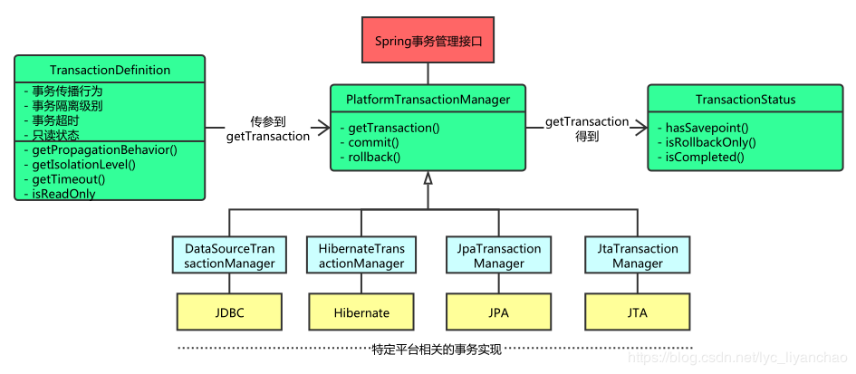

### 事物隔离级别

 **一、事务的并发问题** 

脏读 ：读到别人没有提交的事务

不可重复读：一个事务中读两次，前后不一致，读到别人已经修改和更新的数据

幻读：一个事务中读两次，得到不同的数据集合，读到别人提交的新数据

**二、解决的办法**

| 事务隔离级别                 | 脏读 | 不可重复读 | 幻读 |
| ---------------------------- | ---- | ---------- | ---- |
| 读未提交（read-uncommitted） | 是   | 是         | 是   |
| 不可重复读（read-committed） | 否   | 是         | 是   |
| 可重复读（repeatable-read）  | 否   | 否         | 是   |
| 串行化（serializable）       | 否   | 否         | 否   |

 mysql 默认的事务隔离级别为repeatable-read 

**三 、Spring事物支持核心接口**



**TransactionDefinition–>定义与spring兼容的事务属性的接口**

 ```java
  public interface TransactionDefinition {
  	// 如果当前没有事物，则新建一个事物；如果已经存在一个事物，则加入到这个事物中。
  	int PROPAGATION_REQUIRED = 0;
  	// 支持当前事物，如果当前没有事物，则以非事物方式执行。
  	int PROPAGATION_SUPPORTS = 1;
  	// 使用当前事物，如果当前没有事物，则抛出异常。
  	int PROPAGATION_MANDATORY = 2;
  	// 新建事物，如果当前已经存在事物，则挂起当前事物。
  	int PROPAGATION_REQUIRES_NEW = 3;
  	// 以非事物方式执行，如果当前存在事物，则挂起当前事物。
  	int PROPAGATION_NOT_SUPPORTED = 4;
  	// 以非事物方式执行，如果当前存在事物，则抛出异常。
  	int PROPAGATION_NEVER = 5;
  	// 如果当前存在事物，则在嵌套事物内执行；如果当前没有事物，则与PROPAGATION_REQUIRED传播特性相同
  	int PROPAGATION_NESTED = 6;
  	// 使用后端数据库默认的隔离级别。
  	int ISOLATION_DEFAULT = -1;
  	// READ_UNCOMMITTED 隔离级别
  	int ISOLATION_READ_UNCOMMITTED = Connection.TRANSACTION_READ_UNCOMMITTED;
  	// READ_COMMITTED 隔离级别
  	int ISOLATION_READ_COMMITTED = Connection.TRANSACTION_READ_COMMITTED;
  	// REPEATABLE_READ 隔离级别
  	int ISOLATION_REPEATABLE_READ = Connection.TRANSACTION_REPEATABLE_READ;
  	// SERIALIZABLE 隔离级别
  	int ISOLATION_SERIALIZABLE = Connection.TRANSACTION_SERIALIZABLE;
  	// 默认超时时间
  	int TIMEOUT_DEFAULT = -1;
  	// 获取事物传播特性
  	int getPropagationBehavior();
  	// 获取事物隔离级别
  	int getIsolationLevel();
  	// 获取事物超时时间
  	int getTimeout();
  	// 判断事物是否可读
  	boolean isReadOnly();
  	// 获取事物名称
  	@Nullable
  	String getName();
  }
 ```

**Spring事物传播特性表：**

| 传播特性名称              | 说明                                                         |
| ------------------------- | ------------------------------------------------------------ |
| PROPAGATION_REQUIRED      | 如果当前没有事物，则新建一个事物；如果已经存在一个事物，则加入到这个事物中 |
| PROPAGATION_SUPPORTS      | 支持当前事物，如果当前没有事物，则以非事物方式执行           |
| PROPAGATION_MANDATORY     | 使用当前事物，如果当前没有事物，则抛出异常                   |
| PROPAGATION_REQUIRES_NEW  | 新建事物，如果当前已经存在事物，则挂起当前事物               |
| PROPAGATION_NOT_SUPPORTED | 以非事物方式执行，如果当前存在事物，则挂起当前事物           |
| PROPAGATION_NEVER         | 以非事物方式执行，如果当前存在事物，则抛出异常               |
| PROPAGATION_NESTED        | 如果当前存在事物，则在嵌套事物内执行；如果当前没有事物，则与PROPAGATION_REQUIRED传播特性相同。内层被调用方法回滚与否，不会影响外层调用方法。而外层调用方法出异常回滚，也会回滚内层被调用方法（嵌套事务） |

​     

**PlatformTransactionManager–>Spring事务基础结构中的中心接口**

```java
public interface PlatformTransactionManager {
	// 根据指定的传播行为，返回当前活动的事务或创建新事务。
	TransactionStatus getTransaction(@Nullable TransactionDefinition definition) throws TransactionException;
	// 就给定事务的状态提交给定事务。
	void commit(TransactionStatus status) throws TransactionException;
	// 执行给定事务的回滚。
	void rollback(TransactionStatus status) throws TransactionException;
}
```


**TransactionStatus–>事物状态描述**

```java
public interface TransactionStatus extends SavepointManager, Flushable {
	// 返回当前事务是否为新事务（否则将参与到现有事务中，或者可能一开始就不在实际事务中运行）
	boolean isNewTransaction();
	// 返回该事务是否在内部携带保存点，也就是说，已经创建为基于保存点的嵌套事务。
	boolean hasSavepoint();
    // 设置事务仅回滚。
	void setRollbackOnly();
	// 返回事务是否已标记为仅回滚
	boolean isRollbackOnly();
	// 将会话刷新到数据存储区
	@Override
	void flush();
	// 返回事物是否已经完成，无论提交或者回滚。
	boolean isCompleted();
}
```


**SavepointManager接口**

```java
public interface SavepointManager {
	// 创建一个新的保存点。
	Object createSavepoint() throws TransactionException;
	// 回滚到给定的保存点。
	// 注意：调用此方法回滚到给定的保存点之后，不会自动释放保存点，
	// 可以通过调用releaseSavepoint方法释放保存点。
	void rollbackToSavepoint(Object savepoint) throws TransactionException;
	// 显式释放给定的保存点。（大多数事务管理器将在事务完成时自动释放保存点）
	void releaseSavepoint(Object savepoint) throws TransactionException;
}
```


**Flushable接口**

```java
public interface Flushable {
    // 将会话刷新到数据存储区
    void flush() throws IOException;
}
```


**四 、Spring编程式事物**

```java
package com.example.jdbc.transaction;

import com.zaxxer.hikari.HikariDataSource;
import org.springframework.dao.DataAccessException;
import org.springframework.jdbc.core.JdbcTemplate;
import org.springframework.jdbc.datasource.DataSourceTransactionManager;
import org.springframework.transaction.TransactionDefinition;
import org.springframework.transaction.TransactionStatus;
import org.springframework.transaction.support.DefaultTransactionDefinition;

import javax.sql.DataSource;

public class Transaction {

    private JdbcTemplate jdbcTemplate;
    private DataSourceTransactionManager txManager;
    private DefaultTransactionDefinition txDefinition;
    private String insert_sql = "INSERT INTO t_player (uid, name) VALUES ('10', 'a')";

    public static void main(String[] args) {
        Transaction transaction = new Transaction();

        transaction.save();
    }

    public void save() {
        // 1、初始化jdbcTemplate
        DataSource dataSource = getDataSource();
        jdbcTemplate = new JdbcTemplate(dataSource);

        // 2、创建物管理器
        txManager = new DataSourceTransactionManager();
        txManager.setDataSource(dataSource);

        // 3、定义事物属性
        txDefinition = new DefaultTransactionDefinition();
        // 事务传播特性
        txDefinition.setPropagationBehavior(TransactionDefinition.PROPAGATION_REQUIRED);
        // 事务隔离级别
        txDefinition.setIsolationLevel(TransactionDefinition.ISOLATION_DEFAULT);


        // 3、开启事物
        TransactionStatus txStatus = txManager.getTransaction(txDefinition);

        // 4、执行业务逻辑
        try {
            jdbcTemplate.execute(insert_sql);
            //int i = 1/0;
            //jdbcTemplate.execute(insert_sql);
            txManager.commit(txStatus);
        } catch (DataAccessException e) {
            txManager.rollback(txStatus);
            e.printStackTrace();
        }
    }


    public DataSource getDataSource() {
        HikariDataSource dataSource = new HikariDataSource();
        dataSource.setDriverClassName("com.mysql.cj.jdbc.Driver");
        dataSource.setJdbcUrl("jdbc:mysql://47.100.185.77:3306/qin?useSSL=false&useUnicode=true&characterEncoding=UTF-8");
        dataSource.setUsername("root");
        dataSource.setPassword("373616885");
        return dataSource;
    }

}

```


